# <center>Lab1实验报告</center>

<center>宋昊谦  尹浩燃  穆浩宁</center>

## 练习一
### 分析 `la sp, bootstacktop` 指令
#### 答案：

操作：`la sp, bootstacktop` 指令将 `bootstacktop` 符号所代表的内存地址加载到了 `sp `寄存器中。

目的：为内核初始化一个可用的堆栈空间，是后续调用 C 函数 `kern_init` 的必要前提。

#### 操作过程：
我们在完成练习二之后，程序正停在` kern/init/entry.S `的第一行。
程序从 `0x1000` 开始，经过了OpenSBI的初始化，最后准确地停在了设置的内核入口断点上。CPU的控制权已经成功地从固件移交到了内核。

然后我们来分析 `la sp, bootstacktop` 指令。

这条指令的目的是设置内核的堆栈。我们将通过对比执行前后的 `sp` 寄存器来验证这一点。

输入命令，查看`sp`寄存器当前的值：
```c
info registers sp
```
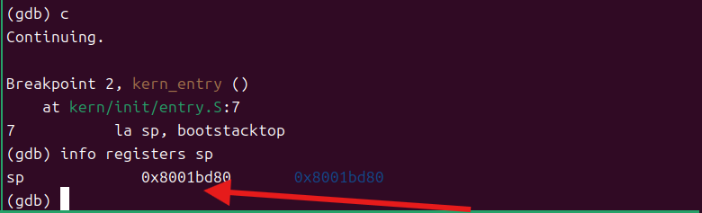
然后输入`si`,执行单条汇编指令
```c
si
```
再次输入命令，查看 sp 寄存器的值发生了什么变化：
```c
info registers sp
```
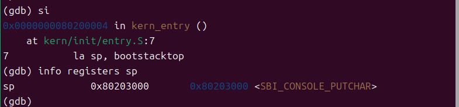
`sp` 寄存器的值已经不再是之前的初始值`0x8001bd80`，而是变成了一个新的、指向 bootstacktop 的地址`0x80203000`。
为了验证这一说法，再输出指令
```c
p/x &bootstacktop
```
查看`bootstacktop`的地址正是`0x80203000`
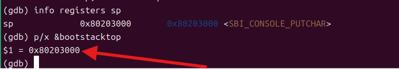

### 分析 `tail kern_init` 指令

#### 答案：
**操作:**

`tail kern_init` 是一条 尾调用优化跳转指令。其具体操作是：

直接跳转：它不会像常规的 `call` 指令那样在堆栈上压入返回地址，而是直接修改程序计数器（`PC`），将 CPU 的执行流程无条件地跳转到 `kern_init` 函数的起始地址。

栈帧复用：它会复用当前的栈帧，而不是在现有栈的顶部创建一个新的栈帧。这意味着 `kern_init` 函数会直接使用由 `la sp, bootstacktop` 刚刚设置好的堆栈。

**目的:**
该指令的核心目的是完成从底层汇编环境到上层C语言环境的最终交接。

移交控制权：汇编代码 `entry.S` 的使命——设置内核堆栈——已经完成。通过 `tail kern_init`，它将CPU的控制权彻底、一次性地移交给内核的C语言主体部分。

保持堆栈整洁：由于 `entry.S` 的进程已经结束，内核永远不会再返回到这个汇编代码。因此，使用 tail 跳转是一种非常高效的选择，它避免了在堆栈上保存一个永远不会被用到的返回地址，确保了新初始化的内核堆栈的干净和正确。

#### 操作过程：
完成上一条指令的分析之后，现在 GDB 停在 `tail kern_init` 这一行。我们再次输入 `si`命令：
```c
si
```
GDB的输出会从显示汇编代码（`entry.S`）变成显示C语言代码（`kern/init/init.c`）
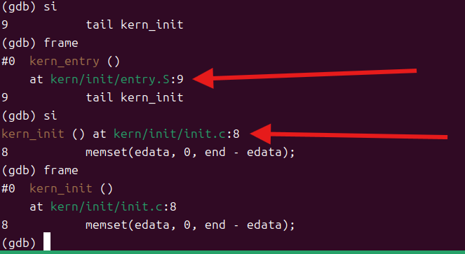

说明此时程序已经不在`entry.S`文件里了，而是进入了 `kern/init/init.c` 这个C语言源文件。

程序现在位于 `kern_init` 函数的内部,说明`tail kern_init` 指令成功地将CPU的控制权交给了 C 函数 `kern_init`。
## 练习二：GDB 验证启动流程
### 答案
`RISC-V 硬件加电后最初执行的几条指令位于什么地址？`

答案:位于`0x1000`。这是 QEMU Virt 机器上电后 PC 的初始值，对应一小段 MROM 固件指令。

`它们主要完成了哪些功能？`

答案: 该小段固件完成最基础的机器级初始化与引导，核心是把控制权转交给机器态固件 OpenSBI（从 `0x1000` 跳转到 `0x80000000`）。随后 OpenSBI 在 M 模式进行初始化，并根据平台配置将内核定位到 `0x80200000`，最终跳转到该地址开始执行内核入口 `kern_entry`。

### 操作过程
首先在终端输入
```c
make qemu
```
观察到OpenSBI 输出一堆信息后，最后打印出 `(THU.CST) os is loading ...`,说明实验代码没问题
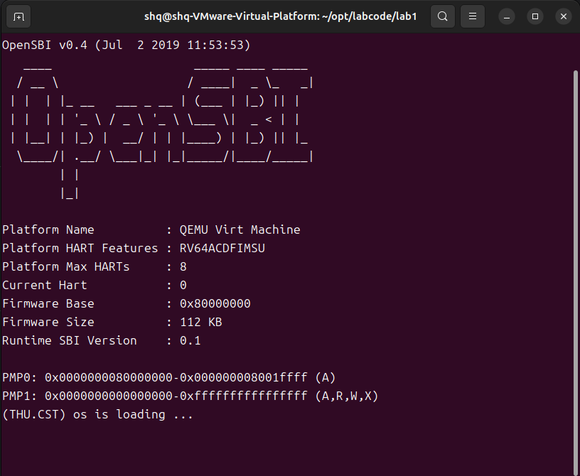
然后使用tmux分割窗口，按照指导书中的步骤，在左侧窗口输入
```c
make debug
```
在右侧窗口输入
```c
make gdb
```
GDB 会启动并自动连接到 QEMU。连接成功后，看到 GDB 停在了 `0x0000000000001000 in ?? ()`
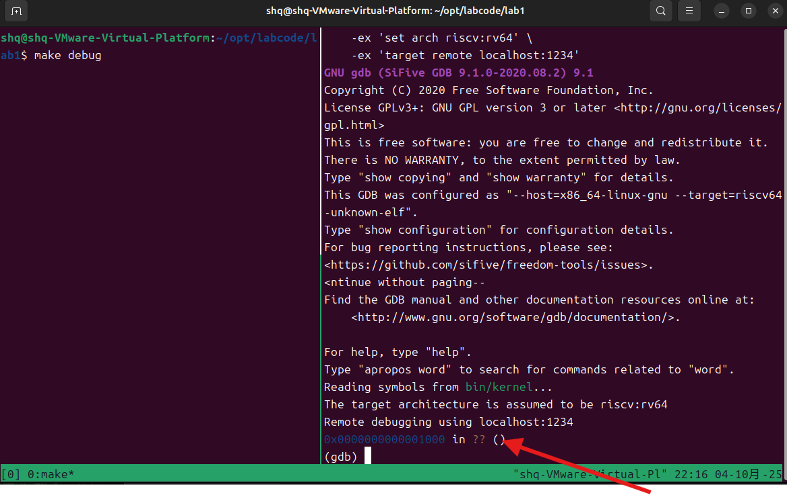


然后，我们要验证 OpenSBI 是如何把控制权交给内核的

我们首先查看pc的地址（0x1000）

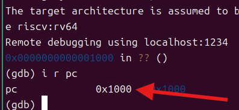

然后再查看sp寄存器的地址(0x0)

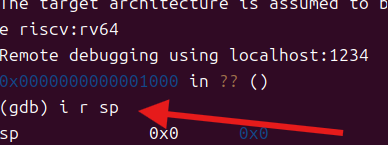

然后在`0x80000000`设置断点，这是OpenSBI 入口
```c
b *0x80000000
```

然后在右侧的终端中，输入
```c
watch *0x80200000
```
这个命令是让GDB监视内存地址 `0x80200000` 的内容。一旦它的值发生任何改变，就暂停程序。
由于本实验使用 QEMU 的 `-device loader` 预加载机制，内核镜像在 CPU 执行前已写入 `0x80200000`，GDB watchpoint 仅能捕获由 CPU 指令触发的写操作，因此对 0x80200000 的 watch 不会触发。我们在makefile中可以看到相关代码。
```c
qemu: $(UCOREIMG) $(SWAPIMG) $(SFSIMG)
#	$(V)$(QEMU) -kernel $(UCOREIMG) -nographic
	$(V)$(QEMU) \
		-machine virt \
		-nographic \
		-bios default \
		-device loader,file=$(UCOREIMG),addr=0x80200000


debug: $(UCOREIMG) $(SWAPIMG) $(SFSIMG)
	$(V)$(QEMU) \
		-machine virt \
		-nographic \
		-bios default \
		-device loader,file=$(UCOREIMG),addr=0x80200000\
		-s -S
```
然后设置断点,在内核的第一行指令处拦截
```c
b *0x80200000
```

然后连续输入两个 c (continue) 命令，让QEMU开始运行OpenSBI固件。首先停在OpenSBI 入口处，然后停在`0x80200000`（`kern_entry`）
```c
c
c
```
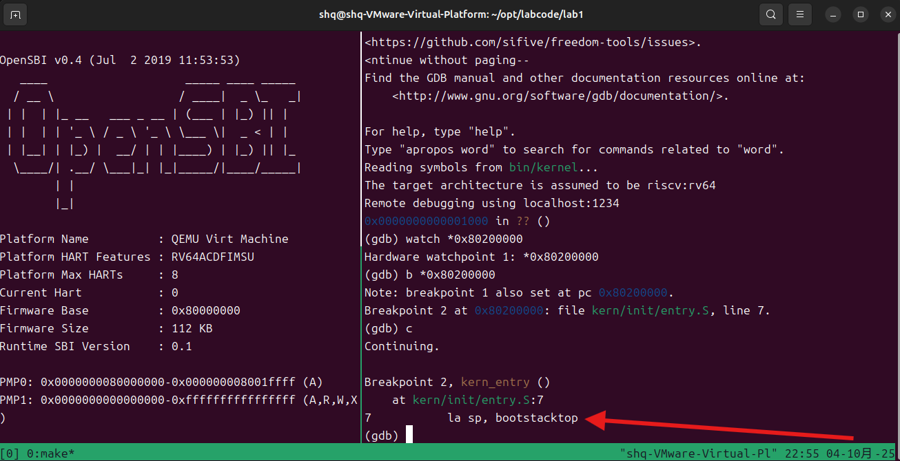
可以观察到程序正停在` kern/init/entry.S `的第一行。

我们再次查看pc和sp的地址

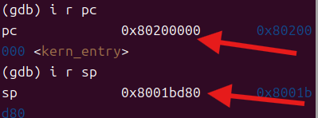

程序从 `0x1000` 开始，继续运行后进入 `0x80000000`（OpenSBI 入口），OpenSBI 在 M 模式进行机器级初始化，再次继续后，PC 到达 `0x80200000`（`kern_entry`），说明控制权从固件移交到内核成功。然后在输入命令查看附近的反汇编代码，
```c
x/6i $pc
```
反汇编显示入口代码先设置 `sp=bootstacktop`，（0x80200000-0x80200008）再用尾调用跳到 `kern_init`(0x80200008-0x8020000a)

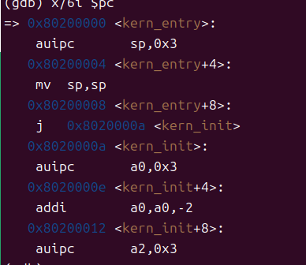


## 重要的知识点与操作系统原理的对应关系

### 1. 内核启动与程序入口（Kernel Boot Process & Entry Point）
 **OS原理中的知识点：** 操作系统的启动过程，包括硬件初始化、引导加载程序（Bootloader）、内核加载。

 **实验1中的知识点：**
   实验1涉及 QEMU 启动过程、OpenSBI 加载内核到 `0x80200000`、程序从汇编代码到 C 语言代码的跳转（`la sp, bootstacktop` 设置栈指针，`tail kern_init` 跳转到 `kern_init`）。
   与OS中启动流程的步骤相对应，重点在于控制权的交接与程序入口点设置。

### 2. 内存管理与栈空间分配（Memory Management & Stack Setup）
 **OS原理中的知识点：** 操作系统为进程分配栈空间，管理内存。

 **实验1中的知识点：**
   在 `kern/init/entry.S` 中，通过 `la sp, bootstacktop` 设置栈指针，分配栈空间供 `kern_init` 使用。
   与OS原理中的内存管理与栈分配一致，确保内核初始化的栈空间可用。

### 3. 指令集架构与操作系统交互（Instruction Set Architecture & OS Interaction）
 **OS原理中的知识点：** 操作系统与硬件交互，通过指令集进行控制。

 **实验1中的知识点：**
   在 `kern/init/entry.S` 中，`la sp, bootstacktop` 和 `tail kern_init` 指令执行栈空间设置和跳转到 C 语言函数。
   该部分展示了操作系统如何与硬件通过指令集进行交互，控制程序执行流程。

### 4. 调试与系统跟踪（Debugging & System Tracing）
 **OS原理中的知识点：** 调试工具帮助开发者追踪内核执行，确保功能正确。

 **实验1中的知识点：**
   使用 GDB 在 QEMU 中调试内核的启动过程，通过断点和单步执行检查内核加载与执行。
   调试过程与OS原理中的调试技术一致，用于验证启动流程的正确性。

### 5. 引导加载程序（Bootloader）与内核加载（Bootloader & Kernel Loading）
 **OS中的知识点：** 引导加载程序加载内核并将控制权交给操作系统。

 **实验1中的知识点：**
   OpenSBI 作为引导加载程序，将操作系统内核加载到内存并跳转至内核的入口。
   与OS原理中引导加载程序的功能一致，负责将控制权交给内核。

### 6. 内核日志与用户交互（Kernel Logging & User Interaction）
 **OS中的知识点：** 内核提供日志输出，向用户反馈系统状态。

 **实验1中的知识点：**
   `kern_init` 中通过 `cprintf` 输出“(THU.CST) os is loading ...”作为内核启动信息。
   该部分与OS原理中的内核日志功能一致，提供启动过程的可视化反馈。


## OS原理中重要但在实验一未体现的知识点分析


### 一、 进程管理相关概念

实验一的内核本质上是一个**单任务裸机程序**，而非一个管理多任务的操作系统。因此，所有与多任务并发相关的概念均未涉及。

* **进程概念本身**：理论上，进程是资源分配和独立运行的基本单位。而实验一仅有内核这**唯一的执行流**（从 `entry.S` 到 `kern_init`），它独占全部硬件资源，不存在多个程序并发执行、需要操作系统进行隔离和管理的场景。

* **进程上下文切换**：上下文切换是为了在多任务间共享CPU而保存和恢复各自的运行状态。实验一的内核是**线性执行，永不中断**，没有定时器中断，也无需主动让出CPU。既然不存在任务切换的需求，自然也无需上下文保存与恢复机制。

* **进程调度**：调度算法的核心是在多个“就绪”进程中进行“多选一”的决策。实验一系统中**仅有一个执行实体**，CPU的执行对象是确定的，不存在“选择”和“竞争”的问题，因此调度算法无用武之地。

### 二、 内存管理相关概念

实验一的内存模型是**静态、固定的物理内存布局**，而非动态、按需分配的虚拟内存系统。

* **动态内存管理**：OS中的空闲链表、位示图等数据结构，是为了高效地跟踪和分配动态内存（如 `malloc`/`free`）。实验一的内存使用完全是静态的：代码、数据和堆栈的大小与位置在编译时已由链接脚本 `kernel.ld` 确定。程序运行中**没有动态申请或释放内存的行为**，因此不需要这些复杂的数据结构。

* **内存空间扩展技术（交换与覆盖）**：交换（Swapping）和覆盖（Overlay）技术都是在物理内存不足时，为运行大程序或多程序而设计的。实验一的内核本身极小（几十KB），而QEMU模拟的内存（MB级别）远超所需，**不存在内存不足的场景**。同时，内核也未实现与磁盘交互的能力，不具备实现这些技术的基础。