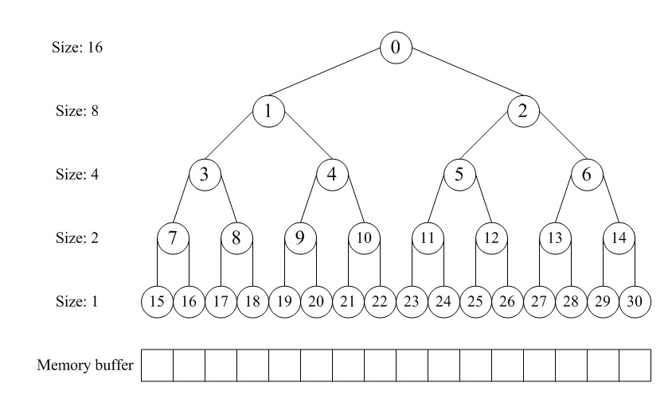

# <center>Lab2</center>

<center>宋昊谦 尹浩燃 穆浩宁</center>

## 练习1：理解 first-fit 连续物理内存分配算法（思考题）


First-Fit 算法是一种动态内存分配策略。它维护一个空闲内存块的链表。当系统收到一个内存分配请求时，算法会从链表的开头开始搜索，并选择第一个足够大的空闲块（即大小大于或等于请求大小的块）进行分配。若空闲块比需求大，则分割，前部分分配出去，剩余部分重新挂回链表。当释放内存时，将释放的块重新插入 free_list，若其与相邻块物理上连续，则合并成更大的块。
算法的时间复杂度为 O(n)


### 实现过程
在 `default_pmm.c` 中，`free_list` 按物理地址从小到大的顺序维护所有空闲块。

- **分配 (Allocation)**：从 `free_list` 链表头开始遍历，查找第一个 `property` (空闲块大小) 大于或等于所需大小 `n` 的块。  
- **释放 (Free)**：将释放的块按其物理地址顺序插回 `free_list`，并检查其前、后块是否在物理上相邻，如果相邻则合并 (Merge) 为一个更大的空闲块。

算法流程图：
```c
分配过程 default_alloc_pages(n)：
  
          +------------------------+
          | default_alloc_pages(n) |
          +------------------------+
                      |
            遍历 free_list 查找首个
             property >= n 的空闲块
                      |
              +----------------+
          找到合适块？          否→ 返回 NULL
              |
              是
              ↓
      若块大小 > n → 分割剩余部分
              |
        从链表中删除已分配块
              |
         更新 nr_free 并返回页

释放过程 default_free_pages：        

         释放页块 base,n
            ↓
         按地址插入 free_list
            ↓
         与前后物理相邻块检查合并
            ↓
         更新 nr_free 与链表状态


```
---

### 代码分析

#### default_init
```c
static void default_init(void) {
    list_init(&free_list);
    nr_free = 0;
}
```

**作用**：初始化物理内存管理器。  
**分析**：  
- `list_init(&free_list)`：初始化 `free_list` 双向循环链表。  
- `nr_free = 0`：将全局的空闲页计数器置为 0。

---

#### default_init_memmap
```c
default_init_memmap(struct Page *base, size_t n)
// 初始化一个给定地址和大小的空闲块。
// base: 指向第一个页面的指。n: 页数。
{
    assert(n > 0);
    // 遍历从 base 开始的每一个页面，
    // 确保每一页都被预留（PageReserved(p)）。然后清除每一页的标志和属性，并设置其引用计数为0
    struct Page *p = base;

    // test point begin
    for (; p != base + 3; p++)
    {
        cprintf("p的虚拟地址: 0x%016lx.\n", (uintptr_t)p);
    }
    // test point end

    p = base; // 将 p 设置为指向这段物理页面的起始地址
    for (; p != base + n; p++)
    { // 从基地址 base 开始，对 n 个连续的物理页面进行初始化
        assert(PageReserved(p));
        p->flags = p->property = 0;
        set_page_ref(p, 0); // 设置引用计数(page的ref成员)为0
    }   
    // 设置基本页面的属性
    // 空闲块中第一个页的property属性标志整个空闲块中总页数
    base->property = n;
    // 将这个页面标记为空闲块开始的页面
    // 将page->flag的PG_property位，也就是第1位（总共0-63有64位）设置为1
    SetPageProperty(base);
    // 更新空闲区域的结构中的空闲块的数量
    nr_free += n;

    // 将新的空闲块添加到空闲列表中
    // 空闲链表为空就直接添加
    if (list_empty(&free_list))
    {
        list_add(&free_list, &(base->page_link));
        // 这个函数将在para2节点插入在para1后面
    }
    else // 非空的话就遍历链表，找到合适的位置插入
    {
        list_entry_t *le = &free_list;             // 哨兵节点，表示链表的开始和结束。
        while ((le = list_next(le)) != &free_list) // 遍历一轮链表
        {
            struct Page *page = le2page(le, page_link); // le2page从给定的链表节点le获取到包含它的struct Page实例。
            if (base < page)                            // 找到了合适的位置，链表是排序的，便于后续搜索，插入要维持有序状态
            {
                list_add_before(le, &(base->page_link)); // 在当前链表条目之前插入新页面。
                break;
            }
            else if (list_next(le) == &free_list) // 到了链表尾部，循环一轮的最后，直接添加
            {
                list_add(le, &(base->page_link));
            }
        }
    }
}
```

**作用**：将一个连续的物理内存块添加到 `free_list` 中管理。  
**分析**：  
- 页面初始化：清除每个页的标志和属性。  
- 标记空闲块：`base->property = n` 记录块大小。  
- 插入链表：保持地址有序。

---

#### default_alloc_pages
```c
default_alloc_pages(size_t n) // 根据首次适应算法从空闲列表中分配所需数量的页
{
    assert(n > 0);
    // 不够分
    if (n > nr_free)
    {
        return NULL;
    }
    // 遍历空闲列表，找到第一个空闲块大小大于等于n的块
    struct Page *page = NULL;
    list_entry_t *le = &free_list;
    while ((le = list_next(le)) != &free_list)
    {
        struct Page *p = le2page(le, page_link);
        if (p->property >= n)
        {
            page = p;
            break;
        }
    }
    if (page != NULL) // 找到了要分配的页，获取这个块前面的链表条目，并从空闲列表中删除这个块。
    {
        list_entry_t *prev = list_prev(&(page->page_link));
        list_del(&(page->page_link));
        if (page->property > n) // 找到的空闲块比请求的大，它将被拆分为两部分
        {
            struct Page *p = page + n;        // p指向第二部分的第一个页面
            p->property = page->property - n; // 更新第二部分的空闲块大小
            SetPageProperty(p);               // 设置第二部分的第一个页面的属性，set property bit，标志空闲
            list_add(prev, &(p->page_link));  // 将第二部分添加到空闲列表中
        }
        // 更新空闲页面计数 nr_free，并清除已分配块的属性标志。
        nr_free -= n;
        ClearPageProperty(page);
    }
    return page;
}
```

**作用**：实现 First-Fit 分配逻辑。  
**分析**：  
1. 遍历 `free_list`，找到第一个 `property >= n` 的块。  
2. 如果块比需求大，则分割。  
3. 更新 `nr_free` 并返回分配块。

---

#### default_free_pages
```c
default_free_pages(struct Page *base, size_t n)
{
    assert(n > 0);
    struct Page *p = base;
    for (; p != base + n; p++)
    {
        assert(!PageReserved(p) && !PageProperty(p)); // 确保页面不是保留的，也不是空闲块的第一个页面
        p->flags = 0;                                 // 清除页面的标志
        set_page_ref(p, 0);                           // 设置页面的引用计数为0
    }
    base->property = n;    // 将要释放的页面中的第一个页面的property属性设置为n，表示需要释放n个页面
    SetPageProperty(base); // 将页面的标志设置为 PG_property，表示这是一个空闲块的第一个页面。
    nr_free += n;          // 将要释放的页面数量 n 加到空闲页面计数 nr_free 中，表示这些页面现在是空闲的

    /**
     * 用 list_empty 宏检查空闲页面链表是否为空
     * 如果为空，则将要添加的页面作为链表的头节点，并返回
     * 否则，函数遍历空闲页面链表，找到要添加的页面在链表中的位置，并将其插入到链表中
     */
    if (list_empty(&free_list))
    {
        list_add(&free_list, &(base->page_link));
    }
    else
    {
        list_entry_t *le = &free_list;
        while ((le = list_next(le)) != &free_list) // 遍历一轮链表
        {
            struct Page *page = le2page(le, page_link); // 使用 le2page 宏将链表节点转换为页面结构体
            // 比较要添加的页面的地址和当前节点所对应的页面的地址的大小
            // 保证链表中页面地址的升序排列
            if (base < page)
            {
                list_add_before(le, &(base->page_link));
                break;
            }
            else if (list_next(le) == &free_list)
            {
                list_add(le, &(base->page_link)); // 加在链表末尾
            }
        }
    }

    // 合并空闲页面链表中相邻的空闲块
    // 判断空闲块之前的块
    list_entry_t *le = list_prev(&(base->page_link)); // 取空闲块的前一个页面的链表节点
    if (le != &free_list)                             // 如果 le 不等于空闲页面链表的头节点，则说明空闲块的前一个页面存在
    {
        /***
         * 函数使用 le2page 宏将链表节点转换为页面结构体，并将其赋值给指针 p
         * 如果 p 的 property 字段加上 p 的地址等于 base 的地址，则说明 p 和 base 是相邻的空闲块，可以将它们合并成一个更大的空闲块
         * 然后使用 ClearPageProperty 宏将 base 的 PG_property 标志位清除
         * 使用 list_del 宏将 base 从空闲页面链表中删除。
         * 函数将 base 的地址更新为 p 的地址，表示合并后的空闲块的起始页面为 p。
         */
        p = le2page(le, page_link);
        if (p + p->property == base)
        {
            p->property += base->property;
            ClearPageProperty(base);
            list_del(&(base->page_link));
            base = p;
        }
    }

    // 判断空闲块之后的块
    le = list_next(&(base->page_link));
    if (le != &free_list)
    {
        p = le2page(le, page_link);
        if (base + base->property == p)
        {
            base->property += p->property;
            ClearPageProperty(p);
            list_del(&(p->page_link));
        }
    }
}
```

**作用**：释放并合并空闲块。  
**分析**：  
- 重置页状态；  
- 插入有序链表；  
- 检查相邻块是否连续并合并。

---

### 物理内存分配过程总结
- `default_init`：初始化空闲内存块的链表，将空闲块的个数设置为0。

- `default_init_memmap`：用于初始化一个空闲内存块。先查询空闲内存块的链表，按照地址顺序插入到合适的位置，并将空闲内存块个数加n。
- `default_alloc_pages`：用于分配给定大小的内存块。如果剩余空闲内存块大小多于所需的内存区块大小，则从链表中查找大小超过所需大小的页，并更新该页剩余的大小。
- `default_free_pages`：该函数用于释放内存块。将释放的内存块按照顺序插入到空闲内存块的链表中，并合并与之相邻且连续的空闲内存块。


---

### 7. 改进空间与优化建议

#### （1）减少前端碎片化问题
First Fit 在每次分配时均从空闲链表头开始搜索，导致低地址区域频繁被分割成零碎小块，而高地址区域保持相对完整，可能出现低地址区充满无法满足较大分配请求的小块。

**改进思路：**
- **Next Fit**：记录上一次分配结束的位置，下一次从此处继续扫描，从而避免反复占用低地址区域。
- **Best Fit**：在整个空闲链表中选择最接近所需大小的块，虽然时间复杂度略高，但可显著减少外部碎片。
- **空闲块合并策略优化**：增加延迟合并或后台整理机制，在系统空闲时合并碎片块，提高大块分配成功率。

#### （2）提升搜索效率
`default_alloc_pages` 采用线性扫描方式查找可用块，时间复杂度为 O(n)。当空闲块数量较大时，性能将明显下降。

**改进思路：**
- **链表 → 平衡树/堆结构**：以空闲块大小或地址为关键字构建红黑树、最小堆结构，查找复杂度可降至 O(log k)。
- **分级空闲链表（Segregated Free List）**：根据块大小划分多条空闲链表，小块与大块独立管理，从而快速定位目标范围。

#### （3）改进页块合并机制
在当前实现中，释放页块时仅检查相邻块是否可以合并，但在多线程或频繁回收场景下，会出现临时未合并的碎片。

**改进思路：**
- **延迟合并**：在分配阶段再检查相邻块是否可合并，从而减少释放操作的锁竞争与性能开销。
- **批量合并机制**：周期性扫描 `free_list`，对相邻小块进行统一合并，保持内存连续性。

#### （4）引入伙伴系统（Buddy System）
在更高层次的优化中，可采用 **Buddy System** 替代单纯的 First Fit。
通过强制块大小为 2 的幂次，并在分配与释放时进行“查找与合并”，实现：
- O(1) 级别的分配与回收；
- 自动碎片整理；
- 较好的空间利用率与可预测性。


---

## 练习2：实现 Best-Fit 连续物理内存分配算法（需要编程）


### 设计实现过程

Best-Fit (最佳适应) 算法的核心思想是**最小化每次分配后剩余的空闲块大小**。

与 First-Fit（首次适应）算法找到第一个满足条件的块就停止不同，Best-Fit 算法必须**遍历整个空闲链表** (`free_list`)，找到所有满足 `property >= n` (大小 >= 请求数) 的块中，`property` 值最小（即最接近 `n`）的那一块。

1.  **初始化 (`best_fit_init`, `best_fit_init_memmap`)**: 这部分与 First-Fit 基本一致。`free_list` 仍然是一个按物理地址从小到大排序的双向链表。
2.  **分配 (`best_fit_alloc_pages`)**
    * 初始化一个 `min_size` 变量（`nr_free + 1`），用来记录迄今为止找到的“最小的”合适块的大小。
    * 初始化一个 `page` 指针为 `NULL`，用来指向最终选中的最佳块。
    * **遍历整个 `free_list` 链表**，不提前 `break`。
    * 在循环中，如果发现一个块 `p` 满足 `p->property >= n`（大小足够），则检查它是否是“更佳”的选择，即 `p->property < min_size`。
    * 如果是更佳选择，则更新 `min_size = p->property` 并 `page = p`。
    * 循环结束后，`page` 指向的就是最佳适应块（如果找到了的话）。
    * 后续的分割、摘链逻辑与 First-Fit 相同。
3.  **释放 (`best_fit_free_pages`)**: 这部分与 First-Fit **完全相同**。释放的块仍然需要按照物理地址插回 `free_list`，并尝试与前后物理地址相邻的空闲块进行合并。

### 代码实现分析

#### 物理内存分配 (`best_fit_alloc_pages`)

```c
static struct Page *
best_fit_alloc_pages(size_t n) {
    assert(n > 0);
    if (n > nr_free) {
        return NULL;
    }
    struct Page *page = NULL;
    list_entry_t *le = &free_list;
    // 初始化 min_size 为一个不可能达到的最大值
    size_t min_size = nr_free + 1;
    
    /*LAB2 EXERCISE 2: 2312580*/ 
    // 下面的代码是first-fit的部分代码，请修改下面的代码改为best-fit
    // 遍历空闲链表，查找满足需求的空闲页框
    // 如果找到满足需求的页面，记录该页面以及当前找到的最小连续空闲页框数量

    // 遍历整个空闲链表，寻找最佳匹配
    while ((le = list_next(le)) != &free_list) {
        struct Page *p = le2page(le, page_link);
        if (p->property >= n) {                  // 1. 块大小满足需求
            if (p->property < min_size) {        // 2. 并且比当前记录的最小块更小（更合适）
                min_size = p->property;          // 更新最小块大小
                page = p;                        // 更新目标块
            }
        }
    }

    // 找到了最佳的块 page
    if (page != NULL) {
        // (后续逻辑与 First-Fit 相同)
        list_entry_t* prev = list_prev(&(page->page_link));
        list_del(&(page->page_link));            // 将目标块从空闲链表中删除
        if (page->property > n) {                // 块大小大于需求，需拆分
            struct Page *p = page + n;           // 拆分后新块的首页
            p->property = page->property - n;    // 新块大小 = 原块大小 - 需求大小
            SetPageProperty(p);                  // 标记新块为空闲块首页
            list_add(prev, &(p->page_link));     // 将新块插回空闲链表（原块的前一个位置）
        }
        nr_free -= n;                 // 总空闲页数减少需求数
        ClearPageProperty(page);      // 清除目标块的“空闲”标记
    }
    return page;
}
```
#### 物理内存释放 (`best_fit_free_pages`)
```c
static void
best_fit_free_pages(struct Page *base, size_t n) {
    assert(n > 0);
    struct Page *p = base;
    
    // 1. 重置被释放页面的状态
    for (; p != base + n; p ++) {
        assert(!PageReserved(p) && !PageProperty(p));
        p->flags = 0;
        set_page_ref(p, 0);
    }
    
    /*LAB2 EXERCISE 2: 2312580*/ 
    // 2. 设置释放块的首页属性
    base->property = n;          // 块首页的property设为总块大小
    SetPageProperty(base);       // 标记该页为空闲块首页
    nr_free += n;                // 总空闲页数增加释放的页数

    // 3. (与 First-Fit 相同) 按地址顺序插回 free_list
    if (list_empty(&free_list)) {
        list_add(&free_list, &(base->page_link));
    } else {
        list_entry_t* le = &free_list;
        while ((le = list_next(le)) != &free_list) {
            struct Page* page = le2page(le, page_link);
            if (base < page) {
                list_add_before(le, &(base->page_link));
                break;
            } else if (list_next(le) == &free_list) {
                list_add(le, &(base->page_link));
            }
        }
    }

    /*LAB2 EXERCISE 2: 2312220*/ 
    // 4. (与 First-Fit 相同) 尝试向前合并
    list_entry_t* le = list_prev(&(base->page_link));
    if (le != &free_list) {
        p = le2page(le, page_link);
        if (p + p->property == base) {  // 前一个空闲块的末尾与当前块的开头连续
            p->property += base->property;  // 合并：前块大小 += 当前块大小
            ClearPageProperty(base);        // 清除当前块的“空闲”标记（不再是块首）
            list_del(&(base->page_link));   // 将当前块从链表中删除
            base = p;                       // 更新base为合并后的块首，便于后续合并后块
        }
    }

    // 5. (与 First-Fit 相同) 尝试向后合并
    le = list_next(&(base->page_link));
    if (le != &free_list) {
        p = le2page(le, page_link);
        if (base + base->property == p) {
            base->property += p->property;
            ClearPageProperty(p);
            list_del(&(p->page_link));
        }
    }
}
```
### 运行结果
执行 `make grade` 后输出：
```
>>>>>>>>>> here_make>>>>>>>>>>>
gmake[1]: Entering directory '/mnt/d/OSlab/lab2/code' + cc kern/init/entry.S + cc kern/init/init.c + cc kern/libs/stdio.c + cc kern/debug/panic.c + cc kern/driver/console.c + cc kern/driver/dtb.c + cc kern/mm/best_fit_pmm.c + cc kern/mm/default_pmm.c + cc kern/mm/pmm.c + cc libs/printfmt.c + cc libs/readline.c + cc libs/sbi.c + cc libs/string.c + ld bin/kernel riscv64-unknown-elf-objcopy bin/kernel --strip-all -O binary bin/ucore.img gmake[1]: Leaving directory '/mnt/d/OSlab/lab2/code'
>>>>>>>>>> here_make>>>>>>>>>>>
<<<<<<<<<<<<<<< here_run_qemu <<<<<<<<<<<<<<<<<<
try to run qemu
qemu pid=126311
<<<<<<<<<<<<<<< here_run_check <<<<<<<<<<<<<<<<<<
  -check physical_memory_map_information:    OK
  -check_best_fit:                           OK
Total Score: 25/25
```

---

### Best-Fit 算法改进空间

1.  **分配效率 (时间复杂度)**:
    * 当前实现的 `best_fit_alloc_pages` 时间复杂度为 $O(N)$，其中 $N$ 是空闲块的数量。因为它**必须遍历整个链表**才能找到“最佳”的块。
    * 相比之下，First-Fit 虽然最坏情况也是 $O(N)$，但平均情况下它会更快，因为它在找到第一个满足条件的块后就停止了。
    * **改进**：可以使用更高效的数据结构来管理空闲块，例如**按块大小排序的平衡二叉搜索树（如红黑树）**或**跳表**。这样，查找最佳块的时间复杂度可以降低到 $O(\log N)$。

2.  **释放效率和数据结构复杂性**:
    * 如果为了提高分配效率而改用按大小排序的数据结构（如上所述），**释放 (`free`) 操作会变得非常复杂**。
    * 释放操作需要合并物理地址上相邻的块。在按大小排序的树中，找到物理地址相邻的块是非常低效的。
    * **改进**：可能需要维护**两套数据结构**：一个按大小排序（用于 `alloc`），另一个按地址排序（用于 `free` 时查找邻居），这会大大增加实现的复杂性和内存开销。

3.  **外部碎片**:
    * Best-Fit 算法虽然看起来很“节省”，但它有一个众所周知的缺点：它倾向于在分配后留下**大量非常小、几乎无法再利用的空闲碎片**。
    * 例如，请求 10 页，Best-Fit 找到了一个 11 页的块，分配后会留下一个 1 页的碎片。久而久之，内存中会充斥着这种难以使用的小碎片，导致没有足够大的连续块来满足后续请求。

## Buddy System 设计文档

> 实验环境：uCore Lab2（RISC-V/QEMU），物理内存 128 MB，页大小 4 KB。本文档描述一种以**线段树摘要**（`longest[]`）实现伙伴分配器（Buddy System）的方法，并给出**分层统计**展示与测试结果解读。

---

### 1. 设计动机与目标

传统伙伴系统常用**多阶空闲链表**（每阶存储 `2^k` 页的空闲块），直观但链表操作多、释放合并易出错、状态分散。  
本实现改用**完全二叉树摘要**（又称 *buddy2* / *longest segment tree*）：

- 用数组 `longest[]` 表示完全二叉树，**每个结点记录该子树当前“最大可用连续页数”**；
- **分配**：自顶向下，总是进入“仍能满足请求”的子树，直到命中“块大小 = 需求”的结点；将其置 0 并向上回写 `longest`；
- **释放**：由页偏移定位叶子，**向上找到首次 `longest==0` 的结点**（即此次要恢复的**实际块**），把其写回为该结点的块大小，并沿途**自然合并**（左右子都满则父满）；
- **展示**：提供**分层聚合**输出：从根到叶统计每层“整块数”“合计空闲页”，计算**本层 Longest**，便于一眼看清碎片化情况；
- **接口**：完全兼容 `pmm_manager` 的 `init/init_memmap/alloc/free/nr_free/check`。

> 优点：释放时不需要找“伙伴链表”；合并自然；复杂度 `O(log N)`；


总体思想+举例：
总体思路：
- 采用完全二叉树来维护空闲内存的“最大可分配块大小”，数组名为 longest[]。
- 树的根（下标 0）表示管理范围内“最大连续可用块”的大小；每个节点的 longest[i] 表示以该结点为根的子树能够提供的最大连续空闲块大小。
- 分配：从根向下查找，优先走能满足请求大小的子树，一直下探到正好等于请求块大小的叶子，然后设置为 0（代表该叶子被占用），并沿父节点向上回写 longest。
- 释放：由释放起始页地址推回叶子下标，自底向上查找“第一个 longest==0 的结点”，将它恢复为对应节点大小，然后继续向上自然合并（如果左右子满则父节点变为更大块）。

举例：如图所示，假设总大小为16单位的内存，我们就建立一个深度为5的满二叉树，根节点从数组下标[0]开始，监控大小16的块；它的左右孩子节点下标[1~2]，监控大小8的块；第三层节点下标[3~6]监控大小4的块……依此类推。

在分配阶段，首先要搜索大小适配的块，假设第一次分配3，转换成2的幂是4，我们先要对整个内存进行对半切割，从16切割到4需要两步，那么从下标[0]节点开始深度搜索到下标[3]的节点并将其标记为已分配。第二次再分配3那么就标记下标[4]的节点。第三次分配6，即大小为8，那么搜索下标[2]的节点，因为下标[1]所对应的块被下标[3~4]占用了。

在释放阶段，我们依次释放上述第一次和第二次分配的块，即先释放[3]再释放[4]，当释放下标[4]节点后，我们发现之前释放的[3]是相邻的，于是我们立马将这两个节点进行合并，这样一来下次分配大小8的时候，我们就可以搜索到下标[1]适配了。若进一步释放下标[2]，同[1]合并后整个内存就回归到初始状态。
---

### 2. 数据结构与常量

```c
#define MAX_BUDDY_ORDER 14                 // 最大支持到 2^14 = 16384 页
#define MAX_PAGES       (1u << MAX_BUDDY_ORDER)
#define TREE_MAX_NODES  (2u * MAX_PAGES)   // longest 用到 [0, 2*size-2]
管理最大页数为 2^14 = 16384，longest[] 的容量按 2*size 预留，足以存放高度为 log2(size)+1 的完全二叉树；
注：当设置MAX_BUDDY_ORDER超过14时，系统会报编译错误（越界）

typedef struct {
    unsigned int size;          // 根容量（页数，2^k）
    unsigned int max_order;     // k
    unsigned int nr_free;       // 当前空闲总页数
    struct Page *base;          // 管理范围起始页
    size_t       base_idx;      // = base - pages
    unsigned int longest[TREE_MAX_NODES]; // 完全二叉树摘要
} buddy2_t;
```

**树索引（根=0）：**

```c
#define LEFT_LEAF(i)    ((i) * 2 + 1)
#define RIGHT_LEAF(i)   ((i) * 2 + 2)
#define PARENT(i)       (((i) + 1) / 2 - 1)
#define IS_POWER_OF_2(x) (!((x) & ((x) - 1)))
用数组模拟完全二叉树：根=0，LEFT_LEAF / RIGHT_LEAF / PARENT 分别给出左右孩子和父结点下标。
IS_POWER_OF_2 用位运算判断是否为 2 的幂（0 返回假）。
```

**结点块大小**  
结点 `i` 的层数 `level = floor(log2(i+1))`，其块大小 `node_size = size >> level`。根块大小为 `size`，每下一层 `/2`。

**工具函数**

```c
static inline unsigned Next_Pow2(unsigned n);
static inline unsigned Prev_Pow2(unsigned n);
static inline unsigned Get_Order_Of_2(unsigned n);
Next_Pow2(n): 返回 >= n 的最小 2 次幂（n<=1 时返回 1）。用于把请求页数向上取整为 2 的幂。
Prev_Pow2(n): 返回 <= n 的最大 2 次幂。用于初始化映射时，将可管理总页数“裁到”不超过上限的最大 2 的幂。
Get_Order_Of_2(n): 求 n = 2^k 的 k 值（通过右移计数实现）。用于计算“阶”。
复杂度：均为 O(1) 位运算；Get_Order_Of_2 的循环执行次数不超过 31 次（32 位）。
```

---

### 3. 核心算法

#### 3.1 初始化（`init` / `init_memmap`）

1. 将 `[base, base+n)` 页元信息清零：`flags=0`, `property=-1`, `ref=0`；  
2. 设 `size = min(Prev_Pow2(n), MAX_PAGES)`，`max_order = log2(size)`，`nr_free = size`；  
3. **填充 `longest[]`**：从根到叶，令每个结点的 `longest[i] = 该结点块大小`；  
4. 为方便展示，将 `base->property = max_order` 并 `SetPageProperty(base)`。
5. 步骤：
- 清理 [base, base+n) 的页元信息：flags=0、property=-1、引用计数清零（要求 PageReserved(p) 为真）。
- 将 n 裁成 p2 = Prev_Pow2(n)，同时不超过 MAX_PAGES，作为管理根容量。
- 填充 b2 的基本字段：size/max_order/nr_free/base/base_idx。
- 构造 longest[]：从根到叶，按 buddy2 的标准初始化，使每个节点的 longest[i] = 该节点的块大小 node_size。具体做法是用一个从 size*2 逐层右移的 node_size 写入数组（当 i+1 是 2 的幂时意味着进入下一层，所以需要 node_size >>= 1）。


#### 3.2 分配（`alloc_pages(m)`）

- 需求对齐：`need = Next_Pow2(m)`；若 `need > size` 或 `longest[0] < need` → 失败；（剪枝）  
- 从根 `index=0` 向下：
  - 若 `longest[LEFT(index)] >= need`，走左；否则走右；
  - 直到“当前结点块大小 == need”，记为 `alloc_index`；
- 占用：`longest[alloc_index] = 0`；向上沿父节点逐层回写：父结点 `longest = max(左右子节点 longest)`；  
- 计算页偏移：`offset = (alloc_index + 1) * need - size`，返回 `&pages[base_idx + offset]`；  
- 计数：`nr_free -= need`。

**复杂度**：`O(log size)`。

#### 3.3 释放（`free_pages(base, n)`）

- 规范化：`size = Next_Pow2(n)`（超过根容量则截断为根容量）；
- 偏移：`offset = (base - pages) - base_idx`（断言范围合法）；  
- **定位恢复结点**：从叶结点 `index = offset + size_root - 1` 向上爬，找到**第一个 `longest[index]==0`** 的结点，该结点对应的 `node_size` 即**实际释放块大小**；
- 写回：`longest[index] = node_size`；  
- 继续向上合并：若左右子节点 `longest` 之和等于父块大小，则父也满；否则父取两子节点 `longest` 的较大者；即left_longest + right_longest == 当前 node_size，说明左右子刚好都满，父结点也就可以合并成更大的满块（b2.longest[parent]=node_size*2）；  
- 计数：`nr_free += size`（按传参与根对齐的页数加回）。

> 即便传参 `n` 不是原始块大小，也能据摘要恢复正确块，避免链表版常见的“右半残留头页”。

**复杂度**：`O(log size)`。

---

### 4. 展示：分层聚合 + 本层 Longest（从根到叶）

本版 `show_buddy_array(left, right)` 输出**每一层**的：

- **整块数**：该层所有“**满块且父非满**”的块数（避免与父层重复统计）；
- **合计空闲页**：该层整块数 × 该层块大小；
- **本层 Longest**：该层所有结点 `longest[i]` 的最大值（直观显示该层还能“容纳的最大连续块”），并标注对应阶，如“`~No.7`”。

#### 4.1 关键实现点

- **按层扫描**：层 `level = max_order - ord`，索引区间 `[first, last] = [2^level-1, 2^(level+1)-2]`；  
- **父非满**：若父结点 `longest[parent] == 2 × block_size`，则当前满块由父层覆盖，不在本层计数；  
- **跳过被占用叶子子树**：  
  定义辅助判定 `under_allocated_leaf(i, block_size)`：若从结点 `i` 向上链路上存在**块大小 ≥ `block_size` 且 `longest==0`** 的祖先结点，说明当前结点处在一个“已占用叶子”的子树里；继续统计会把**初始化时的子结点默认值**误当成有效空闲，因此应当**跳过**。  

---

### 5. 正确性与不变量

- **摘要语义**：任一结点 `i`：`longest[i]` 等于“该子树**可分配**的最大连续页数”；  
- **自顶/自底一致**：分配把叶置 0 并向上 `max()`；释放从“首次 0”结点恢复，并通过“左右和为父块”实现自然合并；  

---

### 6. 复杂度与空间开销

- `alloc_pages` / `free_pages`：`O(log size)`；  
- `show_buddy_array`：按层扫描，最坏 `O(size)`；  
- `longest[]` 空间：约 `2*size` 个 `unsigned`。

---

### 7. 测试样例及解读
#### 1.static void buddy_system_check_easy(void);
流程：
- 连续分配三个 8 页块，观察树形摘要如何从“一个大块”向下被分裂。
- 依次释放三个 8 页块，每次释放后打印，观察合并“自然发生”，最终回归到“一个 2^14 大块”。

```c
当前总的空闲块的数量为：16384
1.p0请求8页
------------------按层级统计（从根到叶）:------------------
No.14 层：整块数=0，合计空闲页=0（每块 16384 页） | 本层Longest=8192页（~No.13）
No.13 层：整块数=1，合计空闲页=8192（每块 8192 页） | 本层Longest=8192页（~No.13）
No.12 层：整块数=1，合计空闲页=4096（每块 4096 页） | 本层Longest=4096页（~No.12）
No.11 层：整块数=1，合计空闲页=2048（每块 2048 页） | 本层Longest=2048页（~No.11）
No.10 层：整块数=1，合计空闲页=1024（每块 1024 页） | 本层Longest=1024页（~No.10）
No.9 层：整块数=1，合计空闲页=512（每块 512 页） | 本层Longest=512页（~No.9）
No.8 层：整块数=1，合计空闲页=256（每块 256 页） | 本层Longest=256页（~No.8）
No.7 层：整块数=1，合计空闲页=128（每块 128 页） | 本层Longest=128页（~No.7）
No.6 层：整块数=1，合计空闲页=64（每块 64 页） | 本层Longest=64页（~No.6）
No.5 层：整块数=1，合计空闲页=32（每块 32 页） | 本层Longest=32页（~No.5）
No.4 层：整块数=1，合计空闲页=16（每块 16 页） | 本层Longest=16页（~No.4）
No.3 层：整块数=1，合计空闲页=8（每块 8 页） | 本层Longest=8页（~No.3）
No.2 层：整块数=0，合计空闲页=0（每块 4 页） | 本层Longest=4页（~No.2）
No.1 层：整块数=0，合计空闲页=0（每块 2 页） | 本层Longest=2页（~No.1）
No.0 层：整块数=0，合计空闲页=0（每块 1 页） | 本层Longest=1页（~No.0）
全局剩余空闲页：16376
------------------显示完成!------------------
```
申请的页数为8 = 2^3,申请到No.3层的左子节点，No.0-No.2均不继续延伸，故为默认值0；

```c
2.p1请求8页
------------------按层级统计（从根到叶）:------------------
No.14 层：整块数=0，合计空闲页=0（每块 16384 页） | 本层Longest=8192页（~No.13）
No.13 层：整块数=1，合计空闲页=8192（每块 8192 页） | 本层Longest=8192页（~No.13）
No.12 层：整块数=1，合计空闲页=4096（每块 4096 页） | 本层Longest=4096页（~No.12）
No.11 层：整块数=1，合计空闲页=2048（每块 2048 页） | 本层Longest=2048页（~No.11）
No.10 层：整块数=1，合计空闲页=1024（每块 1024 页） | 本层Longest=1024页（~No.10）
No.9 层：整块数=1，合计空闲页=512（每块 512 页） | 本层Longest=512页（~No.9）
No.8 层：整块数=1，合计空闲页=256（每块 256 页） | 本层Longest=256页（~No.8）
No.7 层：整块数=1，合计空闲页=128（每块 128 页） | 本层Longest=128页（~No.7）
No.6 层：整块数=1，合计空闲页=64（每块 64 页） | 本层Longest=64页（~No.6）
No.5 层：整块数=1，合计空闲页=32（每块 32 页） | 本层Longest=32页（~No.5）
No.4 层：整块数=1，合计空闲页=16（每块 16 页） | 本层Longest=16页（~No.4）
No.3 层：整块数=0，合计空闲页=0（每块 8 页） | 本层Longest=8页（~No.3）
No.2 层：整块数=0，合计空闲页=0（每块 4 页） | 本层Longest=4页（~No.2）
No.1 层：整块数=0，合计空闲页=0（每块 2 页） | 本层Longest=2页（~No.1）
No.0 层：整块数=0，合计空闲页=0（每块 1 页） | 本层Longest=1页（~No.0）
全局剩余空闲页：16368
------------------显示完成!------------------
```
继续申请到No.3的右子节点，故No.3层无整块；

```c
3.p2请求8页
------------------按层级统计（从根到叶）:------------------
No.14 层：整块数=0，合计空闲页=0（每块 16384 页） | 本层Longest=8192页（~No.13）
No.13 层：整块数=1，合计空闲页=8192（每块 8192 页） | 本层Longest=8192页（~No.13）
No.12 层：整块数=1，合计空闲页=4096（每块 4096 页） | 本层Longest=4096页（~No.12）
No.11 层：整块数=1，合计空闲页=2048（每块 2048 页） | 本层Longest=2048页（~No.11）
No.10 层：整块数=1，合计空闲页=1024（每块 1024 页） | 本层Longest=1024页（~No.10）
No.9 层：整块数=1，合计空闲页=512（每块 512 页） | 本层Longest=512页（~No.9）
No.8 层：整块数=1，合计空闲页=256（每块 256 页） | 本层Longest=256页（~No.8）
No.7 层：整块数=1，合计空闲页=128（每块 128 页） | 本层Longest=128页（~No.7）
No.6 层：整块数=1，合计空闲页=64（每块 64 页） | 本层Longest=64页（~No.6）
No.5 层：整块数=1，合计空闲页=32（每块 32 页） | 本层Longest=32页（~No.5）
No.4 层：整块数=0，合计空闲页=0（每块 16 页） | 本层Longest=16页（~No.4）
No.3 层：整块数=1，合计空闲页=8（每块 8 页） | 本层Longest=8页（~No.3）
No.2 层：整块数=0，合计空闲页=0（每块 4 页） | 本层Longest=4页（~No.2）
No.1 层：整块数=0，合计空闲页=0（每块 2 页） | 本层Longest=2页（~No.1）
No.0 层：整块数=0，合计空闲页=0（每块 1 页） | 本层Longest=1页（~No.0）
全局剩余空闲页：16360
------------------显示完成!------------------
```
此时No.4层最左节点已经全部被占用，因此申请到与之父结点相同的右边节点的左子节点，所以No.4无整块而No.3右一个整块；

p0的虚拟地址为:0xffffffffc022f818.
p1的虚拟地址为:0xffffffffc022f958.
p2的虚拟地址为:0xffffffffc022fa98.
容易验证：P0,P1,P2所占的虚拟地址是连续的；

```c
释放p0...
Buddy System算法将释放第NO.525159页开始的共8页
释放p0后,总空闲块数目为:16368
------------------按层级统计（从根到叶）:------------------
No.14 层：整块数=0，合计空闲页=0（每块 16384 页） | 本层Longest=8192页（~No.13）
No.13 层：整块数=1，合计空闲页=8192（每块 8192 页） | 本层Longest=8192页（~No.13）
No.12 层：整块数=1，合计空闲页=4096（每块 4096 页） | 本层Longest=4096页（~No.12）
No.11 层：整块数=1，合计空闲页=2048（每块 2048 页） | 本层Longest=2048页（~No.11）
No.10 层：整块数=1，合计空闲页=1024（每块 1024 页） | 本层Longest=1024页（~No.10）
No.9 层：整块数=1，合计空闲页=512（每块 512 页） | 本层Longest=512页（~No.9）
No.8 层：整块数=1，合计空闲页=256（每块 256 页） | 本层Longest=256页（~No.8）
No.7 层：整块数=1，合计空闲页=128（每块 128 页） | 本层Longest=128页（~No.7）
No.6 层：整块数=1，合计空闲页=64（每块 64 页） | 本层Longest=64页（~No.6）
No.5 层：整块数=1，合计空闲页=32（每块 32 页） | 本层Longest=32页（~No.5）
No.4 层：整块数=0，合计空闲页=0（每块 16 页） | 本层Longest=16页（~No.4）
No.3 层：整块数=2，合计空闲页=16（每块 8 页） | 本层Longest=8页（~No.3）
No.2 层：整块数=0，合计空闲页=0（每块 4 页） | 本层Longest=4页（~No.2）
No.1 层：整块数=0，合计空闲页=0（每块 2 页） | 本层Longest=2页（~No.1）
No.0 层：整块数=0，合计空闲页=0（每块 1 页） | 本层Longest=1页（~No.0）
全局剩余空闲页：16368
------------------显示完成!------------------

释放p1...
Buddy System算法将释放第NO.525167页开始的共8页
释放p1后,总空闲块数目为:16376
------------------按层级统计（从根到叶）:------------------
No.14 层：整块数=0，合计空闲页=0（每块 16384 页） | 本层Longest=8192页（~No.13）
No.13 层：整块数=1，合计空闲页=8192（每块 8192 页） | 本层Longest=8192页（~No.13）
No.12 层：整块数=1，合计空闲页=4096（每块 4096 页） | 本层Longest=4096页（~No.12）
No.11 层：整块数=1，合计空闲页=2048（每块 2048 页） | 本层Longest=2048页（~No.11）
No.10 层：整块数=1，合计空闲页=1024（每块 1024 页） | 本层Longest=1024页（~No.10）
No.9 层：整块数=1，合计空闲页=512（每块 512 页） | 本层Longest=512页（~No.9）
No.8 层：整块数=1，合计空闲页=256（每块 256 页） | 本层Longest=256页（~No.8）
No.7 层：整块数=1，合计空闲页=128（每块 128 页） | 本层Longest=128页（~No.7）
No.6 层：整块数=1，合计空闲页=64（每块 64 页） | 本层Longest=64页（~No.6）
No.5 层：整块数=1，合计空闲页=32（每块 32 页） | 本层Longest=32页（~No.5）
No.4 层：整块数=1，合计空闲页=16（每块 16 页） | 本层Longest=16页（~No.4）
No.3 层：整块数=1，合计空闲页=8（每块 8 页） | 本层Longest=8页（~No.3）
No.2 层：整块数=0，合计空闲页=0（每块 4 页） | 本层Longest=4页（~No.2）
No.1 层：整块数=0，合计空闲页=0（每块 2 页） | 本层Longest=2页（~No.1）
No.0 层：整块数=0，合计空闲页=0（每块 1 页） | 本层Longest=1页（~No.0）
全局剩余空闲页：16376
------------------显示完成!------------------

释放p2...
Buddy System算法将释放第NO.525175页开始的共8页
释放p2后,总空闲块数目为:16384
------------------按层级统计（从根到叶）:------------------
No.14 层：整块数=1，合计空闲页=16384（每块 16384 页） | 本层Longest=16384页（~No.14）
No.13 层：整块数=0，合计空闲页=0（每块 8192 页） | 本层Longest=8192页（~No.13）
No.12 层：整块数=0，合计空闲页=0（每块 4096 页） | 本层Longest=4096页（~No.12）
No.11 层：整块数=0，合计空闲页=0（每块 2048 页） | 本层Longest=2048页（~No.11）
No.10 层：整块数=0，合计空闲页=0（每块 1024 页） | 本层Longest=1024页（~No.10）
No.9 层：整块数=0，合计空闲页=0（每块 512 页） | 本层Longest=512页（~No.9）
No.8 层：整块数=0，合计空闲页=0（每块 256 页） | 本层Longest=256页（~No.8）
No.7 层：整块数=0，合计空闲页=0（每块 128 页） | 本层Longest=128页（~No.7）
No.6 层：整块数=0，合计空闲页=0（每块 64 页） | 本层Longest=64页（~No.6）
No.5 层：整块数=0，合计空闲页=0（每块 32 页） | 本层Longest=32页（~No.5）
No.4 层：整块数=0，合计空闲页=0（每块 16 页） | 本层Longest=16页（~No.4）
No.3 层：整块数=0，合计空闲页=0（每块 8 页） | 本层Longest=8页（~No.3）
No.2 层：整块数=0，合计空闲页=0（每块 4 页） | 本层Longest=4页（~No.2）
No.1 层：整块数=0，合计空闲页=0（每块 2 页） | 本层Longest=2页（~No.1）
No.0 层：整块数=0，合计空闲页=0（每块 1 页） | 本层Longest=1页（~No.0）
全局剩余空闲页：16384
------------------显示完成!------------------
```
释放过程与分配过程正好相反，最终所有占用的页全部释放后，恢复到一个最大整块（16384页）

#### 2.static void buddy_system_check_min(void);
分配/释放 1 页 的极小块；验证最细粒度的分裂与回收。

```c
分配p3之后(1页)
------------------按层级统计（从根到叶）:------------------
No.14 层：整块数=0，合计空闲页=0（每块 16384 页） | 本层Longest=8192页（~No.13）
No.13 层：整块数=1，合计空闲页=8192（每块 8192 页） | 本层Longest=8192页（~No.13）
No.12 层：整块数=1，合计空闲页=4096（每块 4096 页） | 本层Longest=4096页（~No.12）
No.11 层：整块数=1，合计空闲页=2048（每块 2048 页） | 本层Longest=2048页（~No.11）
No.10 层：整块数=1，合计空闲页=1024（每块 1024 页） | 本层Longest=1024页（~No.10）
No.9 层：整块数=1，合计空闲页=512（每块 512 页） | 本层Longest=512页（~No.9）
No.8 层：整块数=1，合计空闲页=256（每块 256 页） | 本层Longest=256页（~No.8）
No.7 层：整块数=1，合计空闲页=128（每块 128 页） | 本层Longest=128页（~No.7）
No.6 层：整块数=1，合计空闲页=64（每块 64 页） | 本层Longest=64页（~No.6）
No.5 层：整块数=1，合计空闲页=32（每块 32 页） | 本层Longest=32页（~No.5）
No.4 层：整块数=1，合计空闲页=16（每块 16 页） | 本层Longest=16页（~No.4）
No.3 层：整块数=1，合计空闲页=8（每块 8 页） | 本层Longest=8页（~No.3）
No.2 层：整块数=1，合计空闲页=4（每块 4 页） | 本层Longest=4页（~No.2）
No.1 层：整块数=1，合计空闲页=2（每块 2 页） | 本层Longest=2页（~No.1）
No.0 层：整块数=1，合计空闲页=1（每块 1 页） | 本层Longest=1页（~No.0）
全局剩余空闲页：16383
------------------显示完成!------------------

p3的虚拟地址为:0xffffffffc022f818.
Buddy System算法将释放第NO.525159页开始的共1页
------------------按层级统计（从根到叶）:------------------
No.14 层：整块数=1，合计空闲页=16384（每块 16384 页） | 本层Longest=16384页（~No.14）
No.13 层：整块数=0，合计空闲页=0（每块 8192 页） | 本层Longest=8192页（~No.13）
No.12 层：整块数=0，合计空闲页=0（每块 4096 页） | 本层Longest=4096页（~No.12）
No.11 层：整块数=0，合计空闲页=0（每块 2048 页） | 本层Longest=2048页（~No.11）
No.10 层：整块数=0，合计空闲页=0（每块 1024 页） | 本层Longest=1024页（~No.10）
No.9 层：整块数=0，合计空闲页=0（每块 512 页） | 本层Longest=512页（~No.9）
No.8 层：整块数=0，合计空闲页=0（每块 256 页） | 本层Longest=256页（~No.8）
No.7 层：整块数=0，合计空闲页=0（每块 128 页） | 本层Longest=128页（~No.7）
No.6 层：整块数=0，合计空闲页=0（每块 64 页） | 本层Longest=64页（~No.6）
No.5 层：整块数=0，合计空闲页=0（每块 32 页） | 本层Longest=32页（~No.5）
No.4 层：整块数=0，合计空闲页=0（每块 16 页） | 本层Longest=16页（~No.4）
No.3 层：整块数=0，合计空闲页=0（每块 8 页） | 本层Longest=8页（~No.3）
No.2 层：整块数=0，合计空闲页=0（每块 4 页） | 本层Longest=4页（~No.2）
No.1 层：整块数=0，合计空闲页=0（每块 2 页） | 本层Longest=2页（~No.1）
No.0 层：整块数=0，合计空闲页=0（每块 1 页） | 本层Longest=1页（~No.0）
全局剩余空闲页：16384
------------------显示完成!------------------
```
可以看到除根节点外，每一层都被延伸了节点，从形状上来看，这是一个左子树不断延伸的树。

#### 3.static void buddy_system_check_max(void);
直接尝试分配“最大连续块”（2^max_order 页）。如果被前面的测试切成碎片而尚未回归到大块，会打印 WARN；

```c
分配p3之后(16384页)
------------------按层级统计（从根到叶）:------------------
（无可按层统计的整块或连续空闲，可能空闲被高度碎片化或根可用空间极小）
全局剩余空闲页：0
------------------显示完成!------------------

p3的虚拟地址为:0xffffffffc022f818.
Buddy System算法将释放第NO.525159页开始的共16384页
------------------按层级统计（从根到叶）:------------------
No.14 层：整块数=1，合计空闲页=16384（每块 16384 页） | 本层Longest=16384页（~No.14）
No.13 层：整块数=0，合计空闲页=0（每块 8192 页） | 本层Longest=8192页（~No.13）
No.12 层：整块数=0，合计空闲页=0（每块 4096 页） | 本层Longest=4096页（~No.12）
No.11 层：整块数=0，合计空闲页=0（每块 2048 页） | 本层Longest=2048页（~No.11）
No.10 层：整块数=0，合计空闲页=0（每块 1024 页） | 本层Longest=1024页（~No.10）
No.9 层：整块数=0，合计空闲页=0（每块 512 页） | 本层Longest=512页（~No.9）
No.8 层：整块数=0，合计空闲页=0（每块 256 页） | 本层Longest=256页（~No.8）
No.7 层：整块数=0，合计空闲页=0（每块 128 页） | 本层Longest=128页（~No.7）
No.6 层：整块数=0，合计空闲页=0（每块 64 页） | 本层Longest=64页（~No.6）
No.5 层：整块数=0，合计空闲页=0（每块 32 页） | 本层Longest=32页（~No.5）
No.4 层：整块数=0，合计空闲页=0（每块 16 页） | 本层Longest=16页（~No.4）
No.3 层：整块数=0，合计空闲页=0（每块 8 页） | 本层Longest=8页（~No.3）
No.2 层：整块数=0，合计空闲页=0（每块 4 页） | 本层Longest=4页（~No.2）
No.1 层：整块数=0，合计空闲页=0（每块 2 页） | 本层Longest=2页（~No.1）
No.0 层：整块数=0，合计空闲页=0（每块 1 页） | 本层Longest=1页（~No.0）
全局剩余空闲页：16384
------------------显示完成!------------------
```
可以看到全部页被分配后全局无空闲页，测试通过。


### 8. 与“多阶链表 Buddy”的对比

| 方面 | 链表多阶实现 | 本实现（longest 线段树） |
| --- | --- | --- |
| 释放合并 | 需定位伙伴 & 链表操作，易出“幽灵头页” | 摘要定位 & 自然合并，无链表 |
| 查找可分配块 | 多阶链表遍历/分裂 | 自顶向下贪心，`O(log N)` |
| 展示 | 逐阶遍历链表 | **分层聚合 + Longest**，直观查看碎片化 |
| 代码复杂度 | 状态分散 | 摘要集中、思路统一 |

---


### 9. 与 uCore 的接口

```c
const struct pmm_manager buddy_system_pmm_manager = {
    .name = "buddy_system_pmm_manager",
    .init = buddy_system_init,
    .init_memmap = buddy_system_init_memmap,
    .alloc_pages = buddy_system_alloc_pages,
    .free_pages = buddy_system_free_pages,
    .nr_free_pages = buddy_system_nr_free_pages,
    .check = buddy_system_check,
};
```


## Challenge3：硬件的可用物理内存范围的获取方法(思考题)

### 扩展练习Challenge：硬件的可用物理内存范围的获取方法（思考题）

如果 OS 无法提前知道当前硬件的可用物理内存范围，请问你有何办法让 OS 获取可用物理内存范围？

---

**答：**

如果操作系统（OS）无法通过 OpenSBI、UEFI 或 BIOS 等引导程序/固件“提前知道”（例如通过设备树 DTB 或 E820 内存映射表）可用的物理内存范围，OS 就必须在启动早期自行进行**内存探测（Memory Probing）**。


#### 方法一：利用固件/引导程序提供的标准接口

尽管“无法提前知道”，但在真实场景中，OS 的首要职责是去**主动查询**。这个“不知道”通常指的是“没有硬编码（Hard-coded）”，而不是“无法在启动时获取”。

 **查询设备树 (DTB)**
    * 引导程序（OpenSBI）会在启动 OS 内核时，将一个指向 DTB (Device Tree Blob) 的物理地址传递给内核（在本实验中，是通过 `a1` 寄存器传递的）。
    * OS 内核（如 `dtb_init` 函数）负责解析这个 DTB。DTB 中的 `/memory` 节点会明确定义所有可用 DRAM 的基地址和大小（`reg = <base, size>`）。
    * 这是最安全、最标准的方法，因为它不仅提供了 RAM 的范围，还隐式地告知了哪里是“内存空洞”或 MMIO 区域。


#### 方法二：手动探测（Read-After-Write Test）

如果连 DTB 或 E820 这样的标准接口都不可用，OS 只能尝试**“盲”探测**。

通常采用“写后读”测试：

1.  **基本原理**：
    * OS 从一个已知的安全地址（例如内核 `.end` 符号之后）开始。
    * 它向一个目标物理地址（例如 `addr`）写入一个特定的“魔法值”（Magic Value），如 `0xDEADBEEF`。
    * 然后立即从 `addr` 读回一个值。
    * 如果读回的值等于 `0xDEADBEEF`，则 OS **假设**这个地址对应的是可读写的 RAM。
    * 如果读回的值不一致，或者写入/读取时触发了异常（如总线错误），则该地址不是 RAM。

2.  **改进的探测**：
    * 仅测试一个值是不够的（可能地址线有“浮动”或“镜像”）。更可靠的测试会使用多个模式来检查数据线和地址线是否损坏，例如：
        * `Pattern 1`: 写入 `0x55555555`，读回并校验。
        * `Pattern 2`: 写入 `0xAAAAAAAA`，读回并校验。
    * 最重要的是，在测试前必须**先读取并保存 `addr` 处的原始值**，测试完成后再将其写回，以避免破坏可能存在的（但 OS 尚不知道的）重要数据。

3.  **探测的步伐**：
    * OS 不需要逐字节探测。它通常会以页大小（如 4KB）或更大的步长（如 1MB）进行跳跃探测，以确定大块内存区域的边界。

4.  **风险**：
    * **MMIO (Memory-Mapped I/O)**：这是最大的危险。物理地址空间中不仅有 RAM，还有大量的外设寄存器（如本实验 Qemu 内存布局中的 CLINT, PLIC, UART 等）。
    * 如果 OS 向一个 MMIO 地址写入了“魔法值”，这可能会被设备解释为一个命令，导致灾难性后果（例如：格式化磁盘、重置系统、关闭中断等）。
    * 因此，一个“盲”探测的 OS 必须有一个已知的“安全”MMIO 范围列表，并且在探测时跳过这些区域。

#### 方法三：查询平台特定的硬件寄存器

* 在某些（特别是旧的或简单的）芯片组或 SoC 上，可能存在一个或多个特定的**内存控制器寄存器**。
* OS 可以直接读取这些硬件寄存器，以获取已安装 RAM 的总量或配置信息。
* **缺点**：这种方法是**完全不可移植的**。OS 必须为它支持的每一个主板或芯片组硬编码这些寄存器的地址和含义。
