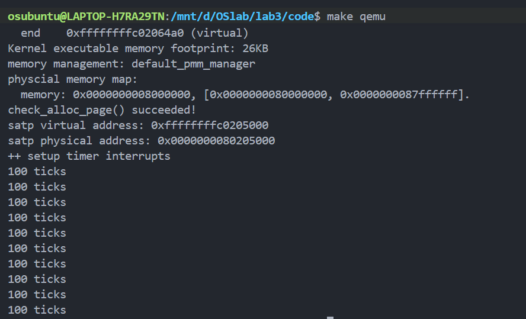

# <center>Lab3 实验报告</center>
<center>宋昊谦 尹浩燃 穆浩宁</center>

## 练习1：完善中断处理（需要编程）

本次练习的目标是完善 `kern/trap/trap.c` 中的中断处理函数，使其能够正确响应 S 模式（Supervisor Mode）的时钟中断（`IRQ_S_TIMER`）。

要求如下：
1.  在每次时钟中断发生时，必须重新设置下一次时钟中断，以保证时钟中断的周期性。
2.  操作系统维护一个全局计数器 `ticks`（在 `clock.c` 中定义）。
3.  每当 `ticks` 计数器累加到 100 次时，调用 `print_ticks()` 子程序，在屏幕上打印 "100 ticks"。
4.  在 "100 ticks" 打印满 10 次后，调用 `sbi.h` 中的 `sbi_shutdown()` (或 `shut_down()`) 函数关闭系统。

---

### 实现过程

**1. 修改文件：** `kern/trap/trap.c`

**2. 包含头文件：**
为了能够调用 `sbi_shutdown()` 函数，需要在 `trap.c` 的文件顶部添加 `sbi.h` 头文件。
```c
#include <sbi.h>
```

**3. 添加静态变量：**
为了追踪 "100 ticks" 的打印次数，我们在 `trap.c` 中定义了一个静态全局变量 `print_num`，并初始化为 0。

```c
static int print_num = 0;
```

**4. 完善 `interrupt_handler`：**
我们定位到 `interrupt_handler` 函数中的 `case IRQ_S_TIMER:` 分支，并填充以下逻辑：

  * **设置下次中断**：首先调用 `clock_set_next_event()`。这是最关键的一步，它通过 SBI 调用 `sbi_set_timer` 来设置下一次时钟中断的触发时间。如果缺少这一步，时钟中断将只会触发一次。
  * **累加 ticks**：`ticks++`，递增全局时钟中断计数器。
  * **判断 100 次中断**：使用 `if (ticks % TICK_NUM == 0)` 判断是否达到了 100 次中断。
  * **打印与计数**：如果达到 100 次，则调用 `print_ticks()` 打印信息，并将我们自定义的打印计数器 `print_num` 加一。
  * **判断 10 次打印**：在 `print_num` 增加后，立刻检查 `if (print_num == 10)`。
  * **关机**：如果 "100 ticks" 已经打印了 10 次，则调用 `sbi_shutdown()` 关闭 QEMU。

```c
case IRQ_S_TIMER:
    // "All bits besides SSIP and USIP in the sip register are
    // read-only." -- privileged spec1.9.1, 4.1.4, p59
    // In fact, Call sbi_set_timer will clear STIP, or you can clear it
    // directly.
    // cprintf("Supervisor timer interrupt\n");

    /* LAB3 EXERCISE1   YOUR CODE : 2312220 */
    /*(1)设置下次时钟中断- clock_set_next_event()
        *(2)计数器（ticks）加一
        *(3)当计数器加到100的时候，我们会输出一个`100ticks`表示我们触发了100次时钟中断，
        同时打印次数（num）加一
        * (4)判断打印次数，当打印次数为10时，调用<sbi.h>中的关机函数关机
        */

    // (1) 设置下次时钟中断
    clock_set_next_event();

    // (2) 计数器（ticks）加一 (ticks 在 clock.c 中定义, clock.h 提供了声明)
    ticks++;

    // (3) 检查是否达到 TICK_NUM (100)
    if (ticks % TICK_NUM == 0) {
        // 输出 "100 ticks"
        print_ticks();
        
        // 打印次数（num）加一
        print_num++;

        // (4) 判断打印次数是否达到 10 次
        if (print_num == 10) {
            // 关机
            sbi_shutdown();
        }
    }
    break;
```
### 定时器中断处理流程

1.  **硬件触发**：当 `time` 寄存器的值达到 `sbi_set_timer` 设定的目标值时，硬件触发一个 S 模式时钟中断。
2.  **CPU 陷入**：CPU 响应中断，自动执行以下操作：
      * 将当前 `pc`（程序计数器）保存到 `sepc` 寄存器。
      * 在 `scause` 寄存器中设置中断原因（`IRQ_S_TIMER`，最高位为1）。
      * 清除 `sstatus` 寄存器中的 `SIE` 位，禁用 S 模式中断，防止中断嵌套。
      * 跳转到 `stvec` 寄存器指向的地址，即 `kern/trap/trapentry.S` 中的 `__alltraps`。
3.  **汇编入口 (`__alltraps`)**：
      * 执行 `SAVE_ALL` 宏，将所有通用寄存器和 `sepc`, `sstatus`, `scause` 等 CSR 按照 `trapframe` 结构体的布局压入内核栈。
      * `move a0, sp`：将指向 `trapframe` 的栈顶指针 `sp` 放入 `a0` 寄存器，作为 C 函数的第一个参数。
      * `jal trap`：跳转并链接，调用 `kern/trap/trap.c` 中的 `trap` 函数。
4.  **C 语言分发 (`trap.c`)**：
      * `trap(struct trapframe *tf)` 函数被调用。
      * `trap_dispatch(tf)` 检查 `tf->cause` 的最高位。因为是中断（负数），所以调用 `interrupt_handler(tf)`。
5.  **C 语言处理 (`interrupt_handler`)**：
      * 函数内的 `switch` 语句根据 `cause` 值跳转到 `case IRQ_S_TIMER:`。
      * **执行我们的代码**：
        1.  调用 `clock_set_next_event()` 设置下一次时钟中断。
        2.  `ticks++`。
        3.  `if (ticks % 100 == 0)` 成立，调用 `print_ticks()`，`print_num++`。
        4.  `if (print_num == 10)` 成立，调用 `sbi_shutdown()`。
      * `break` 后，`interrupt_handler`, `trap_dispatch`, `trap` 函数逐层返回。
6.  **汇编返回 (`__trapret`)**：
      * 执行流回到 `trapentry.S` 中 `jal trap` 的下一条指令。
      * 执行 `RESTORE_ALL` 宏，从内核栈上的 `trapframe` 中恢复所有寄存器，包括 `sepc` 和 `sstatus`。
      * 执行 `sret`（Supervisor Return）特权指令。
7.  **CPU 恢复**：硬件自动执行以下操作：
      * 从 `sepc` 恢复 `pc`。
      * 根据 `sstatus.SPIE` 恢复 `sstatus.SIE`（重新使能中断）。
      * 返回到被中断的指令继续执行。

-----

### 运行结果

在 `lab3/code` 目录下执行 `make qemu`，系统编译运行，输出结果如下。可以看到系统正确地打印了 10 行 "100 ticks"，随后 QEMU 模拟器自动退出（ `sbi_shutdown()` 执行成功）。


## Challenge1：描述与理解中断流程
1. 异常处理的步骤如下：  
异常产生后，系统先将中断或异常发生时的 `pc` 值保存到 `sepc` 寄存器中，然后记录中断或异常的类型并保存在 `scause` 寄存器中，接下来保存相关辅助信息在 `stval` 寄存器中以便中断处理程序在后续处理中使用。  
之后保存并修改中断使能状态。将当前的中断使能状态 `sstatus.SIE` 保存到 `sstatus.SPIE` 中，并且会将 `sstatus.SIE` 清零，从而禁用 S 模式下的中断。这是为了保证在处理中断时不会被其他中断打断。  
随后保存当前的特权级信息。将当前特权级保存到 `sstatus.SPP` 中，并将当前特权级切换到 S 模式。然后 `pc` 会跳转到寄存器 `stvec` 保存的地址执行指令，由于内核初始化时将该寄存器设置为 `__alltraps`，所以会跳转到 `trapentry.S` 中的 `__alltraps` 标签处执行。  
接着保存所有的寄存器，然后执行 `mov a0,sp` 将 `sp` 保存到 `a0` 中，之后跳转到 `trap` 函数继续执行。  
最后调用 `trap_dispatch` 函数，判断异常是中断还是异常，分别跳转到对应的处理函数 `interrupt_handler` 或 `exception_handler` 处根据 `cause` 的值执行相应的处理程序。

2. 执行 `mov a0,sp` 是因为根据 RISC-V 的函数调用规范，a0~a7 寄存器用来存储函数参数。将该结构体的首地址保存在寄存器 `a0` 中，`a0` 寄存器传递参数给接下来调用的函数 `trap`。

3. 寄存器保存的位置是由结构体 `trapframe` 决定的，`trapframe` 中依次定义这些寄存器，保存的时候从栈顶向低地址依次分配空间。

4. 需要保存所有的寄存器。这些寄存器将作为函数 `trap` 参数的一部分，如果不保存所有寄存器，函数参数不完整。

## Challenge2：理解上下文切换机制
1. `csrw sscratch, sp`：将 `sp` 的值赋值给 `sscratch`，即保存原先的栈顶指针到 `sscratch`。  
2. `csrrw s0, sscratch, x0`：将 `sscratch` 赋值给 `s0`，然后将 `sscratch` 置 0。s0 用来表示函数调用前栈顶的位置。将 `sscratch` 置 0 的话如果产生递归异常，异常向量就会知道它来自于内核。  
3. 首先异常已经由 `trap` 处理过了，没有必要再去还原那两个 csr。而且 `stval` 和 `scause` 包含有关导致异常或中断的相关信息，在之后处理异常或中断时可能仍然需要，保留这两个 csr 的值方便在未来的异常或中断处理程序中，读取它们的值以确定异常的原因或其他相关信息。将这些状态寄存器作为参数的一部分传递给 `trap` 函数，确保在处理异常或中断时保留关键的执行上下文，处理异常效率更高。

## Challenge3：完善异常中断（Illegal Instruction 与 Breakpoint）

**目标**：当触发一条**非法指令**或**断点（`ebreak`）**时，在 `exception_handler` 中正确捕获并处理：  
- 打印：  
  - `Exception type: Illegal instruction` 与 `Illegal instruction caught at 0x(地址)`  
  - `Exception type: breakpoint` 与 `ebreak caught at 0x(地址)`  
- 关键：**更新 `tf->epc`** 跳过当前异常指令，避免反复陷入同一条指令。

### 一个值得注意的点
RISC‑V 支持 16 位（RVC）与 32 位指令：若 `*(uint16_t*)epc` 的低两位不等于 `0b11`，则当前为 16 位指令，应使 `epc += 2`；否则为 32 位指令，应使 `epc += 4`：
```c
static inline uintptr_t rv_next_step(uintptr_t epc) {
    unsigned short half = *(unsigned short *)epc;
    return ((half & 0x3) != 0x3) ? 2 : 4;
}
```

### `trap.c` 中的实现
```c
case CAUSE_ILLEGAL_INSTRUCTION:
    cprintf("Exception type: Illegal instruction\n");
    cprintf("Illegal instruction caught at 0x%08x\n", tf->epc);
    tf->epc += rv_next_step(tf->epc);  // 跳过当前指令继续执行
    break;

case CAUSE_BREAKPOINT:
    cprintf("Exception type: breakpoint\n");
    cprintf("ebreak caught at 0x%08x\n", tf->epc);
    tf->epc += rv_next_step(tf->epc);  // 跳过当前指令继续执行
    break;
```


### 触发与验证
我们在 `trap.c` 中提供了两个测试函数用于主动触发异常：
```c
__attribute__((noinline)) void test_breakpoint(void) {
    cprintf("\n=== [TEST] breakpoint begin ===\n");
    asm volatile("ebreak");
    cprintf("[TEST] breakpoint returned\n");
}

__attribute__((noinline)) void test_illegal(void) {
    cprintf("\n=== [TEST] illegal begin (32-bit) ===\n");
    asm volatile(".align 2\n\t"
                 ".word 0xFFFFFFFF\n\t");
    cprintf("[TEST] illegal 32-bit returned\n");

    cprintf("\n=== [TEST] illegal begin (16-bit) ===\n");
    asm volatile(".2byte 0x0000\n\t");
    cprintf("[TEST] illegal 16-bit returned\n");
}
```

并在trap.h中添加上这两个函数方便调用；

在init.c中调用：
```c
test_breakpoint();
test_illegal();
```


### 预期输出
```
=== [TEST] breakpoint begin ===
Exception type: breakpoint
ebreak caught at 0xC0200C16
[TEST] breakpoint returned

=== [TEST] illegal begin (32-bit) ===
Exception type: Illegal instruction
Illegal instruction caught at 0xC0200C38
[TEST] illegal 32-bit returned

=== [TEST] illegal begin (16-bit) ===
Exception type: Illegal instruction
Illegal instruction caught at 0xC0200C4A
[TEST] illegal 16-bit returned
```

### 遇见的问题与规避
- **无限循环打印 Illegal instruction**：未更新 `tf->epc` 或误判指令长度（对 RVC 错加 4）。使用 `rv_next_step()`得以解决。  
- **对齐问题**：32 位非法指令前加 `.align 2`；16 位非法指令无需额外对齐。

---

**结论**：通过在 `exception_handler` 中对 `CAUSE_ILLEGAL_INSTRUCTION` 与 `CAUSE_BREAKPOINT` 分支分别打印标准化信息并精确推进 `tf->epc`（+2/+4），系统可在触发异常后准确返回并继续执行，满足 Challenge3 要求。

**相关日志输出**
```c
check_alloc_page() succeeded!
satp virtual address: 0xffffffffc0206000
satp physical address: 0x0000000080206000

=== [TEST] breakpoint begin ===
Exception type: breakpoint
ebreak caught at 0xc0200c16
[TEST] breakpoint returned

=== [TEST] illegal begin (32-bit) ===
Exception type: Illegal instruction
Illegal instruction caught at 0xc0200c38
[TEST] illegal 32-bit returned

=== [TEST] illegal begin (16-bit) ===
Exception type: Illegal instruction
Illegal instruction caught at 0xc0200c54
[TEST] illegal 16-bit returned
++ setup timer interrupts
...
```
