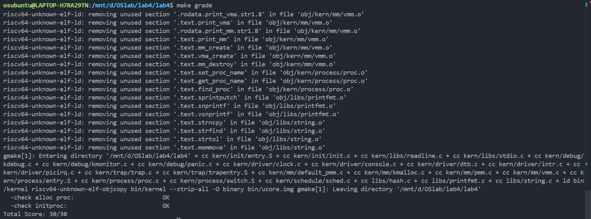

# <center>Lab4 实验报告</center>

<center>宋昊谦 尹浩燃 穆浩宁</center>

## 练习1：分配并初始化一个进程控制块（需要编码）

### 问题

alloc_proc函数（位于kern/process/proc.c中）负责分配并返回一个新的struct proc_struct结构，用于存储新建立的内核线程的管理信息。ucore需要对这个结构进行最基本的初始化，你需要完成这个初始化过程。

> 【提示】在alloc_proc函数的实现中，需要初始化的proc_struct结构中的成员变量至少包括：state/pid/runs/kstack/need_resched/parent/mm/context/tf/pgdir/flags/name。

请在实验报告中简要说明你的设计实现过程。请回答如下问题：

-   请说明proc_struct中`struct context context`和`struct trapframe *tf`成员变量含义和在本实验中的作用是啥？（提示通过看代码和编程调试可以判断出来）

### 解答

#### 设计实现

我们首先在 `proc.c` 的 `alloc_proc` 函数中查看 `proc_struct` 结构需要初始化的字段（如注释所示）：

```c
         /*
         * below fields in proc_struct need to be initialized
         * enum proc_state state;                      // Process state
         * int pid;                                    // Process ID
         * int runs;                                   // the running times of Proces
         * uintptr_t kstack;                           // Process kernel stack
         * volatile bool need_resched;                 // bool value: need to be rescheduled to release CPU?
         * struct proc_struct *parent;                 // the parent process
         * struct mm_struct *mm;                       // Process's memory management field
         * struct context context;                     // Switch here to run process
         * struct trapframe *tf;                       // Trap frame for current interrupt
         * uintptr_t pgdir;                            // the base addr of Page Directroy Table(PDT)
         * uint32_t flags;                             // Process flag
         * char name[PROC_NAME_LEN + 1];               // Process name
         */
```

我们需要做的就是将这些变量进行初始化。

根据指导书上的提示和后续 `proc_init` 中的检查，设置进程为“初始”态，我们使用 `PROC_UNINIT`；设置进程 pid 的未初始化值，我们使用 -1；使用内核页目录表的基址，我们使用 `boot_pgdir_pa`。

我们的设计如下所示：

```c
static struct proc_struct *
alloc_proc(void)
{
    struct proc_struct *proc = kmalloc(sizeof(struct proc_struct));
    if (proc != NULL)
    {
        // LAB4:EXERCISE1 YOUR CODE
        /*
         * below fields in proc_struct need to be initialized
         * enum proc_state state;                      // Process state
...
         * char name[PROC_NAME_LEN + 1];               // Process name
         */
        proc->state = PROC_UNINIT;          // Process state
        proc->pid = -1;                     // Process ID
        proc->runs = 0;                     // the running times of Proces
        proc->kstack = 0;                   // Process kernel stack
        proc->need_resched = 0;             // bool value: need to be rescheduled
        proc->parent = NULL;                // the parent process
        proc->mm = NULL;                    // Process's memory management field
        memset(&(proc->context), 0, sizeof(struct context)); // Switch here to run process
        proc->tf = NULL;                    // Trap frame for current interrupt
        // 注意: 目标代码 (RISC-V) 使用 pgdir, 参考代码 (x86) 使用 cr3
        // 我们使用目标代码的变量
        proc->pgdir = boot_pgdir_pa;        // the base addr of Page Directroy Table(PDT)
        proc->flags = 0;                    // Process flag
        // 目标代码中 name 数组大小为 PROC_NAME_LEN + 1
        memset(&(proc->name), 0, PROC_NAME_LEN + 1); // Process name
    }
    return proc;
}
```

**解释：**

  * `state`：设置进程为初始态 `PROC_UNINIT`。
  * `pid`：未初始化的进程号设置为 -1。
  * `runs`：刚刚初始化的进程，运行时间设置为 0。
  * `pgdir`：使用内核页目录表的物理基址 `boot_pgdir_pa`。
  * `kstack`：内核栈地址, 尚未分配，初始化为 0。
  * `need_resched`：是否需要调度。初始化的过程中我们不需要对其进行调度，因此设置为 0。
  * `parent`：父进程为空，设置为 `NULL`。
  * `mm`：虚拟内存为空，设置为 `NULL`。
  * `tf`：中断帧指针为空，设置为 `NULL`。
  * `flags`：标志位 `flags` 设置为 0。
  * `memset(&proc->name, 0, ...)`：进程名 `name` 初始化为 0。
  * `memset(&proc->context, 0, ...)`：初始化上下文，将上下文结构体 `context` 初始化为 0。

通过以上的代码，我们就可以完成 PCB 的分配和初始化。

#### 问题

##### **`struct context context`**
context 保存了进程在内核态进行上下文切换（Context Switch）时所需的寄存器状态。根据 RISC-V 的调用约定（Calling Convention），这里只保存被调用者保存（Callee-saved） 的寄存器（s0-s11），以及返回地址寄存器（ra）和栈指针（sp）。

**作用**：
* 进程切换：当内核调用`schedule`函数决定剥夺当前进程 CPU 并让另一个进程运行时，会调用 `proc_run`，进而调用汇编函数`switch_to`。

* 保存与恢复：`switch_to`会将当前处理器上正在运行的进程（prev）的寄存器值保存到其 `proc_struct->context` 中，并从目标进程（next）的 `proc_struct->context` 中加载寄存器值。

* 流控制：通过恢复 `ra` 寄存器，当 `switch_to` 执行 `ret` 指令时，CPU 会跳转到目标进程上次被挂起的位置（或者是新进程的 forkret）继续执行，从而实现执行流的切换。

**`context` 结构分析**（定义在 `proc.h` 中）：

```c
    struct context {
        uintptr_t ra;   // 返回地址
        uintptr_t sp;   // 栈指针
        uintptr_t s0;   // 被调用者保存的寄存器
        uintptr_t s1;
        uintptr_t s2;
        uintptr_t s3;
        uintptr_t s4;
        uintptr_t s5;
        uintptr_t s6;
        uintptr_t s7;
        uintptr_t s8;
        uintptr_t s9;
        uintptr_t s10;
        uintptr_t s11;
    };
    //ra：返回地址寄存器，用于保存函数调用后的返回地址。
    //sp：栈指针寄存器，指向当前线程的栈顶。
    //s0 到 s11：这些是保存寄存器，用于保存临时数据，它们在函数调用时不需要被保存和恢复，因为它们不会被调用者所保留。
```

**为什么不保存所有寄存器？**

因为线程切换（`switch_to`）本身是一个函数调用，编译器会自动处理**调用者保存**寄存器（如 `t0-t6`, `a0-a7`），这些寄存器压栈或视为无需保留。`switch_to` 只需要手动保存和恢复那些编译器期望在函数调用后保持不变的**被调用者保存** 寄存器（`s0-s11`）以及 `ra` (返回地址) 和 `sp` (栈指针) 即可。


##### **`struct trapframe *tf`**

`tf`（中断帧）指向内核栈顶部的一个结构体，用于保存进程在发生中断（Interrupt）、异常（Exception）或系统调用（System Call）瞬间的完整 CPU 执行现场。它包含了所有通用寄存器（32个）、以及 `epc`（异常程序计数器）、`sstatus`（状态寄存器）等硬件状态信息。

**作用**：

1.  **中断处理**：当进程在运行时发生中断，CPU 的所有状态被保存在内核栈顶的 `trapframe` 中，`proc->tf` 会指向它。当中断处理完毕返回时，`__trapret` 会从 `tf` 中恢复所有寄存器，使进程无缝继续执行。

2.  **新线程启动**：在本实验中，`tf` 被用于设置新内核线程的**初始启动状态**。

* 在创建新内核线程（kernel_thread -> do_fork）时，我们并没有一个真实的“中断现场”。

* 因此，代码中手动构造了一个临时的 trapframe，并将其复制到新线程内核栈的顶部。

* 参数传递：利用 tf->gpr.s0 和 tf->gpr.s1 传递线程函数指针 fn 和参数 arg。

* 入口设定：将 tf->epc 设置为 kernel_thread_entry。

* 启动逻辑：当新线程首次被调度运行时，它会先经由 switch_to 跳转到 forkret，再跳转到 forkrets，最后执行 __trapret。__trapret 会将栈顶 tf 中的内容弹出到寄存器中。此时，CPU 的 pc 指针会变成 kernel_thread_entry，从而让新线程“好像”是从中断返回一样，开始执行指定的函数。

首先，`kernel_thread` 在栈上创建了一个**临时的 `trapframe`**，并填充了新线程的启动信息：
```c
int kernel_thread(int (*fn)(void *), void *arg, uint32_t clone_flags)
{
    struct trapframe tf;
    memset(&tf, 0, sizeof(struct trapframe));
    tf.gpr.s0 = (uintptr_t)fn; // s0 = 线程要执行的函数,保存函数指针
    tf.gpr.s1 = (uintptr_t)arg; // s1 = 保存函数参数
    tf.status = (read_csr(sstatus) | SSTATUS_SPP | SSTATUS_SPIE) & ~SSTATUS_SIE;
    tf.epc = (uintptr_t)kernel_thread_entry; // 线程入口点
    return do_fork(clone_flags | CLONE_VM, 0, &tf);
}
```
然后，`do_fork` 调用 `copy_thread`，将这个临时的 `tf` 复制到新线程**内核栈的顶部**，并**设置 `context` 以启动它**：
```c
static void
copy_thread(struct proc_struct *proc, uintptr_t esp, struct trapframe *tf)
{
    // 1. 将 proc->tf 指向内核栈顶的一个 trapframe 大小的空间
    proc->tf = (struct trapframe *)(proc->kstack + KSTACKSIZE - sizeof(struct trapframe));
    // 2. 将 kernel_thread 中设置的临时 tf 复制过来
    *(proc->tf) = *tf;

    // 3. 设置子进程的返回值为 0 (a0 寄存器)
    proc->tf->gpr.a0 = 0;
    proc->tf->gpr.sp = (esp == 0) ? (uintptr_t)proc->tf : esp;

    // 4. 设置 context 的 ra (返回地址) 为 forkret
    // 这是 switch_to 恢复后 JUMP 的地方
    proc->context.ra = (uintptr_t)forkret;
    // 5. 设置 context 的 sp (栈指针) 指向刚设置好的 trapframe
    // 这是 forkret -> forkrets -> __trapret 需要用到的
    proc->context.sp = (uintptr_t)(proc->tf);
}
```
* `tf.epc` (程序计数器) 被设置为 `kernel_thread_entry`，即线程的入口点。
* `tf.gpr.s0` 和 `tf.gpr.s1` 被用来传递新线程要执行的**函数指针** (`fn`) 和**参数** (`arg`)。
* `proc->tf->gpr.a0` 被设置为 0，以便子进程（线程）知道自己是子进程。
* 新线程的 `context.ra` 被设置为 `forkret`，在 `switch_to` 首次恢复后，会跳转到 `forkret`，`forkret` 再调用 `forkrets`，最终通过 `__trapret` 从 `tf` 中恢复状态，跳转到 `epc` (`kernel_thread_entry`) 开始执行。

**`trapframe` 结构分析**（定义不在 `trap.h` 中）
```c
// 32个通用寄存器 (gpr)
struct pushregs
{
    uintptr_t zero; // Hard-wired zero
    uintptr_t ra;   // Return address
    uintptr_t sp;   // Stack pointer
    uintptr_t gp;   // Global pointer
    uintptr_t tp;   // Thread pointer
    uintptr_t t0;   // Temporary
    uintptr_t t1;   // Temporary
    uintptr_t t2;   // Temporary
    uintptr_t s0;   // Saved register/frame pointer
    uintptr_t s1;   // Saved register
    uintptr_t a0;   // Function argument/return value
    uintptr_t a1;   // Function argument/return value
    uintptr_t a2;   // Function argument
    uintptr_t a3;   // Function argument
    uintptr_t a4;   // Function argument
    uintptr_t a5;   // Function argument
    uintptr_t a6;   // Function argument
    uintptr_t a7;   // Function argument
    uintptr_t s2;   // Saved register
    uintptr_t s3;   // Saved register
    uintptr_t s4;   // Saved register
    uintptr_t s5;   // Saved register
    uintptr_t s6;   // Saved register
    uintptr_t s7;   // Saved register
    uintptr_t s8;   // Saved register
    uintptr_t s9;   // Saved register
    uintptr_t s10;  // Saved register
    uintptr_t s11;  // Saved register
    uintptr_t t3;   // Temporary
    uintptr_t t4;   // Temporary
    uintptr_t t5;   // Temporary
    uintptr_t t6;   // Temporary
};

struct trapframe {
    struct pushregs gpr; // 32个通用寄存器
    uintptr_t status;    // sstatus 寄存器
    uintptr_t epc;       // 异常程序计数器
    uintptr_t badvaddr;  // 异常虚拟地址
    uintptr_t cause;     // 异常原因
};
```

* **总结：`context` 与 `tf` 的关系**

    `context` 和 `tf` 都是用于保存寄存器状态，但目的和时机完全不同：

* Context 用于进程之间的主动/被动切换（Switch），只保存 Callee-saved 寄存器，发生在内核态函数调用层面。

* Trapframe 用于中断/异常/系统调用处理，保存完整现场，发生在用户态与内核态之间或硬件中断层面。在本实验中，它特别用于构造新线程的初始执行上下文。

| 特性 | `struct context context` (上下文) | `struct trapframe *tf` (中断帧) |
| :--- | :--- | :--- |
| **保存内容** | **不完整**的 CPU 状态。<br>仅含 Callee-saved 寄存器 (`ra`, `sp`, `s0`-`s11`)。 | **完整**的 CPU 状态。<br>包括所有 GPRs, `epc`, `sstatus` 等。 |
| **保存时机** | 进程**主动**切换时（`schedule` -> `proc_run` -> `switch_to`）。 | 进程**被动**打断时（中断、异常、系统调用）。 |
| **保存位置** | `proc->context` 结构体成员变量中。 | `proc->kstack` (内核栈) 的**顶部**。`proc->tf` 指向此位置。 |
| **本实验作用** | **1. 切换**：在 `switch_to` 中保存旧进程、恢复新进程。<br>**2. 启动**：`context.ra` 被设为 `forkret`，`context.sp` 被设为 `tf` 的地址，用于**引导**新线程的首次运行。 | **1. 启动**：作为新线程的**启动模板**，预设了 `epc` (入口点) 和 `s0`/`s1` (参数)。<br>**2. 中断**：(在后续实验中) 保存中断现场。 |

<!-- end list -->


## 练习2：为新创建的内核线程分配资源（需要编码）

### 问题

创建一个内核线程需要分配和设置好很多资源。kernel_thread函数通过调用**do_fork**函数完成具体内核线程的创建工作。do_kernel函数会调用alloc_proc函数来分配并初始化一个进程控制块，但alloc_proc只是找到了一小块内存用以记录进程的必要信息，并没有实际分配这些资源。ucore一般通过do_fork实际创建新的内核线程。do_fork的作用是，创建当前内核线程的一个副本，它们的执行上下文、代码、数据都一样，但是存储位置不同。因此，我们**实际需要"fork"的东西就是stack和trapframe**。在这个过程中，需要给新内核线程分配资源，并且复制原进程的状态。你需要完成在kern/process/proc.c中的do_fork函数中的处理过程。它的大致执行步骤包括：

- 调用alloc_proc，首先获得一块用户信息块。
- 为进程分配一个内核栈。
- 复制原进程的内存管理信息到新进程（但内核线程不必做此事）
- 复制原进程上下文到新进程
- 将新进程添加到进程列表
- 唤醒新进程
- 返回新进程号

请在实验报告中简要说明你的设计实现过程。请回答如下问题：

- 请说明ucore是否做到给每个新fork的线程一个唯一的id？请说明你的分析和理由。


### 解答

#### 设计实现

我们在 `do_fork` 函数中严格按照指导书给出的 7 步顺序实现了内核线程的创建，核心代码及注释如下：

```c
int do_fork(uint32_t clone_flags, uintptr_t stack, struct trapframe *tf) {
    int ret = -E_NO_FREE_PROC;
    struct proc_struct *proc;
    if (nr_process >= MAX_PROCESS) {
        goto fork_out;
    }
    ret = -E_NO_MEM;

    // 1. 调用 alloc_proc 分配并初始化进程控制块
    if ((proc = alloc_proc()) == NULL) {
        goto fork_out;
    }
    proc->parent = current;                          // 设置父进程为当前进程

    // 2. 为新进程分配内核栈（2 个连续页，16KB）
    if (setup_kstack(proc) != 0) {
        goto bad_fork_cleanup_proc;
    }

    // 3. 复制内存管理信息（本实验中内核线程共享内核地址空间，无需复制）
    //    copy_mm 中断言 current->mm == NULL，直接返回 0
    if (copy_mm(clone_flags, proc) != 0) {
        goto bad_fork_cleanup_kstack;
    }

    // 4. 复制线程执行上下文：中断帧 + 进程上下文
    //    将父进程的中断帧复制到子进程内核栈顶，并设置首次执行路径
    copy_thread(proc, stack, tf);

    // 5. 将新进程插入全局进程链表和哈希表，便于查找与调度
    bool intr_flag;
    local_intr_save(intr_flag);
    {
        proc->pid = get_pid();       // 分配唯一 pid
        hash_proc(proc);             // 插入 pid 哈希表
        list_add(&proc_list, &(proc->list_link));  // 插入全局进程链表
        nr_process++;                // 全局进程数加 1
    }
    local_intr_restore(intr_flag);

    // 6. 将新进程状态设为就绪，加入运行队列
    wakeup_proc(proc);

    // 7. 返回子进程 pid
    ret = proc->pid;

fork_out:
    return ret;

bad_fork_cleanup_kstack:
    put_kstack(proc);
bad_fork_cleanup_proc:
    kfree(proc);
    goto fork_out;
}
```
**解释：**
`proc->parent = current;`：设置父进程指针，便于后续进程回收和调试；
`setup_kstack` 分配 2 页（`KSTACKPAGE = 2`）作为内核栈，保证栈空间足够且 4K 对齐；
`copy_thread` 将父进程的 `trapframe` 复制到子进程内核栈顶，并设置：
* `proc->tf->gpr.a0 = 0`（子进程返回值 0）
* `proc->context.ra = (uintptr_t)forkret`（首次调度时从 `forkret` 开始执行）
* `proc->context.sp = (uintptr_t)proc->tf`（`forkret` 调用 `forkrets` 恢复中断帧）

使用 `local_intr_save/restore` 保护 `nr_process` 和链表操作的原子性；
所有失败路径均正确清理已分配资源，避免内存泄漏。
#### 问题：ucore 是否给每个新 fork 的线程分配唯一的 id？
#### 答案：是的，ucore 保证了每个新 fork 的内核线程拥有全局唯一的 pid。
我们分析对应的函数`get_pid`：

```c++
static int get_pid(void) {
    static int last_pid = 0;        // 上次分配的 pid（实验中实际从 1 开始）
    static int next_safe = MAX_PID;

    do {
        last_pid++;
        if (last_pid >= MAX_PROCESS) last_pid = 1;

        // 检查该 pid 是否已被占用
        list_entry_t *list = &proc_list, *le = list;
        while ((le = list_next(le)) != list) {
            struct proc_struct *p = le2proc(le, list_link);
            if (p->pid == last_pid) {
                last_pid = p->pid;  // 冲突，继续尝试下一个
                break;
            }
        }
    } while (le != list);  // 如果发生冲突，重新遍历

    return last_pid;
}
```
##### 关键机制保证唯一性：
* 自增 + 回绕机制：从 1 开始递增，到达 `MAX_PID` 时回绕到 1；
* 冲突检测：每次尝试一个候选 `pid` 时，都会遍历当前所有进程的 `proc_list`，检查是否已有进程使用该 `pid`；
* 循环重试：若发现冲突，则继续递增并重新检查，直到找到未被使用的 `pid` 为止；
* 并发安全：在 `do_fork` 中插入进程到链表前使用 `local_intr_save` 关中断，保证 `get_pid` 和链表插入的原子性，避免并发分配相同 `pid`。

因此，在单核、无并发创建进程的当前实验环境下，该机制绝对保证了 `pid` 的全局唯一性，即使进程退出后其 `pid` 也不会被立即重用（因为退出进程仍存在于链表中，直到父进程回收）。


## 练习3：编写proc_run 函数（需要编码）

### 问题

proc_run用于将指定的进程切换到CPU上运行。它的大致执行步骤包括：

- 检查要切换的进程是否与当前正在运行的进程相同，如果相同则不需要切换。
- 禁用中断。你可以使用`/kern/sync/sync.h`中定义好的宏`local_intr_save(x)`和`local_intr_restore(x)`来实现关、开中断。
- 切换当前进程为要运行的进程。
- 切换页表，以便使用新进程的地址空间。`/libs/riscv.h`中提供了`lcr3(unsigned int cr3)`函数，可实现修改CR3寄存器值的功能。
- 实现上下文切换。`/kern/process`中已经预先编写好了`switch.S`，其中定义了`switch_to()`函数。可实现两个进程的context切换。
- 允许中断。

请回答如下问题：

- 在本实验的执行过程中，创建且运行了几个内核线程？

完成代码编写后，编译并运行代码：make qemu


### 解答

#### 代码实现

根据问题描述，`proc_run` 函数的实现步骤如下：

```c
void proc_run(struct proc_struct *proc) {
    // 如果目标进程和当前进程相同，则不需要切换
    if (proc != current) {
        bool intr_flag;
        // 保存当前进程为 prev_proc
        struct proc_struct *prev_proc = current;

        // 禁用中断，并保存当前中断状态
        local_intr_save(intr_flag);

        {
            // 更新当前进程为目标进程
            current = proc;

            // 切换到新进程的页表（通过修改 SATP 寄存器）
            lsatp(proc->pgdir);

            // 切换上下文，保存当前进程的状态，并恢复新进程的状态
            switch_to(&(prev_proc->context), &(proc->context));
        }

        // 恢复中断状态
        local_intr_restore(intr_flag);
    }
}
```

#### 代码解释

1. **检查当前进程是否与目标进程相同：**
   - 如果目标进程和当前进程相同，则不需要切换进程，直接跳过切换操作。

2. **禁用中断：**
   - 通过 `local_intr_save(intr_flag)` 禁用中断，并保存当前中断状态。

3. **切换当前进程为目标进程：**
   - 将 `current` 变量更新为目标进程的 `proc`，标记当前正在运行的进程。

4. **切换页表：**
   - 调用 `lsatp(proc->pgdir)`，该函数用于修改 SATP 寄存器，以便切换到目标进程的地址空间。

5. **上下文切换：**
   - 调用 `switch_to` 函数来完成两个进程的上下文切换。`switch_to` 会保存当前进程的寄存器状态并恢复目标进程的寄存器状态，完成进程间的切换。

6. **恢复中断状态：**
   - 使用 `local_intr_restore(intr_flag)` 恢复之前保存的中断状态，确保中断在进程切换后能够正常进行。


#### 问题回答

**在本实验的执行过程中，创建且运行了几个内核线程？**

在本实验中，**创建并运行了两个内核线程**：

1. **idleproc**：第一个内核线程，主要用于操作系统启动后的空闲循环。当没有其他进程运行时，`idleproc` 会一直占用 CPU。

2. **initproc**：第二个内核线程，用于执行系统初始化后的一些任务。在本实验中，`initproc` 输出了一些简单的日志信息，作为示例进程。

#### 实验结果

在完成 `proc_run` 函数的编写并运行代码后，使用 `make qemu` 编译并启动虚拟机，能够看到 `initproc` 和 `idleproc` 在系统中轮流执行。`idleproc` 在没有其他进程需要执行时会占用 CPU，`initproc` 在系统初始化时运行，并输出日志信息。这证明了进程切换的成功实现。


## 实验结果




## 扩展练习 Challenge

### 问题一
说明语句 local_intr_save(intr_flag); .... local_intr_restore(intr_flag); 是如何实现开关中断的？

这两个宏通过保存和恢复“执行前的中断状态”来支持嵌套的临界区保护。其核心逻辑并不只是简单的“关”和“开”，而是“基于状态的恢复”。

#### 1. 代码实现解析

代码定义在 kern/sync/sync.h 中：
```c
static inline bool __intr_save(void) {
    // 读取 sstatus 寄存器，检查 SSTATUS_SIE (Supervisor Interrupt Enable) 位
    if (read_csr(sstatus) & SSTATUS_SIE) {
        // 如果当前中断是开启的 (SIE = 1)
        intr_disable(); // 执行关中断指令 (csrc sstatus, SSTATUS_SIE)
        return 1;       // 返回 1，表示“之前是开着的”
    }
    // 如果当前中断已经是关闭的
    return 0;           // 返回 0，表示“之前就是关着的”
}

static inline void __intr_restore(bool flag) {
    // 只有当 flag 为 1 时，才重新开启中断
    if (flag) {
        intr_enable(); // 执行开中断指令 (csrs sstatus, SSTATUS_SIE)
    }
}

// 宏定义封装
#define local_intr_save(x) \
    do {                   \
        x = __intr_save(); \
    } while (0)
#define local_intr_restore(x) __intr_restore(x);
```

#### 2. 执行流程详解

当调用 local_intr_save(intr_flag); 时，发生了以下步骤：

* 检查当前状态：系统首先通过 read_csr(sstatus) 读取当前的硬件状态。

* 保存状态到变量：
  
* 如果当前中断是开启的：__intr_save 会调用 intr_disable() 关闭中断，并返回 1。变量 intr_flag 被赋值为 1。
* 如果当前中断是关闭的（例如已经在另一个临界区内）：__intr_save 不做任何硬件操作，直接返回 0。变量 intr_flag 被赋值为 0。

* 执行临界区代码：此时，无论之前状态如何，现在的中断肯定是被禁用的，保证了操作的原子性。

当调用 local_intr_restore(intr_flag); 时：

* 检查保存的变量：查看 intr_flag 的值。

* 条件恢复：

* 如果 intr_flag 是 1：说明进入临界区前中断是开着的，因此现在调用 intr_enable() 恢复中断。

* 如果 intr_flag 是 0：说明进入临界区前中断本来就是关着的（嵌套调用），因此不执行开中断操作，继续保持关闭状态。

#### 为什么要这样设计？

这种设计是为了支持 嵌套临界区 (Nested Critical Sections)。

如果只是简单地使用 intr_disable() 和 intr_enable()，会遇到如下致命问题：

**场景**：函数 A 关了中断 -> 函数 A 调用函数 B -> 函数 B 关中断 -> 函数 B 开中断 -> 函数 B 返回。

**问题**：当函数 B 返回时，中断被函数 B 里的 intr_enable() 开启了。但此时还处于函数 A 的临界区内，函数 A 的后续操作失去了保护，可能导致竞态条件。

**ucore 的 save/restore 机制完美解决了这个问题**：

* 函数 A：local_intr_save(flagA)。flagA 变为 1，中断关闭。

* 函数 B：local_intr_save(flagB)。因为中断已被 A 关闭，__intr_save 检测到 SIE 为 0，返回 0。flagB 变为 0。

* 函数 B 结束：local_intr_restore(flagB)。因为 flagB 是 0，__intr_restore 什么也不做。中断保持关闭。

* 函数 A 继续：中断依然关闭，安全。

* 函数 A 结束：local_intr_restore(flagA)。因为 flagA 是 1，执行 intr_enable()。中断最终恢复。

### 问题二：深入理解不同分页模式的工作原理

`get_pte()`函数（位于`kern/mm/pmm.c`）用于在页表中查找或创建页表项，从而实现对指定线性地址对应的物理页的访问和映射操作。这在操作系统中的分页机制下，是实现虚拟内存与物理内存之间映射关系非常重要的内容。

#### 问题 1：get_pte() 代码相似性分析

**题目**： get_pte() 函数中有两段形式类似的代码，结合 SV32、SV39、SV48 的异同，解释这两段代码为什么如此相像。

**分析**：

在 pmm.c 的 get_pte 函数中，我们看到了类似这样的结构重复出现：
```c
    // 第一段：处理页目录表 (Level 2 in SV39)
    pde_t *pdep1 = &pgdir[PDX1(la)];
    if (!(*pdep1 & PTE_V)) {
        // 分配物理页，建立映射...
    }

    // 第二段：处理页表 (Level 1 in SV39)
    pde_t *pdep0 = &((pte_t *)KADDR(PDE_ADDR(*pdep1)))[PDX0(la)];
    if (!(*pdep0 & PTE_V)) {
        // 分配物理页，建立映射...
    }
```

**解释**：

* 多级页表的递归/迭代结构：


        无论是 SV32 (2级分页)、SV39 还是 SV48，它们的基本原理都是多级索引。

        每一级页表本质上都是一个“目录”，其中存储的条目（PTE）指向下一级页表的物理基地址。

* 处理每一级的逻辑是完全一致的：

        根据虚拟地址的某一部分（索引）找到当前级页表的条目。

        检查该条目是否有效（PTE_V）。

        如果无效且需要创建，则分配一个新的物理页作为下一级页表，并填充当前条目。

        如果有效，提取下一级页表的物理地址，转换由于内核虚拟地址，进入下一轮查找。

**代码相像的原因：**

这两段代码分别对应了页表遍历的不同层级。

`pdep1` 处理的是 `Page Directory (PD)` 到 `Page Table (PT)` 的中间层级。

`pdep0` 处理的是下一级。

在 SV39 模式下，虚拟地址被分为 `VPN[2] | VPN[1] | VPN[0] | Offset`。代码中的第一段处理 `VPN[1] (PDX1)`，第二段处理 `VPN[0] (PDX0)`。

由于每一层的数据结构（`PTE`）格式相同，处理逻辑（查表->判空->分配->链接）也相同，因此代码看起来非常相似。如果是 SV48，这种相似的代码块会有 3 段。

#### 问题 2：get_pte() 功能设计的优劣探讨

**题目**： 目前 get_pte() 函数将页表项的查找和页表项的分配合并在一个函数里，你认为这种写法好吗？有没有必要把两个功能拆开？

**回答**：

目前的写法（合并查找与分配）是合理且符合内核开发惯例的，但在某些追求极致模块化的场景下可以讨论拆分。

**1. 为什么合并是合理的：**

* 操作的原子意图：在操作系统内存管理中，调用 get_pte 的绝大多数场景（如 page_insert）都是“我要往这里写映射，给我一个可用的 PTE”。如果 PTE 不存在，调用者的意图隐含着“请帮我创建一个”，否则无法进行后续的映射。

* 减少代码冗余与性能开销：

  * 页表查找需要“游走”多级页表（Walk Page Table）。
  
  * 如果拆分成 find_pte() 和 alloc_pte()，当 find 失败后调用 alloc，alloc 内部必须再次从根节点开始遍历页表才能找到正确的位置去插入新页表。这会导致双倍的遍历开销（虽然 TLB 会缓存，但修改页表时往往涉及未缓存区域）。

  * 合并写法只需要遍历一次。


* 接口简洁：通过 bool create 参数控制行为，既满足了只读查找（create=0，如缺页异常时的检查），也满足了写入分配（create=1，如建立映射），接口通用性强。

**2. 某些场景拆分的理由：**

* 单一职责原则：get 函数通常不应产生分配内存的副作用。拆分可以让函数语义更纯粹。

* 错误处理粒度：如果内存分配逻辑极其复杂（例如涉及交换区、写时复制等复杂逻辑），耦合在一起可能导致函数过长。


