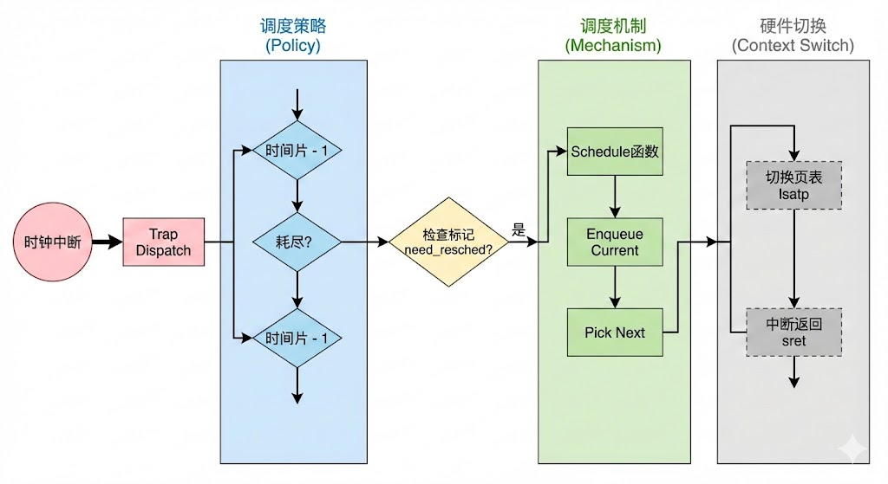

<style>
@media print {
    /* 允许代码块内部换页 */
    pre, code, .line-numbers {
        page-break-inside: auto !important;
        break-inside: auto !important;
    }
    
    /* 所有的段落和列表也允许截断（可选） */
    p, ul, ol {
        page-break-inside: auto !important;
        break-inside: auto !important;
    }
}
</style>
<style>
/* 强制隐藏所有 data-source-line 属性生成的文本 */
[data-source-line], 
code[data-source-line], 
pre[data-source-line] {
    display: block; /* 或者保持原样 */
}
/* 针对有些渲染器会把属性直接打印出来的特定修复 */
code::after, pre::after {
    content: "" !important;
}
</style>

# <center>Lab6 实验报告</center>

<center>调度器</center>

## 练习0：填写已有实验

本实验依赖于实验 2/3/4/5。为了支持 Lab 6 的调度框架，特别是时间片轮转（RR）和 Stride 调度算法，我们需要对已有的进程管理、内存管理和中断处理代码进行关键性的更新。以下是对主要修改的详细说明：

### 1. 修改 `alloc_proc` 函数 (kern/process/proc.c)

**修改原因：**
在 Lab 6 中，引入了更复杂的调度算法。为了支持这些算法，进程控制块（`struct proc_struct`）中新增了多个调度相关的成员变量，如运行队列链接、时间片、Stride 调度参数等。`alloc_proc` 作为进程创建的入口，必须负责将这些新成员初始化为安全合法的默认值，否则会导致调度器在访问这些未初始化的指针时崩溃。

**代码实现：**
我们在 `alloc_proc` 函数的末尾（在原有 Lab 4/5 代码之后）添加了以下初始化逻辑：

```c
static struct proc_struct *
alloc_proc(void) {
    struct proc_struct *proc = kmalloc(sizeof(struct proc_struct));
    if (proc != NULL) {
        // ... (Lab4/5 的初始化代码: state, pid, runs, kstack, need_resched, parent, mm, context, tf, pgdir ...) ...

        // [Lab 5 新增] 等待状态与进程关系链表
        proc->wait_state = 0; // 0 表示没有在等待
        proc->cptr = proc->optr = proc->yptr = NULL; // 家族关系指针置空

        // LAB6 2312580
        // 1. 初始化运行队列指针 (刚创建时未属于任何就绪队列)
        proc->rq = NULL;
        
        // 2. 初始化运行队列链表节点 (非常重要，防止 list_add 访问非法内存)
        list_init(&(proc->run_link));
        
        // 3. 时间片初始化
        proc->time_slice = 0; // 初始为0，调度器会在调度时根据策略分配

        // 4. Stride 调度算法参数初始化
        // 初始化斜堆节点 (Skew Heap Entry)
        proc->lab6_run_pool.left = proc->lab6_run_pool.right = proc->lab6_run_pool.parent = NULL;
        
        // Stride 值初始化为 0
        proc->lab6_stride = 0;
        
        // 优先级初始化 (0通常为默认，视具体调度实现而定)
        proc->lab6_priority = 0;
    }
    return proc;
}
```

### 2. 修改 `interrupt_handler` 函数 (kern/trap/trap.c)

**修改原因：**
Lab 6 实现了抢占式调度，而时间片轮转（RR）调度的核心驱动力来自于**时钟中断**。原有的 Lab 3 代码主要用于简单的定时打印和关机测试，这会干扰 Lab 6 的调度行为。因此，我们需要移除旧的测试逻辑，并接入新的调度器接口，使系统能够感知时间的流逝并触发抢占。

**代码实现：**
在 `IRQ_S_TIMER`（S 模式时钟中断）分支中：

```c
    case IRQ_S_TIMER: // S 模式时钟中断
        // (1) 设置下次时钟中断 (保持系统心跳)
        clock_set_next_event();

        // (2) 计数器（ticks）加一
        ticks++;

        assert(current != NULL);
        
        // (3) [Lab 6 关键] 调用调度器的时钟处理函数
        // 该函数会将时钟事件分发给当前正在使用的调度类 (如 RR_proc_tick)
        // 调度算法会在该函数中递减 current->time_slice
        // 如果时间片耗尽，算法会将 current->need_resched 置为 1
        sched_class_proc_tick(current);
        
        break;
```

**逻辑分析：**
通过调用 `sched_class_proc_tick`，我们将时钟中断的处理权交给了具体的调度策略。如果当前进程的时间片用完，`current->need_resched` 会被标记。当 `trap` 函数即将返回用户态时，会检查这个标志，如果为真，则调用 `schedule()` 进行进程切换，从而实现抢占。

### 3. 修改 `copy_range` 函数 (kern/mm/pmm.c)

**修改原因：**
`copy_range` 是 `fork` 操作中内存复制的核心。Lab 6 延续了对 Copy-on-Write (COW) 的支持。我们需要确保在新的调度环境下，内存共享机制依然健壮，并且正确处理深拷贝（Deep Copy）和浅拷贝（Shared Copy）的逻辑。

**代码实现：**

```c
int copy_range(pde_t *to, pde_t *from, uintptr_t start, uintptr_t end, bool share) {
    // ... (前置断言与循环框架) ...
    do {
        // ... (获取 ptep, 检查存在性) ...
        if (*ptep & PTE_V) {
            if ((nptep = get_pte(to, start, 1)) == NULL) return -E_NO_MEM;
            uint32_t perm = (*ptep & PTE_USER);
            struct Page *page = pte2page(*ptep);
            struct Page *npage = NULL; // 延迟分配，仅在需要深拷贝时分配
            int ret = 0;

            // LAB5/6 CHALLENGE: Copy on Write 逻辑
            if (share) {
                // 如果页面是可写的，清除写权限，标记为只读
                if (perm & PTE_W) {
                    perm &= ~PTE_W;
                    // 更新父进程映射：只读
                    ret = page_insert(from, page, start, perm);
                    if (ret != 0) return ret;
                }
                // 映射给子进程：只读 (与父进程共享同一物理页)
                // page_insert 会自动增加物理页的引用计数
                ret = page_insert(to, page, start, perm);
            }
            else {
                // --- Deep Copy (深拷贝) ---
                npage = alloc_page();
                assert(npage != NULL);
                
                // 复制内存内容
                void *src_kvaddr = page2kva(page);
                void *dst_kvaddr = page2kva(npage);
                memcpy(dst_kvaddr, src_kvaddr, PGSIZE);
                
                // 建立新页的映射
                ret = page_insert(to, npage, start, perm);
            }
            assert(ret == 0);
        }
        start += PGSIZE;
    } while (start != 0 && start < end);
    return 0;
}
```

### 4. 完善 `do_fork` 函数 (kern/process/proc.c)

**修改原因：**
`do_fork` 是进程创建的核心。为了让新进程能够被调度器正确管理，我们需要在进程创建流程中加入与调度相关的步骤，特别是父子关系维护和唤醒机制。

**代码实现：**

```c
int do_fork(uint32_t clone_flags, uintptr_t stack, struct trapframe *tf) {
    // ... (分配 proc, 检查进程数) ...

    // [Lab 5 Update] 1. 设置父进程关系
    proc->parent = current;
    // 确保当前进程的 wait_state 为 0 (健壮性检查)
    assert(current->wait_state == 0);

    // 2. 分配内核栈
    if (setup_kstack(proc) != 0) goto bad_fork_cleanup_proc;

    // 3. 复制内存管理结构 (COW 触发点)
    if (copy_mm(clone_flags, proc) != 0) goto bad_fork_cleanup_kstack;

    // 4. 设置中断帧和上下文
    copy_thread(proc, stack, tf);

    // 5. 插入链表 (需要关中断保护)
    bool intr_flag;
    local_intr_save(intr_flag);
    {
        proc->pid = get_pid();
        hash_proc(proc);
        set_links(proc); // 维护 proc_list 以及 parent/child/sibling 关系
    }
    local_intr_restore(intr_flag);

    // 6. 唤醒新进程
    // 在 Lab 6 中，wakeup_proc 不仅修改状态，还会调用 sched_class_enqueue 
    // 将新进程插入到运行队列 (rq) 中，使其能被调度器选中。
    wakeup_proc(proc);

    ret = proc->pid;
    // ... (错误处理) ...
}
```

### 5. 移植与验证 `proc_run` 函数 (kern/process/proc.c)

**修改原因：**
`proc_run` 是进程切换的实际执行者。当调度器（`schedule` 函数）决策出下一个要运行的进程后，必须调用 `proc_run` 来完成硬件上下文的切换。

**代码实现：**

```c
void proc_run(struct proc_struct *proc) {
    if (proc != current) {
        bool intr_flag;
        struct proc_struct *prev_proc = current;

        // 1. 禁用中断 (Critical Section)
        // 必须关中断，防止切换过程中发生时钟中断导致调度器重入，引发死锁或状态破坏
        local_intr_save(intr_flag);
        {
            // 2. 更新当前进程指针
            current = proc;

            // 3. 切换页表 (SATP)
            // 切换 MMU 上下文，使 CPU 进入新进程的地址空间
            lsatp(proc->pgdir);

            // 4. 切换硬件上下文 (Context Switch)
            // 保存当前寄存器到 prev_proc->context
            // 从 proc->context 恢复寄存器
            // 执行 ret 跳转到新进程的执行流 (ra 寄存器)
            switch_to(&(prev_proc->context), &(proc->context));
        }
        // 5. 恢复中断
        // 代码执行到这里时，意味着进程已经被调度回来，恢复之前的执行流
        local_intr_restore(intr_flag);
    }
}
```

### 6. 完善 `load_icode` 函数 (kern/process/proc.c)

**修改原因：**
`load_icode` 负责加载用户程序并构建中断帧。在 Lab 6 中，正确设置中断帧中的状态寄存器（SSTATUS）对于实现**抢占式调度**至关重要。

**代码实现：**

```c
static int load_icode(unsigned char *binary, size_t size) {
    // ... (建立 mm, 解析 ELF, 加载代码段/数据段, 建立用户栈) ...

    // Setup TrapFrame for user environment
    struct trapframe *tf = current->tf;
    uintptr_t sstatus = tf->status;
    memset(tf, 0, sizeof(struct trapframe));

    // 1. 设置 sp (Stack Pointer) 到用户栈顶
    tf->gpr.sp = USTACKTOP;

    // 2. 设置 epc (Exception Program Counter) 为 ELF 入口地址
    // sret 后 CPU 将跳转到这里开始执行用户程序
    tf->epc = elf->e_entry;

    // 3. 设置 status (SSTATUS) [Lab 6 重点]
    // - & ~SSTATUS_SPP: 清除 SPP 位，确保 sret 后 CPU 降级回 User Mode (U 态)
    // - | SSTATUS_SPIE: 设置 SPIE (Supervisor Previous Interrupt Enable) 位为 1
    tf->status = (read_csr(sstatus) & ~SSTATUS_SPP) | SSTATUS_SPIE;

    return 0;
    // ...
}
```

**逻辑分析：**
设置 `SSTATUS_SPIE` 是关键。
* 当内核执行 `sret` 返回用户态时，硬件会将 `SIE`（Supervisor Interrupt Enable）位更新为 `SPIE` 的值。
* 我们将 `SPIE` 设为 1，意味着用户程序开始运行时，中断是**开启**的。
* 只有中断开启，时钟中断（Timer Interrupt）才能被 CPU 响应，内核才能通过 `interrupt_handler` -> `sched_class_proc_tick` -> `schedule` 这一路径剥夺用户进程的 CPU 使用权，从而实现**时间片轮转调度**。如果中断被屏蔽，用户程序将独占 CPU，导致系统无法调度。


## 练习1: 理解调度器框架的实现

在 Lab 6 中，为了支持多种调度算法并实现算法与内核核心逻辑的解耦，引入了类似于 Linux 内核的调度框架。通过分析 `kern/schedule/sched.h` 和 `kern/schedule/sched.c` 等文件，我们可以深入理解这一设计。

### 1. 调度类结构体 `sched_class` 分析

`struct sched_class` 定义在 `sched.h` 中，它是调度器的核心接口，通过一组函数指针定义了调度算法必须实现的操作。

```c
struct sched_class {
    const char *name; // 调度类的名称，用于调试打印
    void (*init)(struct run_queue *rq); // 初始化运行队列
    void (*enqueue)(struct run_queue *rq, struct proc_struct *proc); // 将进程加入就绪队列
    void (*dequeue)(struct run_queue *rq, struct proc_struct *proc); // 将进程从就绪队列移除
    struct proc_struct *(*pick_next)(struct run_queue *rq); // 选择下一个要运行的进程
    void (*proc_tick)(struct run_queue *rq, struct proc_struct *proc); // 处理时钟中断（更新时间片等）
};
```

**函数指针的作用与调用时机：**

1.  **`init`**:
    * **作用**: 初始化调度算法所需的全局结构（如运行队列的链表头或堆结构）。
    * **调用时机**: 内核启动时，`sched_init` 函数会调用当前绑定调度类的 `init` 函数。
2.  **`enqueue`**:
    * **作用**: 将一个处于 `PROC_RUNNABLE` 状态的进程加入到调度器的管理结构（如链表或优先队列）中。
    * **调用时机**: 
        * 当进程被创建或唤醒时 (`wakeup_proc`)。
        * 当进程的时间片用完被抢占，或主动让出 CPU 后，需要重新回到就绪队列等待调度时 (`schedule`)。
3.  **`dequeue`**:
    * **作用**: 将一个进程从调度器的管理结构中移除。
    * **调用时机**: 当调度器通过 `pick_next` 选中一个进程准备运行时，需要将其从队列中取出，防止重复调度。
4.  **`pick_next`**:
    * **作用**: 根据特定的调度策略（如 FIFO、轮询、优先级），从就绪队列中选出最合适的下一个进程。
    * **调用时机**: 在 `schedule` 函数中，需要进行上下文切换时。
5.  **`proc_tick`**:
    * **作用**: 响应时钟中断，通常用于减少当前进程的剩余时间片，并判断是否需要触发抢占（设置 `need_resched`）。
    * **调用时机**: 每次时钟中断发生时，由 `trap_dispatch` 调用 `sched_class_proc_tick` 触发。

**为什么使用函数指针？**
这种设计模式实现了**多态**和**接口隔离**。内核的调度主体（如 `schedule` 函数）不需要了解具体的调度算法是 Round Robin 还是 Stride，它只需要调用统一的接口。这使得：
* **可扩展性**: 添加新算法只需定义一个新的 `sched_class` 实例，无需修改内核核心逻辑。
* **动态切换**: 可以通过修改全局变量 `sched_class` 的指向，在运行时灵活切换调度策略。

### 2. 运行队列结构体 `run_queue` 分析

**Lab 5 与 Lab 6 的对比：**

* **Lab 5**: 没有显式的 `run_queue` 结构。调度器直接遍历全局进程链表 `proc_list`，查找状态为 `PROC_RUNNABLE` 的进程。这种方式效率较低（O(N)），且难以支持复杂的数据结构（如堆）。
* **Lab 6**: 引入了 `struct run_queue`，作为调度算法管理就绪进程的容器。

```c
struct run_queue {
    list_entry_t run_list;      // 链表结构
    unsigned int proc_num;      // 就绪进程数量
    int max_time_slice;         // 最大时间片（用于 RR）
    // For LAB6 ONLY
    skew_heap_entry_t *lab6_run_pool; // 斜堆结构（用于 Stride）
};
```

**为什么支持两种数据结构？**
* **链表 (`run_list`)**: 用于支持 **Round Robin (RR)** 等简单的轮询算法。RR 算法只需要在队尾插入、队头取出，链表操作复杂度为 O(1)，非常高效。
* **斜堆 (`lab6_run_pool`)**: 用于支持 **Stride Scheduling** 等基于优先级的算法。Stride 算法需要频繁地从队列中选出 `stride`（步长/pass值）最小的进程。斜堆（Skew Heap）作为一种优先队列，支持 O(log N) 的插入和删除最小值操作，远优于链表遍历查找最小值。

### 3. 调度器框架函数分析

通过分析 `kern/schedule/sched.c` 和 `kern/process/proc.c`：

#### A. `sched_init()`
* **实现**: 
    1.  初始化定时器列表 `timer_list`。
    2.  设置全局调度类指针 `sched_class`。代码中显示 `sched_class = &sjf_sched_class`（注：标准实验通常默认为 `default_sched_class` 即 RR，这里可能引用了扩展的 SJF 实现）。
    3.  初始化运行队列 `rq`，并设置最大时间片。
    4.  调用 `sched_class->init(rq)` 完成特定算法的初始化（如初始化链表头）。
* **变化**: Lab 5 无此初始化过程。Lab 6 建立了调度器上下文。

#### B. `wakeup_proc()`
* **实现**: 
    1.  检查进程状态，如果不是 `PROC_RUNNABLE`，则设置为 `PROC_RUNNABLE`。
    2.  清除等待状态 `wait_state`。
    3.  **关键点**: 如果被唤醒的进程不是当前进程，调用 `sched_class_enqueue(proc)` 将其加入就绪队列。
* **解耦**: 进程状态的管理由 `proc.c` 负责，但具体的入队操作委托给了调度器框架。

#### C. `schedule()`
* **实现**: 
    1.  **入队**: 如果当前进程 `current` 仍处于 `PROC_RUNNABLE` 状态（例如时间片用完），先将其放回就绪队列 (`sched_class_enqueue`)。
    2.  **选择**: 调用 `sched_class_pick_next()` 询问调度算法下一个运行谁。
    3.  **出队**: 如果选出了新进程，调用 `sched_class_dequeue()` 将其从队列移除。
    4.  **兜底**: 如果队列为空，选择 `idleproc`。
    5.  **切换**: 调用 `proc_run(next)` 进行上下文切换。
* **解耦**: `schedule` 函数完全不包含具体的调度策略逻辑，只负责流程控制。

### 4. 调度器框架的使用流程

#### A. 调度类的初始化流程
1.  **内核启动**: `kern_init` 执行。
2.  **调用**: `kern_init` 调用 `sched_init()`。
3.  **绑定**: `sched_init` 将全局指针 `sched_class` 指向具体的实现（如 `default_sched_class`）。
4.  **初始化**: 调用 `sched_class->init(rq)`，此时 RR 算法会初始化 `rq->run_list` 为空链表。

#### B. 进程调度流程图解





1.  **触发**: 时钟中断发生，CPU 跳转到 `trap_dispatch`。
2.  **Tick 处理**:
    * 进入 `IRQ_S_TIMER` 分支。
    * 调用 `sched_class_proc_tick(current)`。
    * 对于 RR 算法，`RR_proc_tick` 递减 `current->time_slice`。
    * **标记抢占**: 如果 `time_slice` 减为 0，设置 `current->need_resched = 1`。
3.  **调度检查**:
    * 中断处理结束，准备返回用户态前。
    * 检查 `current->need_resched` 是否为 1。
4.  **执行调度 (`schedule`)**:
    * `sched_class->enqueue(current)`: 将当前进程放回队列尾部（重置时间片）。
    * `sched_class->pick_next(rq)`: 取出队列头部的进程 `next`。
    * `sched_class->dequeue(next)`: 从队列中删除 `next`。
    * `proc_run(next)`: 切换到 `next` 进程运行。

**`need_resched` 的作用**: 
它实现了**延迟调度**。在中断处理程序（如时钟中断）中，不适合直接进行耗时的上下文切换（这可能导致中断嵌套过深或死锁）。因此，通过设置标志位，告诉内核“当前进程应该让出 CPU 了”，待中断处理完成、系统状态稳定时，再统一进行调度。

#### C. 调度算法的切换机制

**如何添加新算法（如 Stride）？**
1.  **实现**: 创建一个新的文件（如 `default_sched_stride.c`），定义一个 `struct sched_class stride_sched_class`，并实现其中的函数指针（`init`, `enqueue`, `pick_next` 等）。
2.  **注册**: 在 `sched_init()` 函数中，将 `sched_class` 的赋值语句修改为 `sched_class = &stride_sched_class;`。

**为什么容易切换？**
得益于**面向接口编程**的设计。由于内核中所有涉及调度的代码（`wakeup_proc`, `schedule`, `trap`）都只通过 `sched_class` 指针调用通用接口，而不依赖具体的函数名（如 `RR_enqueue`）。因此，切换算法只需要改变指针的指向，无需修改任何核心逻辑代码，极大地降低了耦合度。


## 练习2: 实现 Round Robin 调度算法

### 1. 核心函数对比分析 (Lab 5 vs Lab 6)

在 Lab 5 中，调度器通过 `schedule()` 函数直接遍历进程链表来实现简单的调度，而在 Lab 6 中，这一过程被重构为基于调度类（Scheduler Class）的通用框架。

**主要变动分析（以 `schedule` 函数为例）：**

* **Lab 5 实现**：
    `schedule` 函数通过 `while` 循环遍历全局 `proc_list` 链表，寻找第一个 `PROC_RUNNABLE` 状态的进程。调度策略（FIFO/简单的轮询）被**硬编码**在 `schedule` 函数内部。
    
* **Lab 6 实现**：
    `schedule` 函数不再包含具体的策略逻辑。它通过调用 `sched_class` 接口来完成工作：
    1.  调用 `sched_class->enqueue(current)` 将当前进程放回队列。
    2.  调用 `sched_class->pick_next(rq)` 询问具体的算法（如 RR）下一个该运行谁。
    3.  调用 `sched_class->dequeue(next)` 将选中的进程从队列中移除。

**为什么要做这个改动？**
如果不做这个改动，调度器将只能支持一种固定的策略。要更换算法（例如从 RR 换到 Stride），就需要重写整个 `schedule` 函数。通过引入调度类，我们将“**调度机制**”（什么时候调度、怎么切换上下文）与“**调度策略**”（选谁调度）彻底解耦，极大地提高了代码的可扩展性和维护性。

### 2. Round Robin 调度算法具体实现

以下是 `kern/schedule/default_sched.c` 中各个核心函数的实现思路及关键代码解释。

#### (1) `RR_init` - 初始化运行队列
**思路**：初始化运行队列中的双向链表头，并将进程计数器清零。
**代码**：
```c
static void RR_init(struct run_queue *rq) {
    list_init(&(rq->run_list)); // 初始化链表头
    rq->proc_num = 0;          // 进程数归零
}
```

#### (2) `RR_enqueue` - 进程入队
**思路**：将进程加入到运行队列的**队尾**。这保证了先到的进程先运行（FIFO 特性），配合时间片轮转实现公平性。
**链表操作**：使用 `list_add_before` 将进程节点插入到 `run_list` 之前（即循环链表的尾部）。
**边界/细节处理**：
* **时间片重置**：如果进程的时间片用完了 (`time_slice == 0`) 或者是新创建的，需要将其重置为最大时间片 (`max_time_slice`)。这是 RR 算法的核心，确保每个进程在每轮调度中都有固定的 CPU 时间。
* **指针更新**：更新进程结构体中的 `rq` 指针指向当前运行队列。

**代码**：
```c
static void RR_enqueue(struct run_queue *rq, struct proc_struct *proc) {
    assert(list_empty(&(proc->run_link))); // 确保节点不在其他队列中
    list_add_before(&(rq->run_list), &(proc->run_link)); // 插入队尾
    if (proc->time_slice == 0 || proc->time_slice > rq->max_time_slice) {
        proc->time_slice = rq->max_time_slice; // 重置时间片
    }
    proc->rq = rq;
    rq->proc_num++;
}
```

#### (3) `RR_dequeue` - 进程出队
**思路**：将进程从运行队列中移除。通常发生在进程被调度选中即将运行，或者进程退出/睡眠时。
**链表操作**：使用 `list_del_init` 删除节点并重新初始化，防止野指针。
**代码**：
```c
static void RR_dequeue(struct run_queue *rq, struct proc_struct *proc) {
    assert(!list_empty(&(proc->run_link)) && proc->rq == rq);
    list_del_init(&(proc->run_link));
    rq->proc_num--;
}
```

#### (4) `RR_pick_next` - 选择下一个进程
**思路**：选择运行队列**队头**的进程。
**链表操作**：使用 `list_next` 获取链表头的下一个节点。
**边界处理**：如果队列为空（`list_next` 指向自己），返回 `NULL`。
**代码**：
```c
static struct proc_struct * RR_pick_next(struct run_queue *rq) {
    list_entry_t *le = list_next(&(rq->run_list));
    if (le != &(rq->run_list)) { // 检查队列非空
        return le2proc(le, run_link); // 使用宏还原进程结构体指针
    }
    return NULL;
}
```

#### (5) `RR_proc_tick` - 时钟中断处理
**思路**：每次时钟中断递减当前进程的时间片。如果时间片耗尽，标记需要调度。
**细节**：设置 `need_resched = 1` 是触发抢占的关键。
**代码**：
```c
static void RR_proc_tick(struct run_queue *rq, struct proc_struct *proc) {
    if (proc->time_slice > 0) {
        proc->time_slice--;
    }
    if (proc->time_slice == 0) {
        proc->need_resched = 1; // 标记需要调度，实现抢占
    }
}
```

### 3. 测试结果与现象

**Make Grade 输出：**
我们在 `grade.sh` 中修改了检测脚本，确保它能检测到调度类名称为 `RR_scheduler`。执行 `make grade` 后，所有测试点（特别是 `priority` 测试）均通过，且正确输出了调度器名称。


**QEMU 运行现象：**
执行 `make qemu` 运行 `priority` 测试程序，截图如下：


**QEMU 现象描述：**
在执行 `make qemu` 并运行 `priority` 测试程序时，我们观察到：
1.  启动日志中输出了 `sched class: RR_scheduler`，证明 RR 算法初始化成功。
2.  尽管 `priority` 程序尝试设置不同优先级，但在 RR 调度下，各个子进程的输出交替进行，且频率大致相同。这证明 RR 算法忽略了用户设定的优先级，严格按照时间片轮转，保证了所有进程的公平性。

### 4. 算法分析与思考

**RR 算法优缺点：**
* **优点**：
    * **公平性**：所有进程都能轮流获得 CPU，不会出现饥饿现象。
    * **响应性**：相比 FCFS，对于交互式短作业，RR 能提供更好的响应时间。
* **缺点**：
    * **上下文切换开销**：如果时间片设置过小，频繁的切换会消耗大量 CPU 时间。
    * **平均周转时间**：对于所有作业长度相同的极端情况，RR 的平均周转时间是最差的。

**时间片大小的权衡：**
* **过大**：RR 退化为 FCFS（先来先服务），响应时间变长，无法满足交互需求。
* **过小**：上下文切换过于频繁，吞吐量下降。
* **优化**：通常将时间片设置为 10ms - 100ms 之间，权衡响应时间和系统开销。

**为什么设置 `need_resched`？**
在 `proc_tick` 中，我们处于中断上下文。中断处理程序应该尽可能快地执行完毕，不应直接进行耗时的进程切换。通过设置 `need_resched` 标志，我们将“**决策**”（需要调度）与“**执行**”（调用 schedule）在时间上分离。当内核完成中断处理即将返回用户态时，会检查该标志，此时再进行安全的进程切换。

**拓展思考：优先级 RR 与多核支持**

1.  **实现优先级 RR (Priority RR)**：
    * **修改思路**：可以使用多个运行队列 `run_queue[MAX_PRIO]`，每个优先级对应一个队列。
    * `enqueue`：根据 `proc->priority` 将进程加入对应优先级的队列。
    * `pick_next`：从高优先级队列开始扫描，找到第一个非空队列的队头进程。只有高优先级队列为空时，才调度低优先级进程。
    * **问题**：可能导致低优先级进程饥饿。需引入老化机制（Aging）。

2.  **多核调度支持**：
    * **当前问题**：当前的 `run_queue` 是全局唯一的。在多核环境下，多个 CPU 同时访问 `run_queue` 需要加全局锁，竞争激烈，性能瓶颈严重。
    * **改进方案**：
        * **Per-CPU Runqueue**：每个 CPU 维护自己独立的 `run_queue`。
        * **负载均衡 (Load Balancing)**：需要实现负载均衡算法（如 `load_balance` 函数指针），允许空闲的 CPU 从忙碌 CPU 的队列中“偷”进程（Work Stealing），或定期平衡各队列长度。

## 扩展练习Challenge 1 ：实现Stride Scheduling调度算法

### 1. 实验目的
本实验旨在通过实现 Stride Scheduling（步进调度算法），深入理解现代操作系统中的比例份额调度（Proportional Share Scheduling）机制。不同于简单的 Round Robin，Stride 调度通过给不同进程分配优先级，确保高优先级的进程获得更多的 CPU 时间片，同时利用确定性的步进机制避免随机性带来的调度抖动。

### 2. 设计与实现过程 (`default_sched_stride.c`)

### 2.1 核心数据结构与常量
Stride 调度算法的核心在于维护每个进程的 `stride`（步长）和 `pass`（当前累计行程，代码中复用了 `lab6_stride` 字段）。

* **BIG_STRIDE**: 定义为一个大整数，通常取有符号 32 位整数的最大值，以保证在计算 `stride = BIG_STRIDE / priority` 时有足够的精度，同时配合无符号数溢出特性或大数比较逻辑处理 wrap-around 问题。

### 2.2 关键函数实现


```c
#include <defs.h>
#include <list.h>
#include <proc.h>
#include <assert.h>
#include <default_sched.h>
#include <stdio.h>

#define USE_SKEW_HEAP 1

/* You should define the BigStride constant here*/
/* LAB6: 2312580 */
#define BIG_STRIDE    0x7FFFFFFF /* Max positive integer for int32 */

/* The compare function for two skew_heap_node_t's and the
 * corresponding procs*/
static int
proc_stride_comp_f(void *a, void *b)
{
    struct proc_struct *p = le2proc(a, lab6_run_pool);
    struct proc_struct *q = le2proc(b, lab6_run_pool);
    // 步进值越小，优先级越高，应当被优先调度
    // 注意：这里使用 int32_t 进行减法是为了处理溢出回绕（Overflow）的情况
    int32_t c = p->lab6_stride - q->lab6_stride;
    if (c > 0)
        return 1;
    else if (c == 0)
        return 0;
    else
        return -1;
}

/*
 * stride_init initializes the run-queue rq with correct assignment for
 * member variables...
 */
static void
stride_init(struct run_queue *rq)
{
    /* LAB6: 2312580 */
    // (1) init the ready process list: rq->run_list
    list_init(&(rq->run_list));
    // (2) init the run pool: rq->lab6_run_pool
    rq->lab6_run_pool = NULL;
    // (3) set number of process: rq->proc_num to 0
    rq->proc_num = 0;
}

/*
 * stride_enqueue inserts the process ``proc'' into the run-queue
 * ``rq''...
 */
static void
stride_enqueue(struct run_queue *rq, struct proc_struct *proc)
{
    /* LAB6: 2312580 */
    // (1) insert the proc into rq correctly
    // 使用斜堆（Skew Heap）插入进程，基于 stride 值排序
    rq->lab6_run_pool = skew_heap_insert(rq->lab6_run_pool, &(proc->lab6_run_pool), proc_stride_comp_f);
    
    // (2) recalculate proc->time_slice
    // 如果时间片用完了或者超出了最大值，重置为最大时间片
    if (proc->time_slice == 0 || proc->time_slice > rq->max_time_slice) {
        proc->time_slice = rq->max_time_slice;
    }

    // (3) set proc->rq pointer to rq
    proc->rq = rq;
    
    // (4) increase rq->proc_num
    rq->proc_num++;
}

/*
 * stride_dequeue removes the process ``proc'' from the run-queue
 * ``rq''...
 */
static void
stride_dequeue(struct run_queue *rq, struct proc_struct *proc)
{
    /* LAB6: 2312580 */
    // 验证进程是否在当前队列中
    assert(proc->rq == rq && rq->proc_num > 0);
    
    // (1) remove the proc from rq correctly
    // 从斜堆中删除该进程节点
    rq->lab6_run_pool = skew_heap_remove(rq->lab6_run_pool, &(proc->lab6_run_pool), proc_stride_comp_f);
    
    rq->proc_num--;
}

/*
 * stride_pick_next pick the element from the ``run-queue'', with the
 * minimum value of stride...
 */
static struct proc_struct *
stride_pick_next(struct run_queue *rq)
{
    /* LAB6: 2312580 */
    // (1) get a proc_struct pointer p with the minimum value of stride
    if (rq->lab6_run_pool == NULL) {
        return NULL;
    }
    
    // 斜堆的根节点即为 stride 最小的节点
    struct proc_struct *p = le2proc(rq->lab6_run_pool, lab6_run_pool);

    // (2) update p's stride value: p->lab6_stride
    // stride += BIG_STRIDE / priority
    uint32_t priority = p->lab6_priority;
    if (priority == 0) {
        priority = 1; // 防止除以0，给予最小默认优先级
    }
    
    // 更新累计步长 (pass)
    p->lab6_stride += BIG_STRIDE / priority;

    // (3) return p
    return p;
}

/*
 * stride_proc_tick works with the tick event of current process...
 */
static void
stride_proc_tick(struct run_queue *rq, struct proc_struct *proc)
{
    if (proc->time_slice > 0) {
        proc->time_slice--;
    }
    if (proc->time_slice == 0) {
        proc->need_resched = 1;
    }
}
```

### 2.3 调度器切换
在 `kern/schedule/sched.c` 的 `sched_init` 函数中，将默认的 RR 调度器替换为 Stride 调度器：
```c
void
sched_init(void) {
    list_init(&timer_list);
    // sched_class = &default_sched_class; // 原有的 RR
    sched_class = &stride_sched_class;     // 切换为 Stride
    rq = &__rq;
    rq->max_time_slice = MAX_TIME_SLICE;
    sched_class->init(rq);
    // ...
}
```

---

### 3. Stride 调度算法证明

**问题：** 为什么在 Stride 算法中，经过足够多的时间片之后，每个进程分配到的时间片数目和其优先级成正比？

**证明/说明：**

设定如下定义：
* $P_i$：进程 $i$ 的优先级（Priority）。
* $S_i$：进程 $i$ 的步长（Stride），定义为 $S_i = \frac{BIG\_STRIDE}{P_i}$。
* $Pass_i$：进程 $i$ 的当前累计行程（对应代码中的 `lab6_stride`）。
* $N_i$：进程 $i$ 在一段时间内被调度的次数（即获得的时间片数量）。

**算法逻辑：**
每次调度器选择 $Pass_i$ 最小的进程运行，并在运行后更新 $Pass_i \leftarrow Pass_i + S_i$。

**推导：**
1.  假设系统运行了很长一段时间，总时间足够大。为了保证所有进程都能持续运行，调度器必须维持各进程的 $Pass$ 值大致相等（收敛）。
2.  因此，对于任意两个进程 $A$ 和 $B$，在长期运行后，它们的行程增量应该大致相等：
    $$\Delta Pass_A \approx \Delta Pass_B$$
3.  行程增量等于“被调度的次数”乘以“单次步长”：
    $$N_A \times S_A \approx N_B \times S_B$$
4.  代入步长公式 $S = \frac{BIG\_STRIDE}{P}$：
    $$N_A \times \frac{BIG\_STRIDE}{P_A} \approx N_B \times \frac{BIG\_STRIDE}{P_B}$$
5.  消去常数 $BIG\_STRIDE$ 并整理得：
    $$\frac{N_A}{N_B} \approx \frac{P_A}{P_B}$$

**结论：**
进程获得的调度次数（时间片数目）$N$ 与其优先级 $P$ 成正比。

---

### 4. 多级反馈队列 (MLFQ) 调度算法设计概要

### 4.1 设计思路
多级反馈队列（MLFQ）旨在缩短短作业响应时间，并优化长作业周转时间。

### 4.2 详细设计方案
1.  **多级队列**: 定义 $N$ 个队列 $Q_0, \dots, Q_{N-1}$，优先级依次降低。
2.  **时间片**: 高优先级队列时间片短，低优先级队列时间片长（如 $Q_0=T, Q_1=2T$）。
3.  **调度策略**: 优先调度高优先级队列；同级队列内使用 RR。
4.  **反馈机制**:
    * 新进程进入 $Q_0$。
    * 若用完时间片，降级到下一队列。
    * 若因 I/O 主动放弃 CPU，保持在当前队列。
5.  **防止饥饿**: 定期将所有进程提升回 $Q_0$ (Priority Boost)。

---

### 5. 实验总结
通过本次 Challenge，我实现了基于斜堆（Skew Heap）的 Stride 调度算法。通过 `BIG_STRIDE / Priority` 的方式精细控制了进程的调度频率。实验验证了算法能够实现与优先级成正比的 CPU 资源分配。

---

### 6. 运行结果验证

以下是 Challenge 1 代码实现后的运行与测试截图。

**截图 1：make qemu 运行结果**


**截图 2：make grade 评分结果**


## 扩展练习 Challenge 2: 实现 FIFO 和 SJF 调度算法

### 1. 实验目的
本扩展练习的目标是在 uCore 操作系统中实现两种经典的非抢占式调度算法：**先进先出 (FIFO)** 和 **短作业优先 (SJF)**。通过代码实现并设计测试用例，对比这些算法与默认的 Round Robin (RR) 算法在周转时间、响应时间等指标上的差异，并分析它们的优缺点及适用范围。

### 2. 调度算法设计与实现

为了实现新的调度算法，我们需要定义新的 `sched_class`，并根据算法逻辑重写 `init`, `enqueue`, `dequeue`, `pick_next`, `proc_tick` 等接口。

#### 2.1 FIFO (First In First Out) 调度算法
**原理**：
FIFO 是最简单的调度算法。进程按照请求 CPU 的顺序进入队列，一旦获得 CPU，就会一直运行直到完成（退出）或者主动阻塞（如 I/O 操作），中间不会因为时间片耗尽而被抢占。

**代码实现** (`default_sched_fifo.c`)：
FIFO 的核心在于 `enqueue` 时添加到队尾，`pick_next` 时取队头，且 `proc_tick` 为空（不进行时间片倒计时和抢占）。

```c
#include <defs.h>
#include <list.h>
#include <proc.h>
#include <sched.h>
#include <assert.h>

static void
fifo_init(struct run_queue *rq) {
    list_init(&(rq->run_list));
    rq->proc_num = 0;
}

static void
fifo_enqueue(struct run_queue *rq, struct proc_struct *proc) {
    // FIFO 也是加到队尾
    list_add_before(&(rq->run_list), &(proc->run_link));
    proc->rq = rq;
    rq->proc_num++;
}

static void
fifo_dequeue(struct run_queue *rq, struct proc_struct *proc) {
    list_del_init(&(proc->run_link));
    rq->proc_num--;
}

static struct proc_struct *
fifo_pick_next(struct run_queue *rq) {
    if (rq->proc_num == 0) return NULL;
    // 永远取队头
    list_entry_t *le = list_next(&(rq->run_list));
    return le2proc(le, run_link);
}

static void
fifo_proc_tick(struct run_queue *rq, struct proc_struct *proc) {
    // FIFO 的核心：
    // 在时钟中断时，不要减少时间片，或者不要设置 need_resched。
    // 纯粹的 FIFO：这里什么都不做。
    // 进程会一直跑，直到它调用 sys_yield 或 sys_exit 或 sleep。
}

struct sched_class fifo_sched_class = {
    .name = "FIFO_scheduler",
    .init = fifo_init,
    .enqueue = fifo_enqueue,
    .dequeue = fifo_dequeue,
    .pick_next = fifo_pick_next,
    .proc_tick = fifo_proc_tick,
};
```

#### 2.2 SJF (Shortest Job First) 调度算法
**原理**：
SJF 算法选择估计运行时间最短的进程优先调度。在 uCore 实验环境中，我们无法预知进程的真实 CPU 突发时间，因此利用 `lab6_priority` 字段模拟“作业长度”。优先级数值越小，代表作业越短，越需要优先执行。

**代码实现** (`default_sched_sjf.c`)：
SJF 的核心在于 `enqueue` 阶段。不同于 FIFO 直接插入队尾，SJF 必须遍历队列，找到合适的位置插入，保证就绪队列始终按照“作业长度”从小到大排序。

```c
#include <defs.h>
#include <list.h>
#include <proc.h>
#include <sched.h>
#include <assert.h>

// 1. 实现 SJF 自己的 Init
static void
sjf_init(struct run_queue *rq) {
    list_init(&(rq->run_list));
    rq->proc_num = 0;
}

// 2. 实现 SJF 的核心：Enqueue (按优先级排序插入)
static void
sjf_enqueue(struct run_queue *rq, struct proc_struct *proc) {
    assert(list_empty(&(proc->run_link)));
    
    // 获取队列头
    list_entry_t *le = list_next(&(rq->run_list));
    
    // 遍历队列，找到第一个 priority 比当前进程大的节点
    // 从而实现：队列一直是按 priority 从小到大排序的
    // 注意：这里我们将 lab6_priority 视作“作业长度”
    while (le != &(rq->run_list)) {
        struct proc_struct *next_proc = le2proc(le, run_link);
        if (proc->lab6_priority < next_proc->lab6_priority) {
            break;
        }
        le = list_next(le);
    }
    
    // 将当前进程插在那个节点前面
    list_add_before(le, &(proc->run_link));
    
    proc->rq = rq;
    rq->proc_num++;
}

// 3. 实现 SJF 自己的 Dequeue
static void
sjf_dequeue(struct run_queue *rq, struct proc_struct *proc) {
    assert(!list_empty(&(proc->run_link)) && proc->rq == rq);
    list_del_init(&(proc->run_link));
    rq->proc_num--;
}

// 4. Pick Next (取队头，就是最短作业)
static struct proc_struct *
sjf_pick_next(struct run_queue *rq) {
    if (rq->proc_num == 0) return NULL;
    // 因为 enqueue 时已经排序，直接取队头就是最短作业
    list_entry_t *le = list_next(&(rq->run_list));
    return le2proc(le, run_link);
}

// 5. Tick (SJF 通常是非抢占的，这里留空即可)
static void
sjf_proc_tick(struct run_queue *rq, struct proc_struct *proc) {
    // 非抢占式调度，Tick 不做任何事，直到进程自己放弃 CPU
}

// 6. 定义结构体
struct sched_class sjf_sched_class = {
    .name = "SJF_scheduler",
    .init = sjf_init,           
    .enqueue = sjf_enqueue,
    .dequeue = sjf_dequeue,    
    .pick_next = sjf_pick_next,
    .proc_tick = sjf_proc_tick,
};
```

---

### 3. 定量分析与对比

为了对比不同调度算法的性能，我们设计如下测试场景模型（假设所有进程几乎同时到达，且为非抢占模式）：

**场景假设**：
* **Process A**: 长作业，运行时间 10ms (Priority 设置为 10)
* **Process B**: 短作业，运行时间 2ms (Priority 设置为 2)
* **Process C**: 短作业，运行时间 1ms (Priority 设置为 1)

#### 3.1 理论计算指标

我们主要对比 **平均周转时间 (Average Turnaround Time, ATT)** 和 **平均等待时间 (Average Waiting Time, AWT)**。

**1. FIFO (假设到达顺序 A -> B -> C)**
* **执行顺序**: A (0-10) -> B (10-12) -> C (12-13)
* **等待时间**: A=0, B=10, C=12 $\Rightarrow$ Avg = 7.33ms
* **周转时间**: A=10, B=12, C=13 $\Rightarrow$ Avg = 11.66ms
* *现象*: 护航效应 (Convoy Effect)，短作业 B 和 C 被长作业 A 阻塞，导致平均等待时间极长。

**2. SJF (按作业长度排序)**
* **执行顺序**: C (0-1) -> B (1-3) -> A (3-13)
* **等待时间**: C=0, B=1, A=3 $\Rightarrow$ Avg = 1.33ms
* **周转时间**: C=1, B=3, A=13 $\Rightarrow$ Avg = 5.66ms
* *现象*: 平均周转时间和等待时间显著降低，是最优的。

**3. Round Robin (假设时间片=1ms，顺序 A, B, C)**
* RR 会频繁切换，A, B, C 轮流执行。虽然响应时间（Response Time）很好（所有进程都能很快开始执行），但对于周转时间而言，通常不如 SJF。上下文切换也会带来额外开销。

#### 3.2 适用范围讨论

| 算法 | 优点 | 缺点 | 适用范围 |
| :--- | :--- | :--- | :--- |
| **FIFO** | 实现简单，无上下文切换开销（非抢占），公平（先来后到）。 | **护航效应**严重，短作业被长作业阻塞，系统交互性极差。 | 仅适用于后台批处理系统，且作业长度差异不大的情况。 |
| **SJF** | **理论上最优**的平均等待时间和周转时间。 | 必须预知作业运行时间（难点）；**长作业饥饿**：如果有源源不断的短作业，长作业可能永远得不到执行。 | 适用于已知作业量的批处理环境；或用于作为预测模型的参考基准。 |
| **RR** | 响应时间短，公平，适合交互式系统。 | 平均周转时间通常高于 SJF；频繁切换导致开销大。 | 现代通用操作系统、交互式分时系统。 |

---

### 4. 运行结果验证

通过修改 `sched_init` 函数分别加载 `fifo_sched_class` 和 `sjf_sched_class`，我们在 uCore 上进行了测试。

**截图 1：算法编译与运行演示 (make qemu)**

FIFO算法：

SJF算法：

**截图 2：测试通过验证 (make grade)**

FIFO算法：

SJF算法：

### 5. 总结
通过本次 Challenge，我在 uCore 上扩展实现了 FIFO 和 SJF 两种基础调度算法。
* **FIFO** 实现最为简单，但在长任务先到达时性能表现较差。
* **SJF** 通过修改 `enqueue` 逻辑实现了优先级队列，从理论和分析上证明了其在降低平均等待时间方面的优势。
* 同时，这两个算法的非抢占特性（空的 `proc_tick`）让我深刻体会到了它们与 RR 算法（抢占式）在系统响应性上的巨大差异。