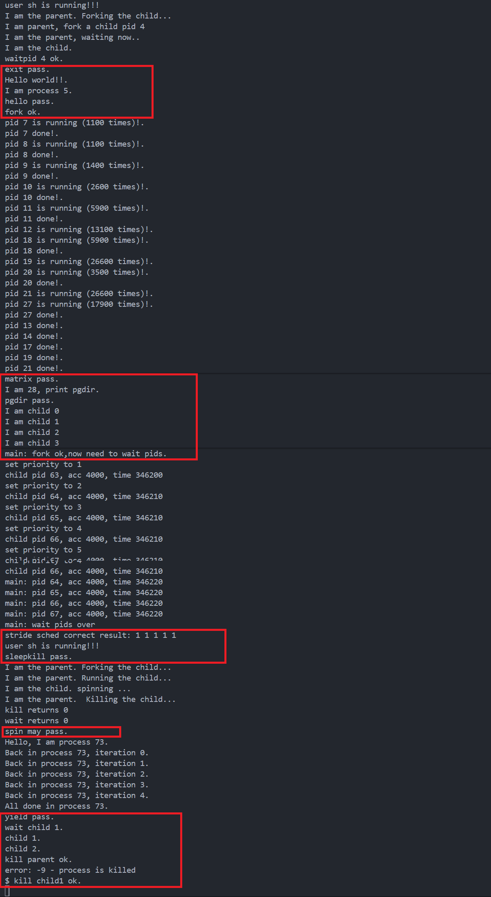

# <center>Lab8</center>

<center>宋昊谦 尹浩燃 穆浩宁</center>

## 练习0：填写已有实验

本实验依赖于之前的实验代码。为了支持文件系统操作（如打开文件、读取 ELF 执行），我们需要在进程控制块中增加文件表的支持，并在进程创建和切换时正确处理这些资源。

### 1. 修改 `proc_struct` 与 `alloc_proc`

在 `kern/process/proc.h` 的 `proc_struct` 结构体中，新增了 `struct files_struct *filesp` 指针，用于管理进程打开的文件。

在 `kern/process/proc.c` 的 `alloc_proc` 函数中，我们需要初始化这个指针：

```c
static struct proc_struct *
alloc_proc(void) {
    struct proc_struct *proc = kmalloc(sizeof(struct proc_struct));
    if (proc != NULL) {
        // ... (Lab4/5/6 初始化代码) ...

        // LAB8 YOUR CODE : (update LAB6 steps)
        // 初始化文件描述符表指针为 NULL
        proc->filesp = NULL;  
    }
    return proc;
}

```

### 2. 修改 `do_fork`

在创建子进程时，除了复制内存 (`copy_mm`)，现在还需要复制或共享父进程打开的文件表。

```c
int do_fork(uint32_t clone_flags, uintptr_t stack, struct trapframe *tf) {
    // ... (省略前面的步骤) ...
    
    // 3. call copy_mm to dup OR share mm according clone_flag
    if (copy_mm(clone_flags, proc) != 0) {
        goto bad_fork_cleanup_kstack;
    }

    // LAB8:EXERCISE2 YOUR CODE
    // 复制文件系统信息（文件描述符表）
    // 如果 clone_flags 设置了 CLONE_FILES，则共享；否则复制
    if (copy_files(clone_flags, proc) != 0) { 
        goto bad_fork_cleanup_kstack;
    }

    // 4. call copy_thread to setup tf & context in proc_struct
    copy_thread(proc, stack, tf);
    
    // ... (后续插入链表和唤醒步骤) ...
}

```

### 3. 修改 `proc_run`

在进程切换时，Lab8 要求我们在切换页表后、切换上下文前显式刷新 TLB。

```c
void proc_run(struct proc_struct *proc) {
    if (proc != current) {
        // ... (关中断等) ...
        
        // [3] 切换页表
        llsatp(proc->pgdir);

        // LAB8 YOUR CODE
        // 严格按照注释要求：before switch_to(); you should flush the tlb
        flush_tlb();
        
        // [4] 上下文切换
        switch_to(&(prev->context), &(proc->context));
        
        // ... (开中断) ...
    }
}

```

## 练习1: 完成读文件操作的实现（需要编码）

### sfs_io_nolock 实现

#### 问题

改写 `kern/fs/sfs/sfs_inode.c` 中的 `sfs_io_nolock` 函数，实现读文件中数据的代码。该函数是 SFS 文件系统读写数据的核心，由于磁盘是以“块”（Block）为单位进行访问的，而用户的读写请求可能是任意偏移量和长度的，因此核心难点在于处理数据在磁盘块上的**不对齐（Unaligned）**情况。

#### 回答

代码如下所示：

```c
static int
sfs_io_nolock(struct sfs_fs *sfs, struct sfs_inode *sin, void *buf, off_t offset, size_t *alenp, bool write) {
    struct sfs_disk_inode *din = sin->din;
    assert(din->type != SFS_TYPE_DIR);
    off_t endpos = offset + *alenp, blkoff;
    *alenp = 0;

    // calculate the Rd/Wr end position
    if (offset < 0 || offset >= SFS_MAX_FILE_SIZE || offset > endpos) {
        return -E_INVAL;
    }
    if (offset == endpos) {
        return 0;
    }
    if (endpos > SFS_MAX_FILE_SIZE) {
        endpos = SFS_MAX_FILE_SIZE;
    }
    if (!write) {
        if (offset >= din->size) {
            return 0;
        }
        if (endpos > din->size) {
            endpos = din->size;
        }
    }

    // 根据读写模式选择对应的底层操作函数
    int (*sfs_buf_op)(struct sfs_fs *sfs, void *buf, size_t len, uint32_t blkno, off_t offset);
    int (*sfs_block_op)(struct sfs_fs *sfs, void *buf, uint32_t blkno, uint32_t nblks);
    if (write) {
        sfs_buf_op = sfs_wbuf, sfs_block_op = sfs_wblock;
    }
    else {
        sfs_buf_op = sfs_rbuf, sfs_block_op = sfs_rblock;
    }

    int ret = 0;
    size_t size, alen = 0;
    uint32_t ino;
    uint32_t blkno = offset / SFS_BLKSIZE;          // The NO. of Rd/Wr begin block
    uint32_t nblks = endpos / SFS_BLKSIZE - blkno;  // The size of Rd/Wr blocks

    // (1) 处理起始部分如果不按照块对齐的情况 (Head)
    blkoff = offset % SFS_BLKSIZE;
    if (blkoff != 0) {
        // 如果 nblks != 0，说明操作跨越了当前块，本块只操作剩余部分 (SFS_BLKSIZE - blkoff)
        // 如果 nblks == 0，说明操作在同一个块内结束，长度就是 endpos - offset
        size = (nblks != 0) ? (SFS_BLKSIZE - blkoff) : (endpos - offset);
        
        // 获取/分配物理块号 (ino)
        // sfs_bmap_load_nolock 将文件逻辑块号 blkno 映射到磁盘物理块号 ino
        if ((ret = sfs_bmap_load_nolock(sfs, sin, blkno, &ino)) != 0) {
            goto out;
        }
        
        // 读/写数据
        // sfs_buf_op 处理非整块的数据读写，注意最后一个参数 blkoff 是块内偏移
        if ((ret = sfs_buf_op(sfs, buf, size, ino, blkoff)) != 0) {
            goto out;
        }
        
        // 更新统计数据和指针
        alen += size;
        buf += size;
        
        // 如果就在这一块内完成了所有操作，直接退出
        if (nblks == 0) {
            goto out;
        }
        
        // 否则，准备处理后续块
        blkno++;
        nblks--;
    }

    // (2) 处理中间完整的块 (Body - Aligned blocks)
    while (nblks > 0) {
        // 获取物理块号
        if ((ret = sfs_bmap_load_nolock(sfs, sin, blkno, &ino)) != 0) {
            goto out;
        }
        
        // 对整块进行读写
        // sfs_block_op 针对整块读写进行了优化，不需要处理偏移
        if ((ret = sfs_block_op(sfs, buf, ino, 1)) != 0) {
            goto out;
        }
        
        alen += SFS_BLKSIZE;
        buf += SFS_BLKSIZE;
        blkno++;
        nblks--;
    }

    // (3) 处理结束部分如果不按照块对齐的情况 (Tail - Last block)
    // 此时 offset 在块内肯定是 0 (因为前面的步骤已经对齐了)
    if (endpos % SFS_BLKSIZE != 0) {
        size = endpos % SFS_BLKSIZE;
        
        if ((ret = sfs_bmap_load_nolock(sfs, sin, blkno, &ino)) != 0) {
            goto out;
        }
        
        // 这里的块内偏移为 0
        if ((ret = sfs_buf_op(sfs, buf, size, ino, 0)) != 0) {
            goto out;
        }
        
        alen += size;
    }

out:
    *alenp = alen;
    if (offset + alen > sin->din->size) {
        sin->din->size = offset + alen;
        sin->dirty = 1;
    }
    return ret;
}

```

#### 设计思路分析

该函数将任意长度的文件 I/O 操作拆解为三个阶段，以适应磁盘基于“块”（Block, 4KB）的读写特性：

1. **首部处理 (Head - Unaligned Start)**：
* 通过 `offset % SFS_BLKSIZE` 计算出 `blkoff`。如果不为 0，说明读写请求的起始位置不在块的边界上。
* 我们需要先处理这一小段数据，使其对齐到下一个块的边界。
* 利用 `sfs_buf_op`（底层对应 `sfs_rbuf` 或 `sfs_wbuf`）进行部分读写，它支持处理块内偏移。


2. **中间块处理 (Body - Aligned Blocks)**：
* 经过首部处理后（或者起始位置本身就是对齐的），中间的数据都是以完整的块（Block Size）为单位的。
* 对于这些完整的块，我们利用 `sfs_block_op`（底层对应 `sfs_rblock` 或 `sfs_wblock`）直接进行整块读写。
* 这种方式避免了不必要的偏移量计算，且整块 I/O 通常在底层驱动中有更好的性能表现。
* 在此循环中，每次操作前都需要调用 `sfs_bmap_load_nolock` 将文件的**逻辑块号**（Logical Block No）映射为磁盘上的**物理块号**（Physical Block No/Inode）。


3. **尾部处理 (Tail - Unaligned End)**：
* 如果结束位置 `endpos` 不在块边界（`endpos % SFS_BLKSIZE != 0`），说明最后一个块只有前面的一部分数据是有效的。
* 此时块内起始偏移肯定是 0，长度为余数大小。
* 同样使用 `sfs_buf_op` 处理这最后剩余的数据。


---

## 练习2: 完成基于文件系统的执行程序机制的实现（需要编码）

### load_icode 实现

#### 问题

改写 `kern/process/proc.c` 中的 `load_icode` 函数，实现基于文件系统的执行程序机制。这与 Lab5 的主要区别在于：需要从磁盘读取 ELF 文件，并且需要正确设置用户栈中的参数 (`argc`, `argv`)，以便用户程序能够接收命令行参数。

#### 回答

代码如下所示：

```c
static int
load_icode(int fd, int argc, char **kargv)
{
    /* LAB8:EXERCISE2 2312220
     * MACROs or Functions:
     * mm_create        - create a mm
     * setup_pgdir      - setup pgdir in mm
     * load_icode_read  - read raw data content of program file
     * mm_map           - build new vma
     * pgdir_alloc_page - allocate new memory for  TEXT/DATA/BSS/stack parts
     * lsatp             - update Page Directory Addr Register -- CR3
     */
    
    // execve 会先销毁旧的 mm，所以这里必须为 NULL
    if (current->mm != NULL)
    {
        panic("load_icode: current->mm must be empty.\n");
    }

    int ret = -E_NO_MEM;
    struct mm_struct *mm;
    struct elfhdr __elf, *elf = &__elf;
    struct proghdr __ph, *ph = &__ph;

    // (1) 创建新的内存管理结构 mm_struct
    if ((mm = mm_create()) == NULL)
    {
        goto bad_mm;
    }

    // (2) 创建并初始化新的页目录表 (Page Directory)
    if (setup_pgdir(mm) != 0)
    {
        goto bad_pgdir_cleanup_mm;
    }

    // (3) 解析 ELF 并加载段
    // LAB8: 使用 load_icode_read 读取 ELF Header
    if (load_icode_read(fd, elf, sizeof(struct elfhdr), 0) != 0)
    {
        goto bad_ctx_cleanup_pgdir;
    }

    // 检查 ELF 魔数
    if (elf->e_magic != ELF_MAGIC)
    {
        ret = -E_INVAL_ELF;
        goto bad_ctx_cleanup_pgdir;
    }

    uint32_t vm_flags, perm;
    struct Page *page = NULL;
    int i;

    // 遍历所有 Program Header
    for (i = 0; i < elf->e_phnum; i++)
    {
        // LAB8: 使用 load_icode_read 读取 Program Header
        off_t phoff = elf->e_phoff + sizeof(struct proghdr) * i;
        if (load_icode_read(fd, ph, sizeof(struct proghdr), phoff) != 0)
        {
            goto bad_cleanup_mmap;
        }

        if (ph->p_type != ELF_PT_LOAD)
        {
            continue;
        }
        if (ph->p_filesz > ph->p_memsz)
        {
            ret = -E_INVAL_ELF;
            goto bad_cleanup_mmap;
        }
        if (ph->p_filesz == 0)
        {
            // continue; //即使文件大小为0，memsz可能不为0 (BSS)，需继续处理
        }

        // (3.5) 设置 VMA 权限
        vm_flags = 0, perm = PTE_U | PTE_V;
        if (ph->p_flags & ELF_PF_X) vm_flags |= VM_EXEC;
        if (ph->p_flags & ELF_PF_W) vm_flags |= VM_WRITE;
        if (ph->p_flags & ELF_PF_R) vm_flags |= VM_READ;

        if (vm_flags & VM_READ) perm |= PTE_R;
        if (vm_flags & VM_WRITE) perm |= (PTE_W | PTE_R);
        if (vm_flags & VM_EXEC) perm |= PTE_X;

        // 建立 VMA 映射
        if ((ret = mm_map(mm, ph->p_va, ph->p_memsz, vm_flags, NULL)) != 0)
        {
            goto bad_cleanup_mmap;
        }

        // (3.6) 拷贝数据
        // start: 段的虚拟起始地址, la: 向下对齐到页边界
        uintptr_t start = ph->p_va, end, la = ROUNDDOWN(start, PGSIZE);
        end = ph->p_va + ph->p_filesz; // 拷贝数据的结束地址

        // 复制文件内容 (Text/Data)
        while (start < end)
        {
            if ((page = pgdir_alloc_page(mm->pgdir, la, perm)) == NULL)
            {
                ret = -E_NO_MEM;
                goto bad_cleanup_mmap;
            }
            
            // 计算页内偏移 off 和本页需要拷贝的大小 size
            size_t off = start - la;
            size_t size = PGSIZE - off;
            la += PGSIZE;
            if (end < la)
            {
                size -= la - end;
            }

            // LAB8: 计算文件中的读取位置，并读取到内核虚拟地址
            // 注意：这里需要计算文件偏移量
            off_t file_offset = ph->p_offset + (start - ph->p_va);
            if (load_icode_read(fd, page2kva(page) + off, size, file_offset) != 0)
            {
                goto bad_cleanup_mmap;
            }
            
            start += size;
        }

        // (3.6.2) 处理 BSS 段 (初始化为 0)
        end = ph->p_va + ph->p_memsz;
        
        // 如果之前那个页还没填满，接着填 0
        if (start < la)
        {
            if (start == end) continue;
            size_t off = start + PGSIZE - la;
            size_t size = PGSIZE - off;
            if (end < la)
            {
                size -= la - end;
            }
            memset(page2kva(page) + off, 0, size);
            start += size;
        }

        // 如果 BSS 跨越了多个新页
        while (start < end)
        {
            if ((page = pgdir_alloc_page(mm->pgdir, la, perm)) == NULL)
            {
                ret = -E_NO_MEM;
                goto bad_cleanup_mmap;
            }
            size_t off = start - la;
            size_t size = PGSIZE - off;
            la += PGSIZE;
            if (end < la)
            {
                size -= la - end;
            }
            memset(page2kva(page) + off, 0, size);
            start += size;
        }
    }

    // (4) 建立用户栈
    vm_flags = VM_READ | VM_WRITE | VM_STACK;
    if ((ret = mm_map(mm, USTACKTOP - USTACKSIZE, USTACKSIZE, vm_flags, NULL)) != 0)
    {
        goto bad_cleanup_mmap;
    }
    // 预分配 4 页的栈空间
    assert(pgdir_alloc_page(mm->pgdir, USTACKTOP - PGSIZE, PTE_USER) != NULL);
    assert(pgdir_alloc_page(mm->pgdir, USTACKTOP - 2 * PGSIZE, PTE_USER) != NULL);
    assert(pgdir_alloc_page(mm->pgdir, USTACKTOP - 3 * PGSIZE, PTE_USER) != NULL);
    assert(pgdir_alloc_page(mm->pgdir, USTACKTOP - 4 * PGSIZE, PTE_USER) != NULL);

    // (5) 设置新进程的 mm 和页表基址
    mm_count_inc(mm);
    current->mm = mm;
    current->pgdir = PADDR(mm->pgdir); // 注意：Lab8 中 struct proc_struct 的 pgdir 是 uintptr_t
    lsatp(PADDR(mm->pgdir));           // 切换页表

    // LAB8: Setup argc/argv in user stack
    // (5.5) 处理命令行参数
    uint32_t argv_size = 0, i_arg;
    for (i_arg = 0; i_arg < argc; i_arg++) {
        argv_size += strnlen(kargv[i_arg], EXEC_MAX_ARG_LEN + 1) + 1;
    }
    
    // 计算参数在栈中的起始位置，并对齐
    uintptr_t stacktop = USTACKTOP - argv_size;
    stacktop = stacktop - (stacktop % sizeof(uintptr_t)); // 对齐

    char **uargv = (char **)(stacktop - (argc + 1) * sizeof(char *));
    
    argv_size = 0;
    for (i_arg = 0; i_arg < argc; i_arg++) {
        // 拷贝字符串到栈顶的高地址区域
        int len = strnlen(kargv[i_arg], EXEC_MAX_ARG_LEN + 1) + 1;
        // 注意：此时已切换页表，可以直接访问用户地址，但必须小心。
        // uCore 内核通常可以直接写用户地址空间（因为内核映射包含了所有物理内存）
        // 但为了安全和正确性，最好使用 page2kva 或者确认 current->mm 已经激活
        strcpy((char *)(stacktop + argv_size), kargv[i_arg]);
        // 设置 argv 数组指向字符串
        uargv[i_arg] = (char *)(stacktop + argv_size);
        argv_size += len;
    }
    uargv[argc] = NULL; // argv 数组以 NULL 结尾

    // (6) 设置 TrapFrame
    struct trapframe *tf = current->tf;
    uintptr_t sstatus = tf->status;
    memset(tf, 0, sizeof(struct trapframe));

    // 设置 sp 到 argv 数组的下方（留出一点空间）
    tf->gpr.sp = (uintptr_t)uargv;
    
    // 设置 entry point
    tf->epc = elf->e_entry;
    
    // 设置 status (User Mode, Interrupt Enable)
    tf->status = (read_csr(sstatus) & ~SSTATUS_SPP) | SSTATUS_SPIE;

    // RISC-V 传递参数规则: a0 = argc, a1 = argv
    tf->gpr.a0 = argc;
    tf->gpr.a1 = (uintptr_t)uargv;

    ret = 0;
out:
    return ret;
bad_cleanup_mmap:
    exit_mmap(mm);
bad_ctx_cleanup_pgdir:
    put_pgdir(mm);
bad_pgdir_cleanup_mm:
    mm_destroy(mm);
bad_mm:
    goto out;
}

```

#### 执行流程分析

`load_icode` 函数完成了用户进程从创建内存空间到准备执行的全过程。相较于 Lab 5，主要的变化在于**文件加载**和**参数传递**。

1. **环境初始化 (Step 1-2)**：
首先调用 `mm_create` 创建内存描述符 `mm`，并调用 `setup_pgdir` 分配页目录表。这为新进程准备了一个空的、独立的虚拟地址空间。
2. **二进制加载 (Step 3)**：
* **ELF 解析**：利用 `load_icode_read`（封装了文件系统 I/O 接口）从磁盘读取 ELF Header。验证 Magic Number 确保文件格式合法。
* **段加载 (Segment Loading)**：遍历 Program Headers。对于类型为 `ELF_PT_LOAD` 的段，根据其属性（读/写/执行）设置 `vm_flags` 和页表权限 `perm`。
* **文件读取与内存填充**：通过 `mm_map` 建立虚拟内存映射 (VMA)。然后逐页分配物理内存 (`pgdir_alloc_page`)，并调用 `load_icode_read` 将文件内容从磁盘读取到内存中。
* **BSS 处理**：如果 `memsz > filesz`，说明该段包含未初始化的全局变量（BSS）。对于这部分内存，代码通过 `memset` 将其清零。


3. **用户栈构建 (Step 4)**：
建立用户栈的 VMA，并预分配 4 页物理内存，以防止缺页异常发生在栈的初始化阶段。
4. **地址空间切换 (Step 5)**：
更新 `current->mm` 和 `current->pgdir`，并调用 `lsatp` 切换到新的页表。此时，CPU 开始使用新进程的地址空间。
5. **参数传递 (Step 5.5 - 重点)**：
为了支持 `main(int argc, char **argv)`，我们需要在用户栈上手动构建参数布局。
* **计算空间**：遍历 `kargv`，计算所有参数字符串的总长度。
* **字符串拷贝**：将参数字符串内容拷贝到栈的**高地址**处。
* **指针数组构建**：在字符串下方构建 `uargv` 指针数组，每个元素指向对应的字符串地址。
* **对齐**：确保栈顶地址按机器字长（64位）对齐。


6. **上下文设置 (Step 6)**：
修改 TrapFrame 以便从内核态返回用户态：
* `tf->gpr.sp`：设置为构建好的用户栈顶（即 `uargv` 数组的低地址处）。
* `tf->epc`：设置为 ELF Header 中的程序入口地址 `e_entry`。
* `tf->status`：清除 `SPP` 位（设置为 User Mode），置位 `SPIE`（开启中断）。
* **RISC-V 调用约定**：将 `argc` 存入 `a0` 寄存器，将 `uargv`（即 `argv` 数组的首地址）存入 `a1` 寄存器。

## 测试结果





## 扩展练习 Challenge1：完成基于“UNIX的PIPE机制”的设计方案

### 1. 设计概述

管道（Pipe）是 UNIX 系统中一种经典的进程间通信（IPC）机制。在 ucore 中，我们将管道实现为一种**基于内存的文件**。它不占用磁盘空间，而是利用内核内存中的环形缓冲区（Ring Buffer）在两个文件描述符之间传递数据。管道遵循“生产者-消费者”模型，一端写入数据，另一端读取数据。

通过查找 Linux 相关资料（如 `fs/pipe.c` 和 `include/linux/pipe_fs_i.h`），Linux 内核使用 `pipe_inode_info` 结构体来管理管道，并利用互斥锁和等待队列来实现同步。参照这一设计，我们在 ucore 中利用现有的 VFS 接口、信号量（Semaphore）和等待队列（Wait Queue）实现了类似机制。

### 2. 数据结构定义

为了在 VFS 框架下支持管道，我们定义了管道控制块 `struct pipe_info`，并将其集成到 `struct inode` 的联合体中。

**C语言 Struct 定义：**

```c
/* 管道缓冲区大小，通常设为一页 (4KB) */
#define PIPE_SIZE  4096

/* 管道控制信息结构体 */
struct pipe_info {
    char *p_buffer;          // 指向内核分配的环形缓冲区 (kmalloc分配)
    off_t p_rpos;            // 读取游标 (Read Head)
    off_t p_wpos;            // 写入游标 (Write Head)
    
    /* 同步互斥机制 */
    semaphore_t mutex;       // 互斥锁：保证对缓冲区和游标修改的原子性
    wait_queue_t wait_queue; // 等待队列：用于缓冲区空(Reader等待)或满(Writer等待)时的进程睡眠
};

/* 修改 kern/fs/vfs/inode.h 中的 inode 结构 */
struct inode {
    union {
        struct device __device_info;
        struct sfs_inode __sfs_inode_info;
        struct pipe_info __pipe_info; // [新增] 管道特有信息
    } in_info;
    enum {
        inode_type_device_info = 0x1234,
        inode_type_sfs_inode_info,
        inode_type_pipe_info_info,    // [新增] 对应 alloc_inode(pipe) 宏展开的类型
    } in_type;
    // ... 其他字段 (ref_count, open_count 等) 保持不变 ...
};
```

### 3. 接口语义与设计方案

为了使管道像普通文件一样工作，我们需要实现 `inode_ops` 接口中的 `vop_read`, `vop_write`, `vop_close` 等函数，并提供系统调用支持。

#### 3.1 读操作 (`pipe_read`)
* **语义**：从管道缓冲区读取数据。遵循 FIFO 原则。
* **逻辑**：
    1.  如果缓冲区为空：
        * 若写端已关闭（`open_count` 仅剩读端持有），返回 0 (EOF)。
        * 若写端仍存在，则阻塞等待（进入 `wait_queue` 睡眠）。
    2.  从 `p_buffer` 的 `p_rpos` 处读取数据到用户缓冲区。
    3.  更新 `p_rpos`。
    4.  读取后缓冲区产生空位，唤醒等待队列中的写进程。

#### 3.2 写操作 (`pipe_write`)
* **语义**：向管道缓冲区写入数据。
* **逻辑**：
    1.  若读端已完全关闭（`open_count` 仅剩写端持有），视为 Broken Pipe，返回 `E_PIPE` 错误。
    2.  如果缓冲区已满：
        * 阻塞等待（进入 `wait_queue` 睡眠）。
    3.  向 `p_buffer` 的 `p_wpos` 处写入数据。
    4.  更新 `p_wpos`。
    5.  写入后缓冲区有了新数据，唤醒等待队列中的读进程。

#### 3.3 关闭操作 (`pipe_close`)
* **语义**：关闭管道的一端。
* **逻辑**：
    * 减少引用计数。
    * **关键步骤**：无论关闭的是读端还是写端，都必须唤醒等待队列中的所有进程。
        * 如果是写者关闭：通知正在等待数据的读者（EOF）。
        * 如果是读者关闭：通知正在等待空位的写者（Broken Pipe）。

#### 3.4 系统调用 (`sys_pipe`)
* **语义**：创建管道，返回两个文件描述符。
* **实现**：
    1.  调用 `alloc_inode` 创建类型为 `pipe` 的 inode。
    2.  分配 4KB 内核缓冲区，初始化信号量和等待队列。
    3.  在当前进程文件表中分配两个 `file` 结构。
    4.  `fd[0]` 设为只读，`fd[1]` 设为只写，均指向该 inode。

### 4. 同步互斥问题的处理

管道本质上是一个并发的**生产者-消费者**模型，必须处理好竞争条件（Race Condition）和条件同步。

1.  **互斥访问 (Mutual Exclusion)**：
    * **问题**：多个进程（父子进程）可能同时尝试读写管道，如果不加锁，`p_rpos` 和 `p_wpos` 的更新会发生冲突，导致数据错乱。
    * **解决方案**：使用 `semaphore_t mutex`。在 `pipe_read` 和 `pipe_write` 的入口处执行 `down(&mutex)`，在操作完成或进入睡眠前执行 `up(&mutex)`。确保同一时刻只有一个进程能操作缓冲区指针。

2.  **条件同步 (Condition Synchronization)**：
    * **问题**：缓冲区空时读者不能读，缓冲区满时写者不能写。
    * **解决方案**：使用 `wait_queue_t wait_queue` 配合调度器。
        * **Reader 阻塞**：当 `p_rpos == p_wpos` (空) 时，Reader 释放 `mutex`，将自己加入 `wait_queue` 并调用 `schedule()` 让出 CPU。被唤醒后重新获取 `mutex` 检查状态。
        * **Writer 阻塞**：当 `p_wpos - p_rpos >= PIPE_SIZE` (满) 时，Writer 执行相同的睡眠逻辑。
        * **死锁预防**：进程在调用 `schedule()` 睡眠前**必须显式释放互斥锁** (`up(&mutex)`)，否则另一端永远无法获得锁来更新状态（填入数据或读走数据），从而导致死锁。


### 5. 关键代码实现

为了实现上述设计，我们在 ucore 中进行了如下具体的代码修改：

#### 5.1 定义错误码 (`libs/error.h`)

首先定义了管道相关的错误码 `E_PIPE`（Broken Pipe），用于在读端关闭时向写端报错。

```c
// 修改 libs/error.h
#define E_PIPE              25  // Pipe Error (新增)

/* 修改 MAXERROR */
//#define MAXERROR          24
#define MAXERROR            25
```

#### 5.2 扩展 VFS 数据结构 (`kern/fs/vfs/inode.h`)

在 VFS 核心头文件中，我们定义了管道控制块 `pipe_info`，并将其加入到 `inode` 的联合体中。特别注意枚举类型 `inode_type_pipe_info_info` 的定义，是为了匹配 ucore 中 `alloc_inode` 宏的展开规则。

```c
// 修改 kern/fs/vfs/inode.h

// 1. 定义管道缓冲区大小 (4KB)
#define PIPE_SIZE  4096

// 2. 定义管道控制块
struct pipe_info {
    char *p_buffer;          // 环形缓冲区指针
    off_t p_rpos;            // 读指针 (read head)
    off_t p_wpos;            // 写指针 (write head)
    semaphore_t mutex;       // 互斥锁：保护缓冲区操作
    wait_queue_t wait_queue; // 等待队列：用于缓冲区空/满时的进程睡眠
};

struct inode {
    union {
        struct device __device_info;
        struct sfs_inode __sfs_inode_info;
        struct pipe_info __pipe_info; // [新增]
    } in_info;
    enum {
        inode_type_device_info = 0x1234,
        inode_type_sfs_inode_info,
        inode_type_pipe_info_info,    // [新增] 对应宏展开 alloc_inode(pipe) -> inode_type_pipe_info_info
    } in_type;
    // ... 其他字段保持不变
};
```

#### 5.3 实现管道核心逻辑 (`kern/fs/pipe/pipe.c`)

这是管道机制的核心实现文件，包含了读写操作的同步互斥逻辑。

```c
/* 新建 kern/fs/pipe/pipe.c */
#include <defs.h>
/* ... 包含必要的头文件 ... */
#include <sem.h>
#include <wait.h>
#include <sched.h>

/* 获取 pipe_info 的宏 */
#define vop_info_pipe(node) (&((node)->in_info.__pipe_info))

/* pipe_read: 从管道读取数据 */
static int pipe_read(struct inode *node, struct iobuf *iob) {
    struct pipe_info *state = vop_info_pipe(node);
    int ret = 0;
    down(&(state->mutex));
    
    // 循环检查：缓冲区为空时等待
    while (state->p_rpos == state->p_wpos) { 
        if (inode_open_count(node) == 1) { // 写端已关闭 -> EOF
            ret = 0; goto out;
        }
        /* 进入等待队列并调度 */
        wait_t __wait, *wait = &__wait;
        wait_current_set(&(state->wait_queue), wait, WT_KSEM);
        up(&(state->mutex)); 
        schedule();          
        down(&(state->mutex)); 
        wait_current_del(&(state->wait_queue), wait);
    }

    // 读取数据到 iobuf
    size_t size = state->p_wpos - state->p_rpos;
    if (size > iob->io_resid) size = iob->io_resid;
    
    size_t i;
    char *buf = state->p_buffer;
    for (i = 0; i < size; i++) {
        char data = buf[(state->p_rpos + i) % PIPE_SIZE];
        iobuf_move(iob, &data, 1, 0, NULL);
    }
    state->p_rpos += size;
    
    // 唤醒写者
    wakeup_queue(&(state->wait_queue), WT_KSEM, 1);
out:
    up(&(state->mutex));
    return ret;
}

/* pipe_write: 向管道写入数据 */
static int pipe_write(struct inode *node, struct iobuf *iob) {
    struct pipe_info *state = vop_info_pipe(node);
    int ret = 0;
    down(&(state->mutex));
    
    if (inode_open_count(node) == 1) { // 读端已关闭 -> Broken Pipe
        ret = -E_PIPE; goto out;
    }

    size_t len = iob->io_resid;
    size_t i;
    char *buf = state->p_buffer;
    
    for (i = 0; i < len; i++) {
        // 检查满：(wpos - rpos) >= PIPE_SIZE
        while ((state->p_wpos - state->p_rpos) >= PIPE_SIZE) {
            if (inode_open_count(node) == 1) {
                ret = -E_PIPE; goto out;
            }
            /* 缓冲区满，进入等待 */
            wait_t __wait, *wait = &__wait;
            wait_current_set(&(state->wait_queue), wait, WT_KSEM);
            up(&(state->mutex));
            schedule();
            down(&(state->mutex));
            wait_current_del(&(state->wait_queue), wait);
        }
        // 写入一个字节
        char data;
        iobuf_move(iob, &data, 1, 0, NULL);
        buf[(state->p_wpos) % PIPE_SIZE] = data;
        state->p_wpos++;
        wakeup_queue(&(state->wait_queue), WT_KSEM, 1);
    }
out:
    up(&(state->mutex));
    return ret;
}

/* pipe_create: 初始化管道 Inode */
int pipe_create(struct inode **node_store) {
    struct inode *node;
    // 使用 alloc_inode(pipe) 匹配 inode_type_pipe_info_info
    if ((node = alloc_inode(pipe)) == NULL) { 
        return -E_NO_MEM;
    }
    vop_init(node, &pipe_node_ops, NULL);
    struct pipe_info *state = vop_info_pipe(node);
    if ((state->p_buffer = kmalloc(PIPE_SIZE)) == NULL) {
        inode_kill(node); return -E_NO_MEM;
    }
    state->p_rpos = state->p_wpos = 0;
    sem_init(&(state->mutex), 1);
    wait_queue_init(&(state->wait_queue));
    *node_store = node;
    return 0;
}
```

#### 5.4 系统调用对接 (`kern/fs/file.c`)

实现了 `file_pipe` 函数，用于分配文件描述符并关联管道 Inode。

```c
/* 修改 kern/fs/file.c，追加以下内容 */

extern int pipe_create(struct inode **node_store);

int file_pipe(int fd[]) {
    int ret;
    struct file *file[2] = {NULL, NULL};
    struct inode *node = NULL;
    
    // 1. 分配两个文件描述符
    if ((ret = fd_array_alloc(NO_FD, &file[0])) != 0) return ret;
    if ((ret = fd_array_alloc(NO_FD, &file[1])) != 0) {
        fd_array_free(file[0]); return ret;
    }
    
    // 2. 创建管道 Inode
    if ((ret = pipe_create(&node)) != 0) {
        fd_array_free(file[0]); fd_array_free(file[1]); return ret;
    }
    
    // 3. 关联 file 结构 (fd[0]读, fd[1]写)
    file[0]->node = node; file[0]->readable = 1; file[0]->writable = 0;
    file[1]->node = node; file[1]->readable = 0; file[1]->writable = 1;
    
    // 4. 增加引用计数 (Ref count = 2, Open count = 2)
    vop_ref_inc(node); 
    vop_open_inc(node); vop_open_inc(node);
    
    // 5. 激活文件描述符
    fd_array_open(file[0]); fd_array_open(file[1]);
    
    fd[0] = file[0]->fd;
    fd[1] = file[1]->fd;
    return 0;
}
```

#### 5.5 构建配置 (`Makefile`)

为了编译新增的管道模块，我们将 `kern/fs/pipe` 目录加入到了编译路径中。

```makefile
# 修改 Makefile
KINCLUDE    += ... kern/fs/pipe/
KSRCDIR     += ... kern/fs/pipe
```

通过上述设计，ucore 成功实现了支持标准 UNIX 语义的匿名管道机制。


## 扩展练习 Challenge2：完成基于“UNIX的软连接和硬连接机制”的设计方案

### 1. 设计概述

UNIX 文件系统提供了两种链接机制：**硬链接 (Hard Link)** 和 **软链接 (Symbolic Link / Soft Link)**。

* **硬链接**：本质上是同一个文件（Inode）在文件系统中拥有多个文件名（目录项 Directory Entry）。硬链接共享相同的 Inode 编号，删除其中一个文件名并不会删除文件数据，只有当指向该 Inode 的链接数（Reference Count）降为 0 时，文件才会被真正删除。
* **软链接**：是一个特殊类型的文件，其数据块中存储的内容是指向另一个文件的路径字符串。当内核解析路径遇到软链接时，会读取其内容并替换当前路径，继续进行查找。

在 ucore 中，我们基于 VFS（虚拟文件系统）和 SFS（Simple FS）实现了这两种机制。参考 Linux 的设计，我们在 Inode 操作接口中添加了 `link` 和 `symlink` 方法，并在 VFS 层实现了路径的递归解析以支持软链接跳转。

### 2. 数据结构定义

为了支持链接机制，我们需要利用 SFS 磁盘结构中预留的字段，并扩展 VFS 的操作接口。

#### 2.1 磁盘与内存结构 (`sfs.h`)

SFS 的磁盘 Inode 结构 `struct sfs_disk_inode` 已经包含了支持硬链接所需的引用计数 `nlinks` 和文件类型 `type`。

```c
/* kern/fs/sfs/sfs.h */

// 文件类型定义
#define SFS_TYPE_FILE   1
#define SFS_TYPE_DIR    2
#define SFS_TYPE_LINK   3  // [使用] 软链接类型

struct sfs_disk_inode {
    uint32_t size;                 /* 文件大小 */
    uint16_t type;                 /* 文件类型 (FILE, DIR, LINK) */
    uint16_t nlinks;               /* [核心] 硬链接计数 */
    uint32_t blocks;               /* 块数 */
    uint32_t direct[SFS_NDIRECT];  /* 直接索引 */
    uint32_t indirect;             /* 间接索引 */
};
```

#### 2.2 VFS 操作接口扩展 (`inode.h`)

为了让 VFS 层能向下派发链接操作，我们需要修改 `struct inode_ops`，增加对应的函数指针。

```c
/* kern/fs/vfs/inode.h */
struct inode_ops {
    unsigned long vop_magic;
    /* ... 原有接口 (open, close, read, write ...) ... */
    
    /* 新增接口 */
    int (*vop_link)(struct inode *node, const char *name, struct inode *link_node);
    int (*vop_symlink)(struct inode *node, const char *name, const char *path);
    int (*vop_readlink)(struct inode *node, struct iobuf *iob);
    int (*vop_unlink)(struct inode *node, const char *name); // 用于删除链接
};

/* 对应的宏定义 */
#define vop_link(node, name, link_node)    (__vop_op(node, link)(node, name, link_node))
#define vop_symlink(node, name, path)      (__vop_op(node, symlink)(node, name, path))
#define vop_unlink(node, name)             (__vop_op(node, unlink)(node, name))
```

### 3. 具体实现方案

#### 3.1 路径查找的重构 (`vfslookup.c`)

这是实现软链接的核心。原有的 `vfs_lookup` 仅做简单的单次查找。为了支持软链接，我们需要在查找过程中检测 Inode 类型，如果是 `S_IFLNK`，则需要读取其内容并递归解析。

**实现逻辑：**
1.  **循环解析**：将路径按 `/` 分割，逐级查找 Component。
2.  **检测 Symlink**：每找到一个 Inode，检查其类型。
3.  **递归跳转**：如果是软链接，调用 `vop_read` 读取其存储的目标路径。
    * 如果是绝对路径（以 `/` 开头），重置当前查找节点为根目录。
    * 如果是相对路径，保持当前目录不变。
    * 将目标路径拼接到剩余路径之前，更新 `path` 缓冲区。
4.  **循环限制**：为了防止软链接指向自己导致死循环（Loop），引入 `MAX_SYMLINK_DEPTH` (5)，超过层级则报错 `E_TOO_BIG`。

#### 3.2 VFS 层接口实现 (`vfsfile.c`)

我们将高层接口实现集中在 `vfsfile.c` 中，以保持代码整洁并避免与 `vfspath.c` 冲突。

* **`vfs_link(old_path, new_path)`**：
    1.  `vfs_lookup(old_path)` 找到源文件的 Inode。
    2.  `vfs_lookup_parent(new_path)` 找到新链接所在的父目录 Inode。
    3.  调用 `vop_link(new_dir, new_name, old_node)`。

* **`vfs_symlink(old_path, new_path)`**：
    1.  `vfs_lookup_parent(new_path)` 找到父目录。
    2.  调用 `vop_symlink(new_dir, new_name, old_path)`。

#### 3.3 SFS 层底层实现 (`sfs_inode.c`)

这是文件系统操作的具体执行者。

* **`sfs_link` (创建硬链接)**：
    1.  检查源文件和目标目录是否在同一个文件系统（不支持跨 FS 硬链接）。
    2.  调用辅助函数 `sfs_dirent_link_nolock` 在目标目录下创建一个新的目录项（Directory Entry），其 `ino` 指向源文件的 Inode 编号。
    3.  **关键步骤**：将源 Inode 的 `nlinks` 加 1，并标记为 Dirty。

* **`sfs_symlink` (创建软链接)**：
    1.  创建一个新文件（Inode）。
    2.  将该 Inode 的类型设为 `SFS_TYPE_LINK`。
    3.  将目标路径字符串作为数据写入该 Inode 的数据块中。

* **`sfs_unlink` (删除链接)**：
    1.  在目录下删除对应的目录项。
    2.  **关键步骤**：将对应 Inode 的 `nlinks` 减 1。
    3.  在 `sfs_reclaim` 中，只有当 `nlinks == 0` 且内存引用计数 `ref_count == 0` 时，才真正释放磁盘块。

### 4. 同步互斥问题的处理

在文件系统操作中，竞争条件可能导致数据损坏（如目录项丢失、引用计数错误）。我们采取了以下措施：

1.  **目录操作锁**：
    * 在执行 `sfs_link`, `sfs_symlink`, `sfs_unlink` 等修改目录结构的操作时，通过 `lock_sfs_fs(sfs)` 或 `lock_sin(dir_inode)` 获取锁。这确保了在同一时刻，不会有两个进程同时修改同一个目录的数据块（避免目录项覆盖）。

2.  **引用计数原子性**：
    * 硬链接的核心是 `nlinks`。虽然 ucore 目前是内核态非抢占的（部分），但在标准实现中，`nlinks++` 和 `nlinks--` 必须是原子操作。我们通过持有 Inode 的信号量锁 (`sin->sem`) 来保护 Inode 结构的修改。

3.  **死锁预防 (Deadlock Prevention)**：
    * 在 `vfs_link` 或 `rename` 操作中，可能需要同时持有两个 Inode 的锁（源文件和目标目录，或两个目录）。为了防止死锁，ucore 简化了设计，通常使用粗粒度的文件系统锁 `lock_sfs_fs` 来序列化涉及元数据修改的复杂操作。
    * 在路径查找 `vfs_lookup` 中，我们在递归解析软链接时，会先释放当前持有的 Inode 引用 (`vop_ref_dec`) 再进行下一次查找，防止占用过多资源或导致逻辑死锁。

4.  **防止无限递归**：
    * 针对软链接可能构成的环路（A -> B -> A），我们在 `vfs_lookup` 中设置了计数器 `link_count`。一旦递归深度超过 `MAX_SYMLINK_DEPTH`，立即终止并返回错误，防止内核栈溢出或死循环。


### 5. 关键代码实现

为了实现 UNIX 风格的软硬链接机制，我们对 ucore 的 VFS 层和 SFS 层进行了深度扩展。以下是各关键文件的具体修改内容：

#### 5.1 扩展 VFS 操作接口 (`kern/fs/vfs/inode.h`)

首先在 VFS 抽象层的 `inode_ops` 结构体中添加了 `link`、`symlink`、`readlink` 等函数指针，并定义了相应的调用宏。

```c
/* 修改 kern/fs/vfs/inode.h */
struct inode_ops {
    unsigned long vop_magic;
    /* ... 原有接口 ... */
    
    /* Challenge 2 新增接口 */
    int (*vop_link)(struct inode *node, const char *name, struct inode *link_node);
    int (*vop_symlink)(struct inode *node, const char *name, const char *path);
    int (*vop_readlink)(struct inode *node, struct iobuf *iob);
    int (*vop_mkdir)(struct inode *node, const char *name);
    int (*vop_unlink)(struct inode *node, const char *name);
    int (*vop_rename)(struct inode *node, const char *name, struct inode *new_node, const char *new_name);
};

/* 新增调用宏 */
#define vop_link(node, name, link_node)             (__vop_op(node, link)(node, name, link_node))
#define vop_symlink(node, name, path)               (__vop_op(node, symlink)(node, name, path))
#define vop_readlink(node, iob)                     (__vop_op(node, readlink)(node, iob))
#define vop_mkdir(node, name)                       (__vop_op(node, mkdir)(node, name))
#define vop_unlink(node, name)                      (__vop_op(node, unlink)(node, name))
```

#### 5.2 实现路径递归解析 (`kern/fs/vfs/vfslookup.c`)

这是支持软链接的核心逻辑。我们将原有的 `vfs_lookup` 重构为支持循环解析，当遇到类型为 `S_IFLNK` 的 inode 时，读取其内容并拼接到剩余路径中继续查找，同时使用 `MAX_SYMLINK_DEPTH` 防止死循环。

```c
/* 修改 kern/fs/vfs/vfslookup.c */
#define MAX_SYMLINK_DEPTH 5

static int
vfs_lookup_internal(char *path, struct inode **node_store, bool stop_at_last, char **endp) {
    // ... 获取起始 inode ...
    int link_count = 0;
loop:
    // ... 提取路径分量 component ...
    
    // 查找当前分量
    if ((ret = vop_lookup(node, component, &next_node)) != 0) goto failed;

    // 检查是否为软链接
    uint32_t type;
    vop_gettype(next_node, &type);
    if (type == S_IFLNK) {
        if (++link_count > MAX_SYMLINK_DEPTH) return -E_TOO_BIG; // E_LOOP

        // 读取软链接内容
        char *link_content = kmalloc(FS_MAX_FPATH_LEN + 1);
        struct iobuf __iob, *iob = iobuf_init(&__iob, link_content, FS_MAX_FPATH_LEN, 0);
        vop_read(next_node, iob);
        vop_ref_dec(next_node);

        // 处理绝对路径与相对路径拼接
        // ... (省略具体的路径拼接代码) ...
        
        goto loop; // 递归解析新路径
    }
    // ... 正常节点处理 ...
}
```

#### 5.3 实现 VFS 层高层接口 (`kern/fs/vfs/vfsfile.c`)

我们在 `vfsfile.c` 中实现了 `vfs_link`、`vfs_symlink` 等函数，负责调用 `vfs_lookup` 解析路径，并将操作转发给底层的 `vop` 接口。

```c
/* 修改 kern/fs/vfs/vfsfile.c */

// 硬链接实现
int vfs_link(char *old_path, char *new_path) {
    struct inode *old_node, *new_dir;
    char *new_name;
    // 查找源文件 Inode
    if ((ret = vfs_lookup(old_path, &old_node)) != 0) return ret;
    // 查找目标目录 Inode
    if ((ret = vfs_lookup_parent(new_path, &new_dir, &new_name)) != 0) {
        vop_ref_dec(old_node); return ret;
    }
    // 调用底层 link
    ret = vop_link(new_dir, new_name, old_node);
    vop_ref_dec(new_dir); vop_ref_dec(old_node);
    return ret;
}

// 软链接实现
int vfs_symlink(char *old_path, char *new_path) {
    struct inode *dir;
    char *name;
    if ((ret = vfs_lookup_parent(new_path, &dir, &name)) != 0) return ret;
    ret = vop_symlink(dir, name, old_path); // old_path 是内容
    vop_ref_dec(dir);
    return ret;
}
```

#### 5.4 实现 SFS 层底层逻辑 (`kern/fs/sfs/sfs_inode.c`)

在 SFS 文件系统中实现了具体的磁盘操作。

```c
/* 修改 kern/fs/sfs/sfs_inode.c */

/* 辅助函数：在目录中创建硬链接条目 */
static int
sfs_dirent_link_nolock(struct sfs_fs *sfs, struct sfs_inode *sin, const char *name, uint32_t ino) {
    // 查找空位并写入新的 sfs_disk_entry (name, ino)
    // ... (具体实现略) ...
}

/* 硬链接操作 */
static int
sfs_link(struct inode *node, const char *name, struct inode *link_node) {
    struct sfs_fs *sfs = fsop_info(vop_fs(node), sfs);
    struct sfs_inode *sin = vop_info(node, sfs_inode);
    struct sfs_inode *link_sin = vop_info(link_node, sfs_inode);
    
    lock_sfs_fs(sfs);
    // 在目录中创建新条目，指向原 inode
    if ((ret = sfs_dirent_link_nolock(sfs, sin, name, link_sin->ino)) == 0) {
        link_sin->din->nlinks++; // 增加引用计数
        link_sin->dirty = 1;
    }
    unlock_sfs_fs(sfs);
    return ret;
}

/* 软链接操作 */
static int
sfs_symlink(struct inode *node, const char *name, const char *path) {
    // 1. 创建新文件
    vop_create(node, name, 1, &new_node);
    // 2. 修改类型为 SFS_TYPE_LINK
    sfs_sin->din->type = SFS_TYPE_LINK;
    // 3. 将路径 path 写入文件内容
    vop_write(new_node, ...);
    return 0;
}

/* 注册操作函数 */
static const struct inode_ops sfs_node_dirops = {
    // ...
    .vop_link = sfs_link,
    .vop_symlink = sfs_symlink,
};
```

#### 5.5 对接系统调用 (`kern/fs/sysfile.c`)

最后，我们在内核系统调用层添加了对应的处理函数，将用户空间的参数拷贝到内核空间，并调用 VFS 接口。

```c
/* 修改 kern/fs/sysfile.c */

int sysfile_link(const char *__path1, const char *__path2) {
    // copy_path 获取 old_path, new_path
    return vfs_link(old_path, new_path);
}

int sysfile_symlink(const char *__path1, const char *__path2) {
    // copy_path 获取 content, new_path
    return vfs_symlink(content, new_path);
}

int sysfile_readlink(const char *__path, char *__buf, size_t len) {
    // copy_path 获取 path
    // 分配内核缓冲区 buffer
    vfs_readlink(path, iob);
    // copy_to_user 将 buffer 内容拷回用户空间
}
```

通过上述设计，ucore 成功扩展了对 UNIX 风格链接机制:软连接和硬连接的支持，使其文件系统功能更加完善。