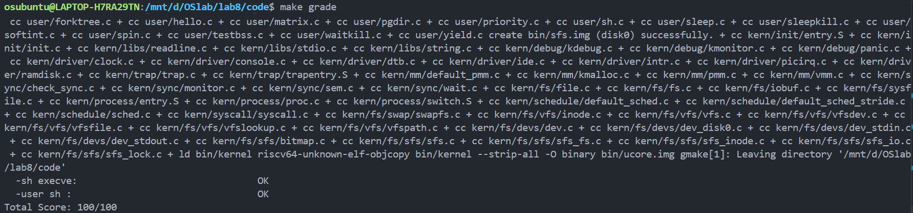

# <center>Lab8</center>

<center>文件系统</center>

## 练习0：填写已有实验

本实验依赖于之前的实验代码。为了支持文件系统操作（如打开文件、读取 ELF 执行），我们需要在进程控制块中增加文件表的支持，并在进程创建和切换时正确处理这些资源。

### 1. 修改 `proc_struct` 与 `alloc_proc`

在 `kern/process/proc.h` 的 `proc_struct` 结构体中，新增了 `struct files_struct *filesp` 指针，用于管理进程打开的文件。

在 `kern/process/proc.c` 的 `alloc_proc` 函数中，我们需要初始化这个指针：

```c
static struct proc_struct *
alloc_proc(void) {
    struct proc_struct *proc = kmalloc(sizeof(struct proc_struct));
    if (proc != NULL) {
        // ... (Lab4/5/6 初始化代码) ...

        // LAB8 YOUR CODE : (update LAB6 steps)
        // 初始化文件描述符表指针为 NULL
        proc->filesp = NULL;  
    }
    return proc;
}

```

### 2. 修改 `do_fork`

在创建子进程时，除了复制内存 (`copy_mm`)，现在还需要复制或共享父进程打开的文件表。

```c
int do_fork(uint32_t clone_flags, uintptr_t stack, struct trapframe *tf) {
    // ... (省略前面的步骤) ...
    
    // 3. call copy_mm to dup OR share mm according clone_flag
    if (copy_mm(clone_flags, proc) != 0) {
        goto bad_fork_cleanup_kstack;
    }

    // LAB8:EXERCISE2 YOUR CODE
    // 复制文件系统信息（文件描述符表）
    // 如果 clone_flags 设置了 CLONE_FILES，则共享；否则复制
    if (copy_files(clone_flags, proc) != 0) { 
        goto bad_fork_cleanup_kstack;
    }

    // 4. call copy_thread to setup tf & context in proc_struct
    copy_thread(proc, stack, tf);
    
    // ... (后续插入链表和唤醒步骤) ...
}

```

### 3. 修改 `proc_run`

在进程切换时，Lab8 要求我们在切换页表后、切换上下文前显式刷新 TLB。

```c
void proc_run(struct proc_struct *proc) {
    if (proc != current) {
        // ... (关中断等) ...
        
        // [3] 切换页表
        llsatp(proc->pgdir);

        // LAB8 YOUR CODE
        // 严格按照注释要求：before switch_to(); you should flush the tlb
        flush_tlb();
        
        // [4] 上下文切换
        switch_to(&(prev->context), &(proc->context));
        
        // ... (开中断) ...
    }
}

```

## 练习1: 完成读文件操作的实现（需要编码）

### sfs_io_nolock 实现

#### 问题

改写 `kern/fs/sfs/sfs_inode.c` 中的 `sfs_io_nolock` 函数，实现读文件中数据的代码。该函数是 SFS 文件系统读写数据的核心，由于磁盘是以“块”（Block）为单位进行访问的，而用户的读写请求可能是任意偏移量和长度的，因此核心难点在于处理数据在磁盘块上的**不对齐（Unaligned）**情况。

#### 回答

代码如下所示：

```c
static int
sfs_io_nolock(struct sfs_fs *sfs, struct sfs_inode *sin, void *buf, off_t offset, size_t *alenp, bool write) {
    struct sfs_disk_inode *din = sin->din;
    assert(din->type != SFS_TYPE_DIR);
    off_t endpos = offset + *alenp, blkoff;
    *alenp = 0;

    // calculate the Rd/Wr end position
    if (offset < 0 || offset >= SFS_MAX_FILE_SIZE || offset > endpos) {
        return -E_INVAL;
    }
    if (offset == endpos) {
        return 0;
    }
    if (endpos > SFS_MAX_FILE_SIZE) {
        endpos = SFS_MAX_FILE_SIZE;
    }
    if (!write) {
        if (offset >= din->size) {
            return 0;
        }
        if (endpos > din->size) {
            endpos = din->size;
        }
    }

    // 根据读写模式选择对应的底层操作函数
    int (*sfs_buf_op)(struct sfs_fs *sfs, void *buf, size_t len, uint32_t blkno, off_t offset);
    int (*sfs_block_op)(struct sfs_fs *sfs, void *buf, uint32_t blkno, uint32_t nblks);
    if (write) {
        sfs_buf_op = sfs_wbuf, sfs_block_op = sfs_wblock;
    }
    else {
        sfs_buf_op = sfs_rbuf, sfs_block_op = sfs_rblock;
    }

    int ret = 0;
    size_t size, alen = 0;
    uint32_t ino;
    uint32_t blkno = offset / SFS_BLKSIZE;          // The NO. of Rd/Wr begin block
    uint32_t nblks = endpos / SFS_BLKSIZE - blkno;  // The size of Rd/Wr blocks

    // (1) 处理起始部分如果不按照块对齐的情况 (Head)
    blkoff = offset % SFS_BLKSIZE;
    if (blkoff != 0) {
        // 如果 nblks != 0，说明操作跨越了当前块，本块只操作剩余部分 (SFS_BLKSIZE - blkoff)
        // 如果 nblks == 0，说明操作在同一个块内结束，长度就是 endpos - offset
        size = (nblks != 0) ? (SFS_BLKSIZE - blkoff) : (endpos - offset);
        
        // 获取/分配物理块号 (ino)
        // sfs_bmap_load_nolock 将文件逻辑块号 blkno 映射到磁盘物理块号 ino
        if ((ret = sfs_bmap_load_nolock(sfs, sin, blkno, &ino)) != 0) {
            goto out;
        }
        
        // 读/写数据
        // sfs_buf_op 处理非整块的数据读写，注意最后一个参数 blkoff 是块内偏移
        if ((ret = sfs_buf_op(sfs, buf, size, ino, blkoff)) != 0) {
            goto out;
        }
        
        // 更新统计数据和指针
        alen += size;
        buf += size;
        
        // 如果就在这一块内完成了所有操作，直接退出
        if (nblks == 0) {
            goto out;
        }
        
        // 否则，准备处理后续块
        blkno++;
        nblks--;
    }

    // (2) 处理中间完整的块 (Body - Aligned blocks)
    while (nblks > 0) {
        // 获取物理块号
        if ((ret = sfs_bmap_load_nolock(sfs, sin, blkno, &ino)) != 0) {
            goto out;
        }
        
        // 对整块进行读写
        // sfs_block_op 针对整块读写进行了优化，不需要处理偏移
        if ((ret = sfs_block_op(sfs, buf, ino, 1)) != 0) {
            goto out;
        }
        
        alen += SFS_BLKSIZE;
        buf += SFS_BLKSIZE;
        blkno++;
        nblks--;
    }

    // (3) 处理结束部分如果不按照块对齐的情况 (Tail - Last block)
    // 此时 offset 在块内肯定是 0 (因为前面的步骤已经对齐了)
    if (endpos % SFS_BLKSIZE != 0) {
        size = endpos % SFS_BLKSIZE;
        
        if ((ret = sfs_bmap_load_nolock(sfs, sin, blkno, &ino)) != 0) {
            goto out;
        }
        
        // 这里的块内偏移为 0
        if ((ret = sfs_buf_op(sfs, buf, size, ino, 0)) != 0) {
            goto out;
        }
        
        alen += size;
    }

out:
    *alenp = alen;
    if (offset + alen > sin->din->size) {
        sin->din->size = offset + alen;
        sin->dirty = 1;
    }
    return ret;
}

```

#### 设计思路分析

该函数将任意长度的文件 I/O 操作拆解为三个阶段，以适应磁盘基于“块”（Block, 4KB）的读写特性：

1. **首部处理 (Head - Unaligned Start)**：
* 通过 `offset % SFS_BLKSIZE` 计算出 `blkoff`。如果不为 0，说明读写请求的起始位置不在块的边界上。
* 我们需要先处理这一小段数据，使其对齐到下一个块的边界。
* 利用 `sfs_buf_op`（底层对应 `sfs_rbuf` 或 `sfs_wbuf`）进行部分读写，它支持处理块内偏移。


2. **中间块处理 (Body - Aligned Blocks)**：
* 经过首部处理后（或者起始位置本身就是对齐的），中间的数据都是以完整的块（Block Size）为单位的。
* 对于这些完整的块，我们利用 `sfs_block_op`（底层对应 `sfs_rblock` 或 `sfs_wblock`）直接进行整块读写。
* 这种方式避免了不必要的偏移量计算，且整块 I/O 通常在底层驱动中有更好的性能表现。
* 在此循环中，每次操作前都需要调用 `sfs_bmap_load_nolock` 将文件的**逻辑块号**（Logical Block No）映射为磁盘上的**物理块号**（Physical Block No/Inode）。


3. **尾部处理 (Tail - Unaligned End)**：
* 如果结束位置 `endpos` 不在块边界（`endpos % SFS_BLKSIZE != 0`），说明最后一个块只有前面的一部分数据是有效的。
* 此时块内起始偏移肯定是 0，长度为余数大小。
* 同样使用 `sfs_buf_op` 处理这最后剩余的数据。


---

## 练习2: 完成基于文件系统的执行程序机制的实现（需要编码）

### load_icode 实现

#### 问题

改写 `kern/process/proc.c` 中的 `load_icode` 函数，实现基于文件系统的执行程序机制。这与 Lab5 的主要区别在于：需要从磁盘读取 ELF 文件，并且需要正确设置用户栈中的参数 (`argc`, `argv`)，以便用户程序能够接收命令行参数。

#### 回答

代码如下所示：

```c
static int
load_icode(int fd, int argc, char **kargv)
{
    /* LAB8:EXERCISE2 2312220
     * MACROs or Functions:
     * mm_create        - create a mm
     * setup_pgdir      - setup pgdir in mm
     * load_icode_read  - read raw data content of program file
     * mm_map           - build new vma
     * pgdir_alloc_page - allocate new memory for  TEXT/DATA/BSS/stack parts
     * lsatp             - update Page Directory Addr Register -- CR3
     */
    
    // execve 会先销毁旧的 mm，所以这里必须为 NULL
    if (current->mm != NULL)
    {
        panic("load_icode: current->mm must be empty.\n");
    }

    int ret = -E_NO_MEM;
    struct mm_struct *mm;
    struct elfhdr __elf, *elf = &__elf;
    struct proghdr __ph, *ph = &__ph;

    // (1) 创建新的内存管理结构 mm_struct
    if ((mm = mm_create()) == NULL)
    {
        goto bad_mm;
    }

    // (2) 创建并初始化新的页目录表 (Page Directory)
    if (setup_pgdir(mm) != 0)
    {
        goto bad_pgdir_cleanup_mm;
    }

    // (3) 解析 ELF 并加载段
    // LAB8: 使用 load_icode_read 读取 ELF Header
    if (load_icode_read(fd, elf, sizeof(struct elfhdr), 0) != 0)
    {
        goto bad_ctx_cleanup_pgdir;
    }

    // 检查 ELF 魔数
    if (elf->e_magic != ELF_MAGIC)
    {
        ret = -E_INVAL_ELF;
        goto bad_ctx_cleanup_pgdir;
    }

    uint32_t vm_flags, perm;
    struct Page *page = NULL;
    int i;

    // 遍历所有 Program Header
    for (i = 0; i < elf->e_phnum; i++)
    {
        // LAB8: 使用 load_icode_read 读取 Program Header
        off_t phoff = elf->e_phoff + sizeof(struct proghdr) * i;
        if (load_icode_read(fd, ph, sizeof(struct proghdr), phoff) != 0)
        {
            goto bad_cleanup_mmap;
        }

        if (ph->p_type != ELF_PT_LOAD)
        {
            continue;
        }
        if (ph->p_filesz > ph->p_memsz)
        {
            ret = -E_INVAL_ELF;
            goto bad_cleanup_mmap;
        }
        if (ph->p_filesz == 0)
        {
            // continue; //即使文件大小为0，memsz可能不为0 (BSS)，需继续处理
        }

        // (3.5) 设置 VMA 权限
        vm_flags = 0, perm = PTE_U | PTE_V;
        if (ph->p_flags & ELF_PF_X) vm_flags |= VM_EXEC;
        if (ph->p_flags & ELF_PF_W) vm_flags |= VM_WRITE;
        if (ph->p_flags & ELF_PF_R) vm_flags |= VM_READ;

        if (vm_flags & VM_READ) perm |= PTE_R;
        if (vm_flags & VM_WRITE) perm |= (PTE_W | PTE_R);
        if (vm_flags & VM_EXEC) perm |= PTE_X;

        // 建立 VMA 映射
        if ((ret = mm_map(mm, ph->p_va, ph->p_memsz, vm_flags, NULL)) != 0)
        {
            goto bad_cleanup_mmap;
        }

        // (3.6) 拷贝数据
        // start: 段的虚拟起始地址, la: 向下对齐到页边界
        uintptr_t start = ph->p_va, end, la = ROUNDDOWN(start, PGSIZE);
        end = ph->p_va + ph->p_filesz; // 拷贝数据的结束地址

        // 复制文件内容 (Text/Data)
        while (start < end)
        {
            if ((page = pgdir_alloc_page(mm->pgdir, la, perm)) == NULL)
            {
                ret = -E_NO_MEM;
                goto bad_cleanup_mmap;
            }
            
            // 计算页内偏移 off 和本页需要拷贝的大小 size
            size_t off = start - la;
            size_t size = PGSIZE - off;
            la += PGSIZE;
            if (end < la)
            {
                size -= la - end;
            }

            // LAB8: 计算文件中的读取位置，并读取到内核虚拟地址
            // 注意：这里需要计算文件偏移量
            off_t file_offset = ph->p_offset + (start - ph->p_va);
            if (load_icode_read(fd, page2kva(page) + off, size, file_offset) != 0)
            {
                goto bad_cleanup_mmap;
            }
            
            start += size;
        }

        // (3.6.2) 处理 BSS 段 (初始化为 0)
        end = ph->p_va + ph->p_memsz;
        
        // 如果之前那个页还没填满，接着填 0
        if (start < la)
        {
            if (start == end) continue;
            size_t off = start + PGSIZE - la;
            size_t size = PGSIZE - off;
            if (end < la)
            {
                size -= la - end;
            }
            memset(page2kva(page) + off, 0, size);
            start += size;
        }

        // 如果 BSS 跨越了多个新页
        while (start < end)
        {
            if ((page = pgdir_alloc_page(mm->pgdir, la, perm)) == NULL)
            {
                ret = -E_NO_MEM;
                goto bad_cleanup_mmap;
            }
            size_t off = start - la;
            size_t size = PGSIZE - off;
            la += PGSIZE;
            if (end < la)
            {
                size -= la - end;
            }
            memset(page2kva(page) + off, 0, size);
            start += size;
        }
    }

    // (4) 建立用户栈
    vm_flags = VM_READ | VM_WRITE | VM_STACK;
    if ((ret = mm_map(mm, USTACKTOP - USTACKSIZE, USTACKSIZE, vm_flags, NULL)) != 0)
    {
        goto bad_cleanup_mmap;
    }
    // 预分配 4 页的栈空间
    assert(pgdir_alloc_page(mm->pgdir, USTACKTOP - PGSIZE, PTE_USER) != NULL);
    assert(pgdir_alloc_page(mm->pgdir, USTACKTOP - 2 * PGSIZE, PTE_USER) != NULL);
    assert(pgdir_alloc_page(mm->pgdir, USTACKTOP - 3 * PGSIZE, PTE_USER) != NULL);
    assert(pgdir_alloc_page(mm->pgdir, USTACKTOP - 4 * PGSIZE, PTE_USER) != NULL);

    // (5) 设置新进程的 mm 和页表基址
    mm_count_inc(mm);
    current->mm = mm;
    current->pgdir = PADDR(mm->pgdir); // 注意：Lab8 中 struct proc_struct 的 pgdir 是 uintptr_t
    lsatp(PADDR(mm->pgdir));           // 切换页表

    // LAB8: Setup argc/argv in user stack
    // (5.5) 处理命令行参数
    uint32_t argv_size = 0, i_arg;
    for (i_arg = 0; i_arg < argc; i_arg++) {
        argv_size += strnlen(kargv[i_arg], EXEC_MAX_ARG_LEN + 1) + 1;
    }
    
    // 计算参数在栈中的起始位置，并对齐
    uintptr_t stacktop = USTACKTOP - argv_size;
    stacktop = stacktop - (stacktop % sizeof(uintptr_t)); // 对齐

    char **uargv = (char **)(stacktop - (argc + 1) * sizeof(char *));
    
    argv_size = 0;
    for (i_arg = 0; i_arg < argc; i_arg++) {
        // 拷贝字符串到栈顶的高地址区域
        int len = strnlen(kargv[i_arg], EXEC_MAX_ARG_LEN + 1) + 1;
        // 注意：此时已切换页表，可以直接访问用户地址，但必须小心。
        // uCore 内核通常可以直接写用户地址空间（因为内核映射包含了所有物理内存）
        // 但为了安全和正确性，最好使用 page2kva 或者确认 current->mm 已经激活
        strcpy((char *)(stacktop + argv_size), kargv[i_arg]);
        // 设置 argv 数组指向字符串
        uargv[i_arg] = (char *)(stacktop + argv_size);
        argv_size += len;
    }
    uargv[argc] = NULL; // argv 数组以 NULL 结尾

    // (6) 设置 TrapFrame
    struct trapframe *tf = current->tf;
    uintptr_t sstatus = tf->status;
    memset(tf, 0, sizeof(struct trapframe));

    // 设置 sp 到 argv 数组的下方（留出一点空间）
    tf->gpr.sp = (uintptr_t)uargv;
    
    // 设置 entry point
    tf->epc = elf->e_entry;
    
    // 设置 status (User Mode, Interrupt Enable)
    tf->status = (read_csr(sstatus) & ~SSTATUS_SPP) | SSTATUS_SPIE;

    // RISC-V 传递参数规则: a0 = argc, a1 = argv
    tf->gpr.a0 = argc;
    tf->gpr.a1 = (uintptr_t)uargv;

    ret = 0;
out:
    return ret;
bad_cleanup_mmap:
    exit_mmap(mm);
bad_ctx_cleanup_pgdir:
    put_pgdir(mm);
bad_pgdir_cleanup_mm:
    mm_destroy(mm);
bad_mm:
    goto out;
}

```

#### 执行流程分析

`load_icode` 函数完成了用户进程从创建内存空间到准备执行的全过程。相较于 Lab 5，主要的变化在于**文件加载**和**参数传递**。

1. **环境初始化 (Step 1-2)**：
首先调用 `mm_create` 创建内存描述符 `mm`，并调用 `setup_pgdir` 分配页目录表。这为新进程准备了一个空的、独立的虚拟地址空间。
2. **二进制加载 (Step 3)**：
* **ELF 解析**：利用 `load_icode_read`（封装了文件系统 I/O 接口）从磁盘读取 ELF Header。验证 Magic Number 确保文件格式合法。
* **段加载 (Segment Loading)**：遍历 Program Headers。对于类型为 `ELF_PT_LOAD` 的段，根据其属性（读/写/执行）设置 `vm_flags` 和页表权限 `perm`。
* **文件读取与内存填充**：通过 `mm_map` 建立虚拟内存映射 (VMA)。然后逐页分配物理内存 (`pgdir_alloc_page`)，并调用 `load_icode_read` 将文件内容从磁盘读取到内存中。
* **BSS 处理**：如果 `memsz > filesz`，说明该段包含未初始化的全局变量（BSS）。对于这部分内存，代码通过 `memset` 将其清零。


3. **用户栈构建 (Step 4)**：
建立用户栈的 VMA，并预分配 4 页物理内存，以防止缺页异常发生在栈的初始化阶段。
4. **地址空间切换 (Step 5)**：
更新 `current->mm` 和 `current->pgdir`，并调用 `lsatp` 切换到新的页表。此时，CPU 开始使用新进程的地址空间。
5. **参数传递 (Step 5.5 - 重点)**：
为了支持 `main(int argc, char **argv)`，我们需要在用户栈上手动构建参数布局。
* **计算空间**：遍历 `kargv`，计算所有参数字符串的总长度。
* **字符串拷贝**：将参数字符串内容拷贝到栈的**高地址**处。
* **指针数组构建**：在字符串下方构建 `uargv` 指针数组，每个元素指向对应的字符串地址。
* **对齐**：确保栈顶地址按机器字长（64位）对齐。


6. **上下文设置 (Step 6)**：
修改 TrapFrame 以便从内核态返回用户态：
* `tf->gpr.sp`：设置为构建好的用户栈顶（即 `uargv` 数组的低地址处）。
* `tf->epc`：设置为 ELF Header 中的程序入口地址 `e_entry`。
* `tf->status`：清除 `SPP` 位（设置为 User Mode），置位 `SPIE`（开启中断）。
* **RISC-V 调用约定**：将 `argc` 存入 `a0` 寄存器，将 `uargv`（即 `argv` 数组的首地址）存入 `a1` 寄存器。

## 测试结果


